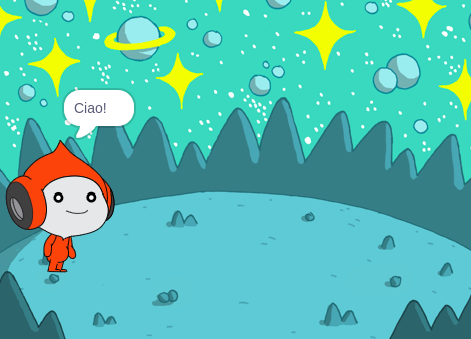
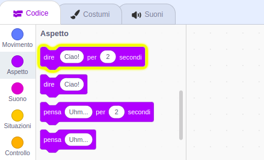
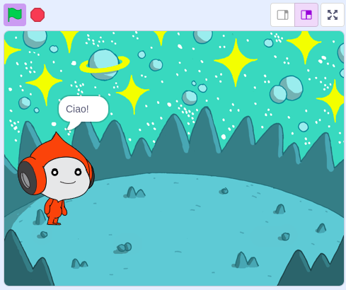
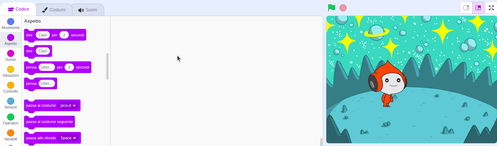
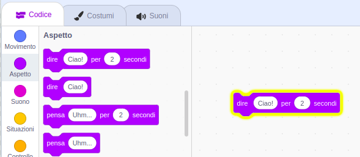
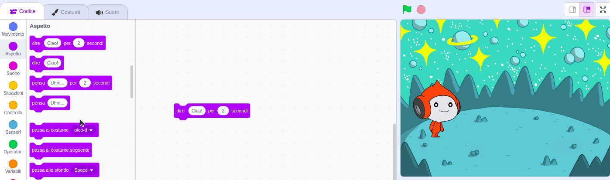
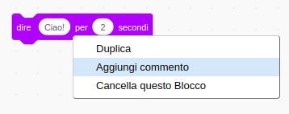

## Pico dice Ciao

<div style="display: flex; flex-wrap: wrap">
<div style="flex-basis: 200px; flex-grow: 1; margin-right: 15px;">
Uno sprite può avere del codice, dei costumi e dei suoni per cambiare il suo aspetto e quello che fa. 
  
Aggiungi blocchi di codice per far parlare Pico o per fargli emettere suoni quando lo si clicca.
</div>
<div>

{:width="300px"}

</div>
</div>

<p style="border-left: solid; border-width:10px; border-color: #0faeb0; background-color: aliceblue; padding: 10px;">
Le <span style="color: #0faeb0">**Emoticon**</span> servono a dare una personalità al personaggio nel gioco. Possono usare parole, suoni, movimenti, o effetti grafici, proprio come in Scratch. Hai mai giocato a un gioco che utilizza le emoticon?
</p>

### Usa il blocco dire

--- task ---

Apri il menu dei blocchi `Aspetto`{:class="block3looks"}.

Fai clic sul blocco `dire`{:class="block3looks"} `Ciao!``per`{:class="block3looks"} `2` `secondi`{:class="block3looks"}.



Lo sprite **Pico** mostrerà un fumetto per due secondi.



**Suggerimento:** I blocchi di codice in Scratch si illuminano con un contorno giallo quando sono in esecuzione.

--- /task ---

--- task ---

Trascina il blocco `dire`{:class="block3looks"} `Ciao!``per`{:class="block3looks"} `2` `secondi`{:class="block3looks"} nell'area del Codice. Clicca sul blocco di nuovo.





--- /task ---

### Fai parlare Pico quando viene cliccato (o toccato)

--- task ---

Trascina un blocco `quando si clicca su questo sprite`{:class="block3events"} dal menu dei blocchi `Situazioni`{:class="block3events"} e connettilo alla parte superiore del blocco `dire`{:class="block3looks"} nell'area del Codice. I blocchi si incastreranno insieme.




```blocks3
+when this sprite clicked
say [Hello!] for [2] seconds // hide speech after 2 seconds
```

--- /task ---

### Commenti al Codice

--- task ---

```blocks3
say [Hello!] for [2] seconds // hide speech after 2 seconds
```
Vedrai i commenti negli esempi di codice. Non serve che aggiungi i commenti quanto aggiungi codice al tuo progetto.

Se hai tempo quando hai finito il progetto, è una buona idea aggiungere commenti al codice così sarà più facile da capire. Try adding a comment now. Per aggiungere un commento, fai clic con il pulsante destro (o su un tablet, tocca e tieni premuto) su un blocco nell'area del Codice e seleziona **Aggiungi commento**.



--- /task ---

### Prova

--- task ---

**Prova:** fai clic sullo sprite **Pico** sullo Stage e controlla che un fumetto appaia per due secondi. È importante provare il tuo codice per verificare che faccia ciò che ti aspetti.

--- /task ---

--- task ---

Hai già salvato il tuo progetto e gli hai dato un nome. Scratch ora lo salverà **automaticamente** per te.

Puoi comunque fare click su salva se ti va, per essere sicuro.

--- /task ---
