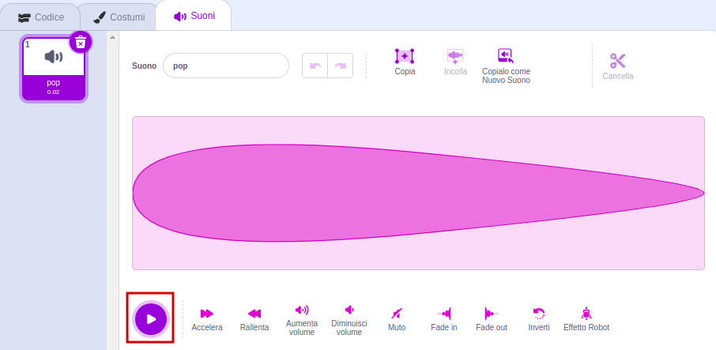
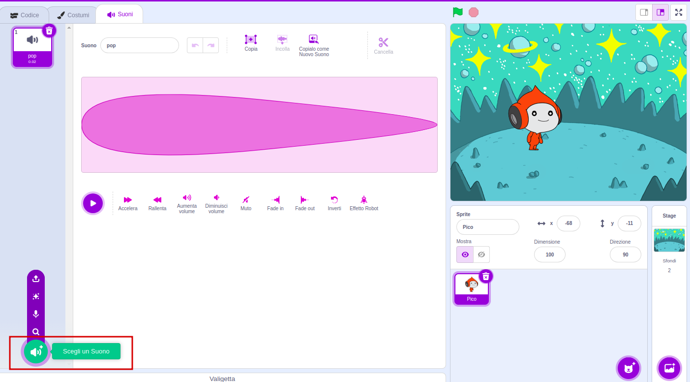
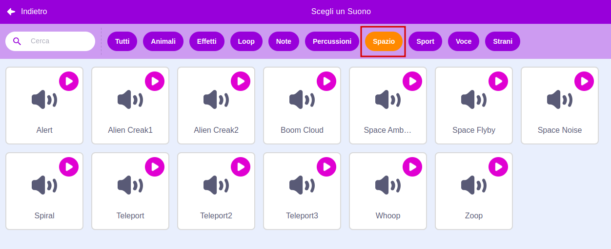
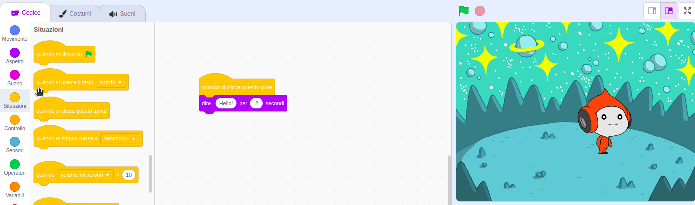
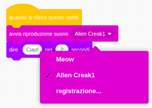

## Pico riproduce un suono

<div style="display: flex; flex-wrap: wrap">
<div style="flex-basis: 200px; flex-grow: 1; margin-right: 15px;">
Un altro modo per comunicare è usare i suoni.
</div>
<div>

{:width="300px"}

</div>
</div>

### Aggiungi un suono allo sprite Pico

--- task ---

Fai clic sulla scheda **Suoni** per lo sprite **Pico** e troverai un suono **pop**. Fai clic sull'icona **Play** per ascoltare il suono **pop**.



**Debug**: Se non riesci a sentire il suono controlla che l'audio sul tuo computer o sul tuo tablet funzioni.

--- /task ---

--- task ---

Per selezionare un nuovo suono, fai clic sull'icona **Scegli un Suono** e seleziona la categoria **Spazio** o scrivi `space` nella barra di ricerca.






--- /task ---

--- task ---

Riproduci alcuni suoni diversi usando le icone **Play**. Quando hai trovato il suono che vuoi utilizzare, fai clic su di esso per aggiungerlo al progetto.


--- /task ---

### Fai riprodurre il suono a Pico quando viene cliccato (o toccato)

--- task ---

Fai clic sulla scheda **Codice**. Nel menu dei blocchi `Suono`{:class="block3sound"}, cerca il blocco `avvia riproduzione suono`{:class="block3sound"}.

Trascina il blocco nell'area del Codice, tra il blocco `quando si clicca questo`{:class="block3events"} e il blocco `dire`{:class="block3looks"}. Si aprirà uno spazio vuoto e il blocco si incasterà nella posizione corretta.



Il tuo codice dovrebbe assomigliare a questo:


```blocks3
when this sprite clicked
+start sound [Alien Creak1 v] 
say [Ciao!] for [2] seconds // nascondi il fumetto dopo 2 secondi
```

--- /task ---

### Prova il tuo codice

--- task ---

Controlla che il blocco `avvia riproduzione suono`{:class="block3sound"} abbia il suono scelto da te. Se non lo ha, devi fare clic sul blocco `avvia riproduzione suono`{:class="block3sound"}, e poi seleziona il tuo suono nel menu a comparsa.



--- /task ---

--- task ---

**Prova:** fai clic sullo sprite **Pico** e controlla che un fumetto appaia e che si senta un suono. Se non senti il suono, controlla di aver aggiunto il blocco `avvia riproduzione suono`{:class="block3sound"} sotto il blocco `quando si clicca questo sprite`{:class="block3events"}.

--- /task ---

