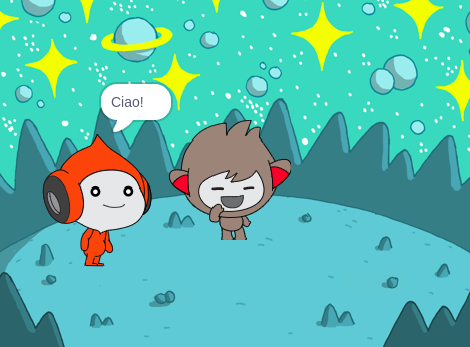
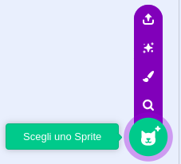
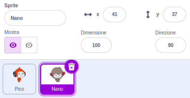
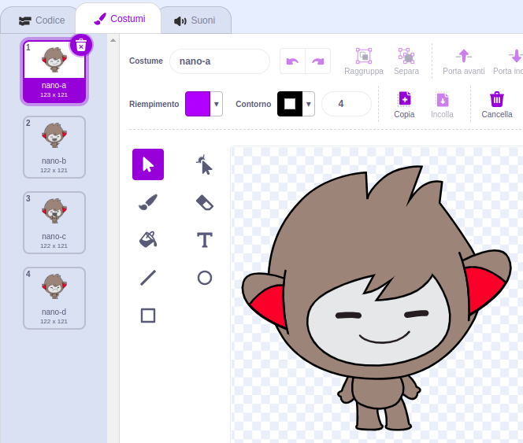
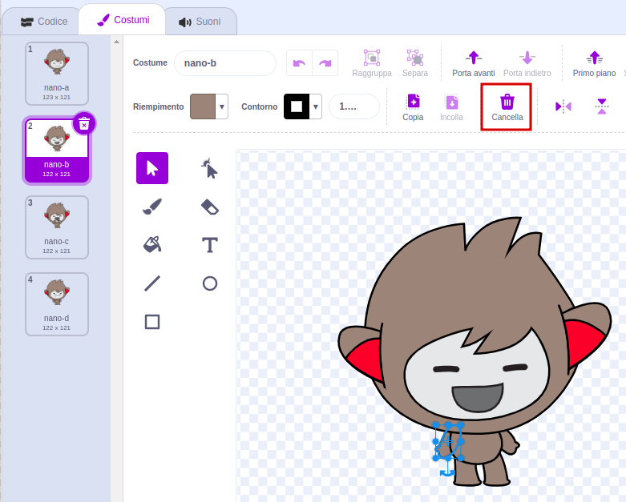
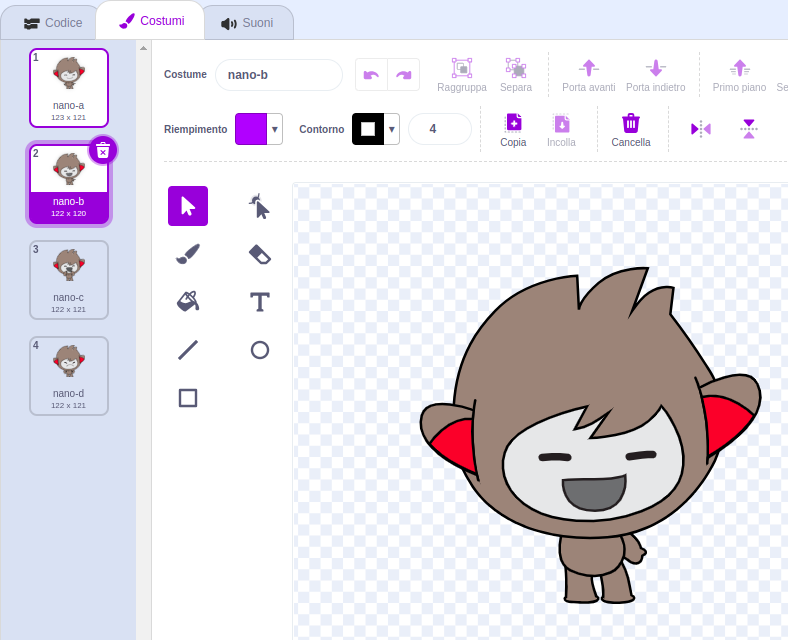
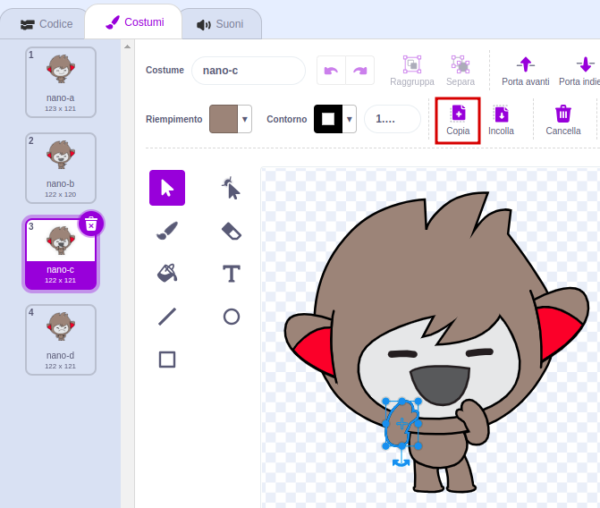
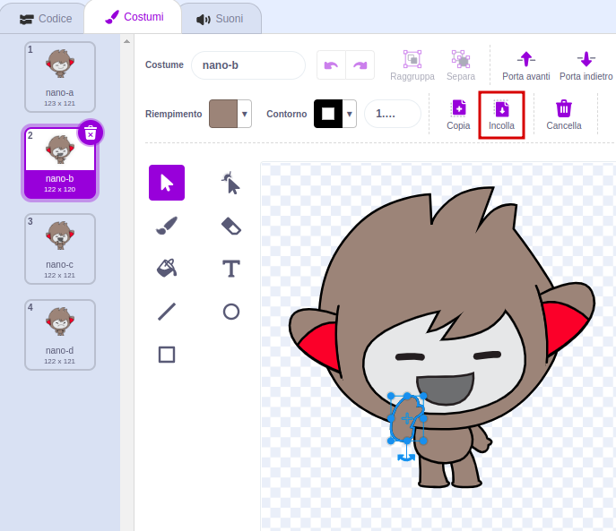

## Nano cambia il costume

<div style="display: flex; flex-wrap: wrap">
<div style="flex-basis: 200px; flex-grow: 1; margin-right: 15px;">

Fai in modo che Nano si esprima cambiano **costumi**.

Gli Sprite hanno **costumi** per cambiare il loro aspetto. Per animare uno sprite, puoi cambiargli il costume.

</div>
<div>

{:width="300px"}

</div>
</div>

### Nano fa il segno "Grazie!"

--- task ---

Aggiungi lo sprite **Nano** al tuo progetto dalla categoria **Fantasia**.



--- /task ---

--- task ---

Assicurati che lo sprite **Nano** sia selezionato nella lista degli Sprite sotto lo Stage.




Fai clic sulla scheda **Codice** e aggiungi uno script per fare in modo che lo sprite **Nano** ringrazi utilizzando `passa al costume`{:class="block3looks"} e `attendi`{:class="block3control"}:


```blocks3
when this sprite clicked // when Nano is clicked
switch costume to [nano-b v] // Nano talking
wait (0.5) seconds // try 0.25 instead of 0.5
switch costume to [nano-a v] // Nano smiling
```
--- /task ---

**Suggerimento:** Tutti i blocchi hanno un colore specifico, quindi troverai il blocco `passa al costume`{:class="block3looks"} nel menu dei blocchi `Aspetto`{:class="block3looks"} e il blocco `attendi`{:class="block3control"} nel menu dei blocchi `Controllo`{:class="block3control"}.

--- task ---

**Prova:** Fai clic sullo sprite **Nano** sullo Stage e controlla che Nano cambi il suo costume.

--- /task ---

### Nano usa la lingua dei segni

<p style="border-left: solid; border-width:10px; border-color: #0faeb0; background-color: aliceblue; padding: 10px;">Milioni di persone usano la lingua dei segni per comunicare. Un modo comune per fare il segno "Grazie" è posizionare le dita sul mento con la mano più piatta possibile. Poi muovi la tua mano in avanti, lontano dal tuo mento e leggermente verso il basso. 
</p>

<!-- Add a video of someone signing -->

Nano userà la lingua dei segni cambiano i suoi costumi.

Puoi modificare i costumi per i tuoi sprite con l'editor Paint. Modificherai un costume di Nano per fargli fare il segno "grazie".

--- task ---

Fai clic sulla scheda **Costumi** per vedere i costumi dello sprite **Nano**:



--- /task ---

--- task ---

Clicca sul costume **nano-b**. Fai clic sul braccio della mano sinistra, e poi fai clic su **Cancella**.



Il tuo costume dovrebbe assomigliare a questo:



--- /task ---

**Suggerimento:**Se fai un errore nell'editor Paint, puoi cliccare **Annulla**.


--- task ---

Vai al costume **nano-c** e fai clic sul braccio sinistro, poi fai clic su **Copia**.



--- /task ---

--- task ---

Torna al costume **nano-b** e fai clic su **Incolla**. Il costume dovrebbe assomigliare a questo:



--- /task ---

--- task ---

**Prova:**Clicca lo sprite **Nano** sullo Stage e controlla che appaia il fumetto e che il costume di Nano cambi nel costume che hai modificato.

--- /task ---

<p style="border-left: solid; border-width:10px; border-color: #0faeb0; background-color: aliceblue; padding: 10px;">Hai imparato a fare il segno "grazie". La prossima volta che ringrazi qualcuno, perché non usi la tua nuova abilità?
</p>

