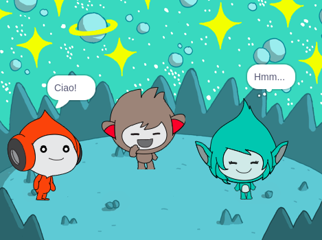

## Giga cambia il colore

<div style="display: flex; flex-wrap: wrap">
<div style="flex-basis: 200px; flex-grow: 1; margin-right: 15px;">
Gli Sprite possono anche usare fumetti pensierosi e cambiare colore per mostrare la loro personalità. Useremo Giga per farlo.
</div>
<div>

{:width="300px"}

</div>
</div>

### Fai cambiare colore a Giga

--- task ---

Aggiungi lo sprite da **Giga**.

Trascina lo sprite **Giga** per posizionarlo sul lato destro dello Stage.

--- /task ---

--- task ---

Assicurati che lo sprite **Giga** sia selezionato nella lista degli Sprite sotto lo Stage. Aggiungi questo codice per far esprimere lo sprite **Giga** cambiando colore:


```blocks3
when this sprite clicked
set [color v] effect to [0] // 0 è il colore iniziale
think [Hmm...] for [2] seconds 
clear graphic effects // ritorna al colore iniziale
```

--- /task ---

**Suggerimento:** Fai clic sullo sprite nell'elenco degli Sprite sotto lo Stage prima di aggiungere o modificare codice, costumi o il suono. Assicurati di aver cliccato sullo sprite corretto.

--- task ---

Prova numeri diversi da `1` a `200` nel blocco `porta effetto colore a`{:class="block3looks"} finché non trovi un colore che ti piace.

--- /task ---

--- task ---

Cambia le parole e il numero di secondi nel blocco `pensa`{:class="block3looks"}.

--- /task ---

--- task ---

**Prova:** Fai clic sullo sprite **Giga** sullo Stage e controlla che lo sprite cambi colore e mostri un fumetto pensieroso.

--- /task ---

