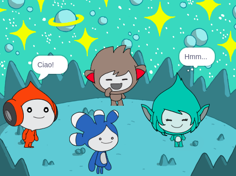

## Migliora il tuo progetto

<div style="display: flex; flex-wrap: wrap">
<div style="flex-basis: 200px; flex-grow: 1; margin-right: 15px;">
Aggiungi lo sprite **Tera** e usa uno qualsiasi dei blocchi che hai imparato per far esprimere lo sprite **Tera**.
</div>
<div>

{:width="300px"}

</div>
</div>

Puoi anche utilizzare l'estensione Da Testo a Voce per far parlare ad alta voce **Tera**:

[[[scratch3-text-to-speech]]]

La personalità dello sprite **Tera** è una tua scelta, quindi divertiti usando la tua creatività.

```blocks3
when this sprite clicked

say [Hello!] for [2] seconds

say [Hello!]

say [] // hide speech bubble

think [Hmm...] for [2] seconds

switch costume to [tera-d v]

wait (1) seconds // 0.5 is half a second

set [color v] effect to [0] // number up to 200

clear graphic effects

play sound [pop v] until done

start sound [pop v]

speak [hello]
```

Puoi anche fare 'remix' del progetto per fare le modifiche che vuoi. Potresti cambiare lo sfondo e il modo in cui gli sprite si esprimono e persino scegliere diversi sprite e dare loro delle espressioni.

**Suggerimento:** Fai clic su uno sprite nella lista degli Sprite sotto lo Stage per modificare il codice, i costumi e il suono per quello sprite.

--- collapse ---
---
title: Certificato di Coversazione spaziale
---

Ben fatto! Hai completato il progetto Conversazione spaziale. Ecco il [certificato](https://drive.google.com/file/d/18xx4uNIyRSty_2ujHkGDzGwTgfSGC1AF/view?usp=sharing){:target="_blank"} per festeggiare le tue nuove abilità. Scarica una copia e poi aprila per aggiungere il tuo nome.

--- /collapse ---

--- collapse ---
---
title: Il progetto completo
---

Puoi visualizzare i [progetti completati qui](https://scratch.mit.edu/projects/485673032/){:target="_blank"}.

--- /collapse ---

--- save ---
