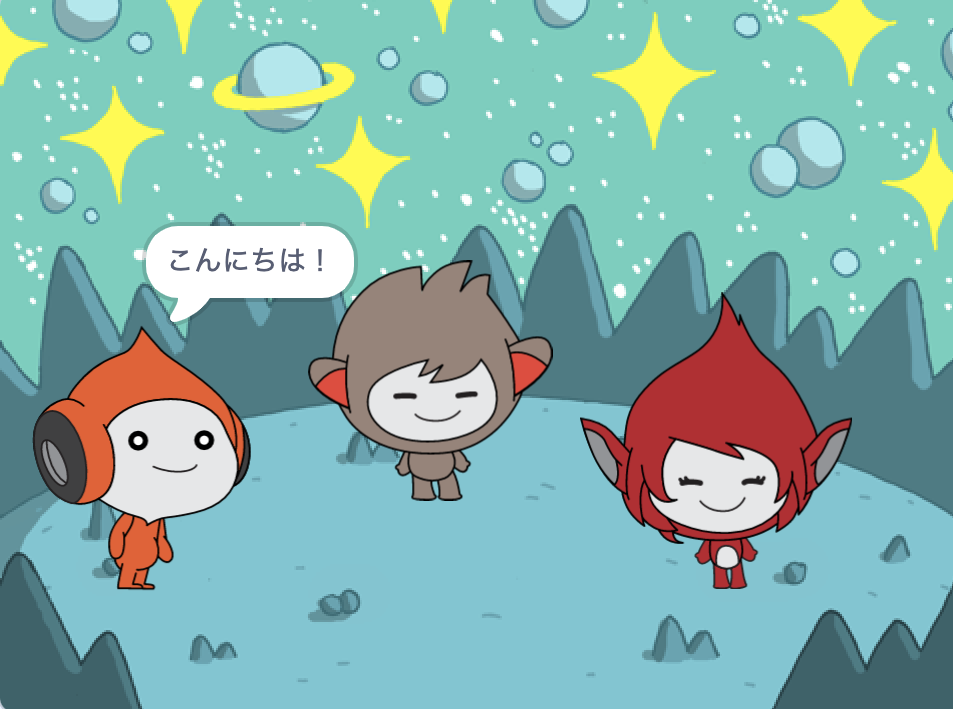

## What you will make

キャラクター👾が「感情を表現（エモート）」して考えや感情をやりとりする宇宙の場面をつくります。

Scratchでは、キャラクターとオブジェクトは**スプライト**と呼ばれ**ステージ**上に表示されます。

次のことを行います。
+ スプライトと**背景**を追加して、プロジェクトをセットアップします
+ `見た目`{:class="block3looks"}および`音`{:class="block3sound"}コードブロックを使い、スプライトをクリックするとコミュニケーションが行われるようにします
+ **ペイントエディタ**を使って**コスチューム**を変更します

--- no-print --- --- task ---
### プレイ ▶️

  
各スプライトをクリックして何が起きるか確認します。 

あるスプライトをクリックしてから別のスプライトをすばやくクリックするとどうなりますか？

  <iframe allowtransparency="true" width="485" height="402" src="https://scratch.mit.edu/projects/embed/485673032/?autostart=false" frameborder="0"></iframe>

--- /task --- --- /no-print ---

--- print-only ---

--- /print-only ---

