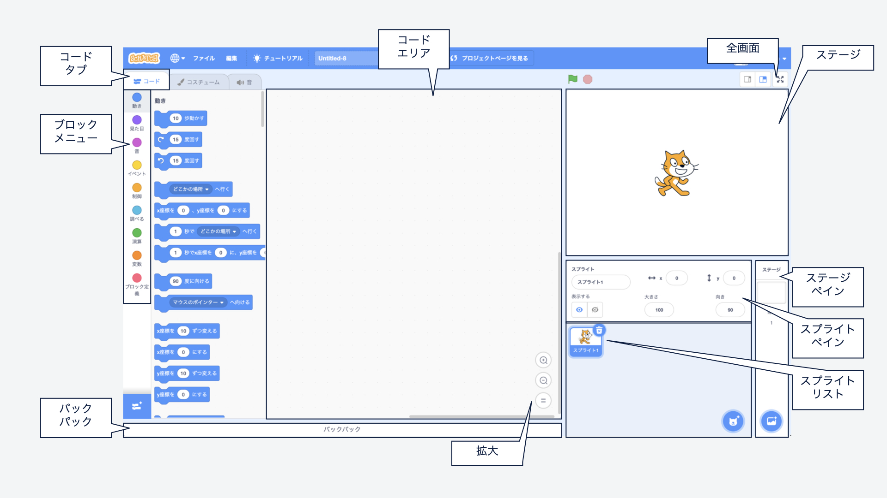
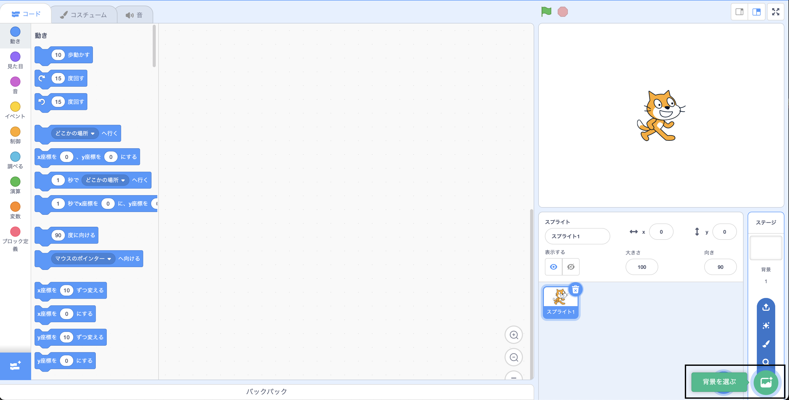
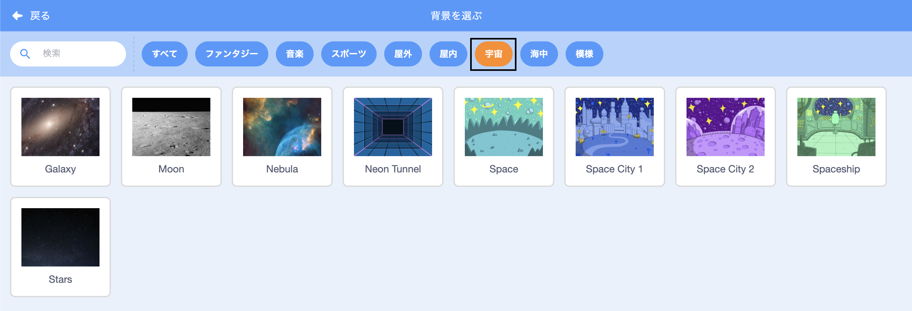
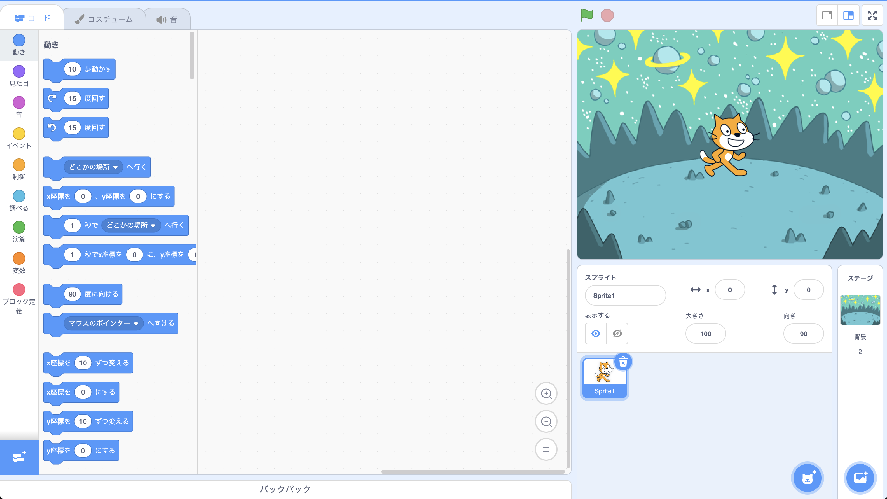
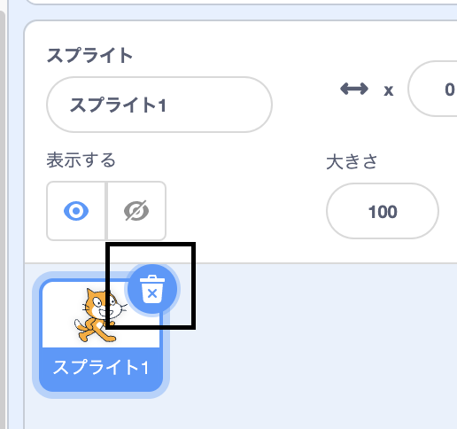
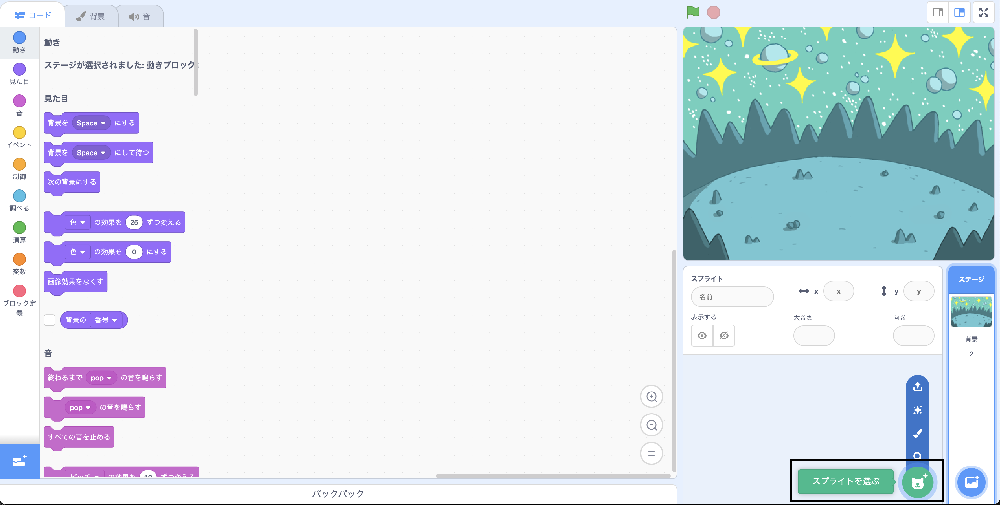
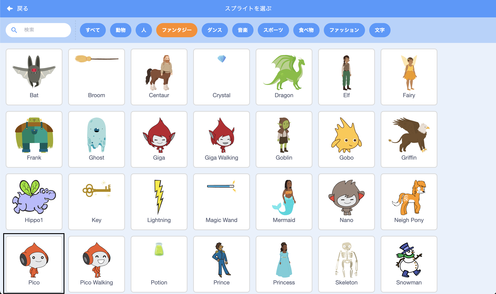
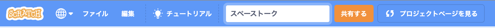
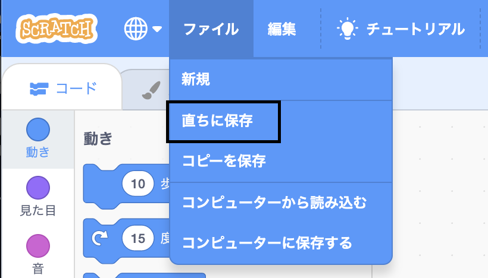

## 場面を作る

このステップでは、スペースの背景と最初のスプライトを使ってプロジェクトをセットアップします。 

{:width="300px"}

### スタータープロジェクトを開く

--- task ---

[スペーストークスタータープロジェクト](https://scratch.mit.edu/projects/582213331/editor){:target="_blank"}を開きます。 Scratchが別のブラウザタブで開きます。

[[[working-offline]]]

--- /task ---

### Scratchエディター

### 背景を追加する

**ステージ**はプロジェクトが実行される場所です。 **背景**はステージの見え方を変更します。

--- task ---

ステージペインで**背景を選ぶ**をクリック（タブレットの場合はタップ）します。

--- /task ---

--- task ---

**宇宙**カテゴリをクリックするか、検索ボックスに「`space`」と入力します。

--- /task ---

この例では**Space**背景を選択しましたが、一番気に入った背景を選択しましょう。

--- task ---

あなたが選択した背景をクリックしてプロジェクトに追加します。 ステージに選択した背景が表示されます。

--- /task ---

### スプライトを追加する

プロジェクトにすでに含まれているスプライトがありますか？ それはScratch Catです。

--- task ---

**Sprite1** (Scratch Cat) スプライトを削除します。ステージの下にあるスプライトリストで**Sprite1**を選択し、**削除**アイコンをクリックします。

--- /task ---

--- task ---

スプライトリストで**スプライトを選ぶ**をクリックします。

--- /task ---

--- task ---

**ファンタジー**カテゴリを選択します。 **Pico**スプライトをクリックしてプロジェクトに追加します。

--- /task ---

--- task ---

**Pico**スプライトをドラッグして、ステージの左側に置きます。 ステージは次のようになります。

--- /task ---

--- task ---

**保存**: Scratchのアカウントにサインインしている場合は、緑色のリミックスボタンをクリックします。 これにより、あなたのScratchアカウントにプロジェクトのコピーが保存されます。

画面上部のプロジェクト名ボックスにプロジェクトの名前を入力します。

**ヒント:** プロジェクトがたくさんあるときに簡単に見つけられるように、プロジェクトにわかりやすい名前を付けます。

次に、**ファイル**、それから**直ちに保存**の順にクリックしてプロジェクトを保存します。

オンラインではない場合や、Scratchアカウントを持っていない場合は、**コンピューターに保存する** をクリックしてプロジェクトのコピーを保存できます。

--- /task ---

