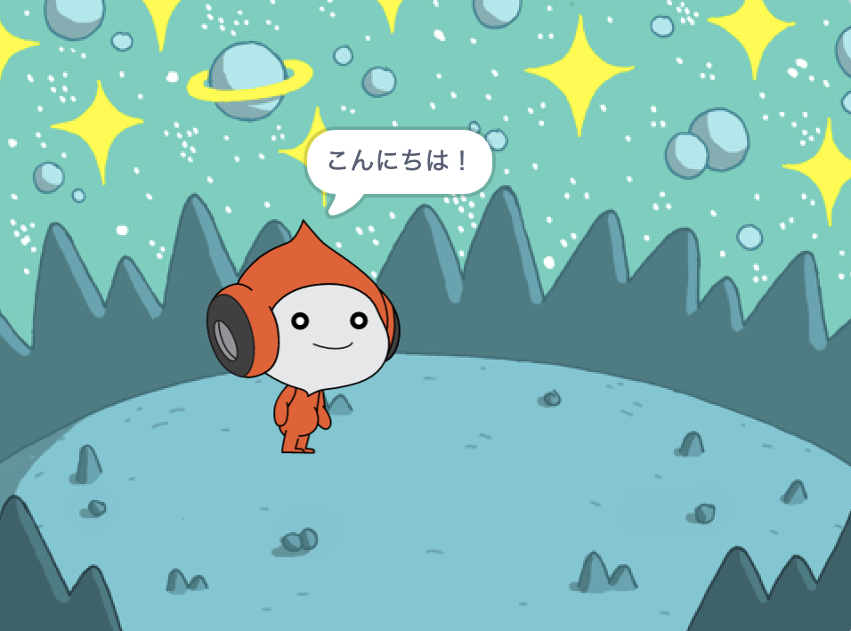
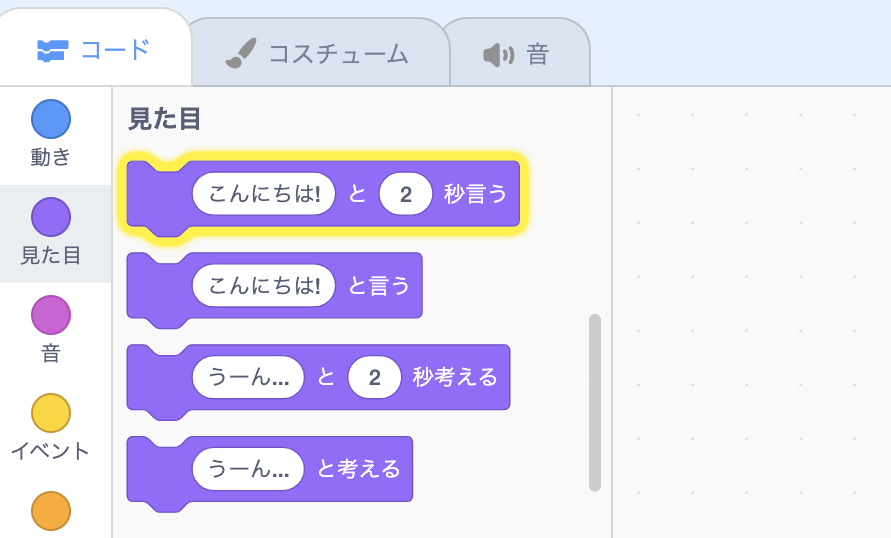
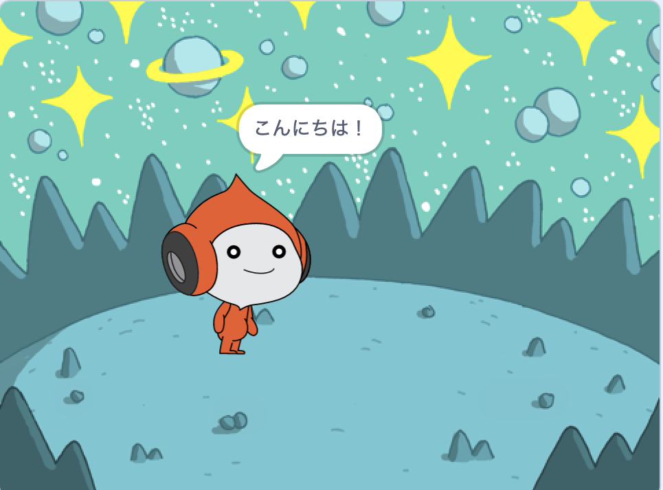
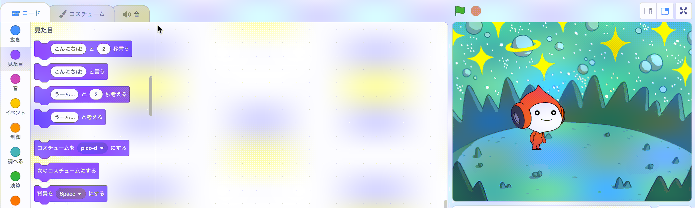
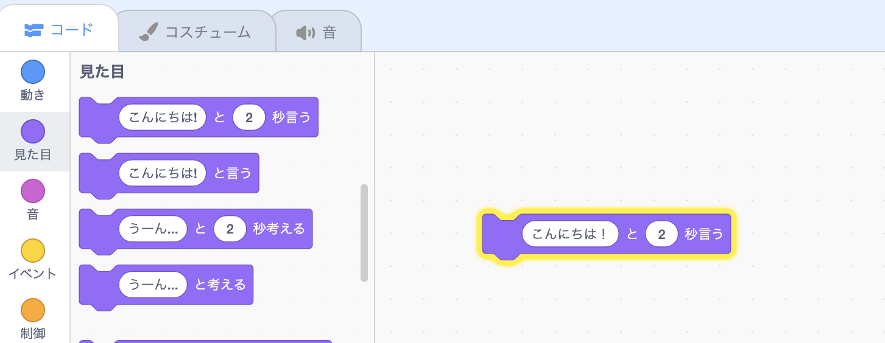
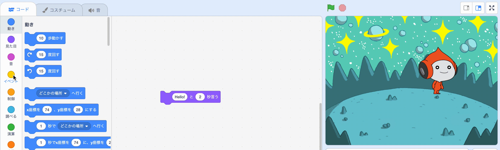
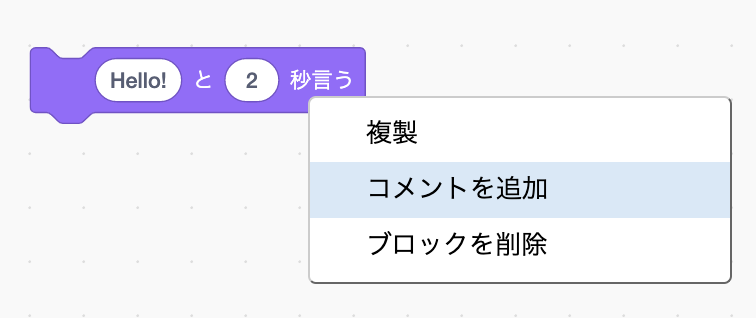

## Picoに「こんにちは」と言わせる

<div style="display: flex; flex-wrap: wrap">
<div style="flex-basis: 200px; flex-grow: 1; margin-right: 15px;">
スプライトにコード、コスチューム、サウンドを設定して見た目や動きを変更できます。 
  
コードブロックを追加して、スプライトがクリックされたときにPicoが言葉と音でエモートするようにします。
</div>
<div>

{:width="300px"}

</div>
</div>

<p style="border-left: solid; border-width:10px; border-color: #0faeb0; background-color: aliceblue; padding: 10px;">
<span style="color: #0faeb0">**エモート**</span>は、ゲーム内のキャラクターの個性を表す方法です。 Scratchで、セリフ、音、動き、グラフィック効果を使用できます。 エモートを使うゲームを遊んだことはありますか？
</p>

### 言うブロックを使用する

--- task ---

`見た目`{:class="block3looks"}ブロックメニューを開きます。

`こんにちは！``と`{:class="block3looks"}`2``秒言う`{:class="block3looks"}ブロックをクリックします。



**Pico**スプライトが2秒間ふきだしを表示します。



**ヒント:** Scratchのコードブロックは、実行時にまわりが黄色く光ります。

--- /task ---

--- task ---

`こんにちは！``と`{:class="block3looks"}`2``秒言う`{:class="block3looks"}ブロックをコードエリアにドラッグします。 もう一度クリックします。





--- /task ---

### クリック（またはタップ）されたらPicoにしゃべらせる

--- task ---

`イベント`{:class="block3events"}ブロックメニューから`このスプライトが押されたとき`{:class="block3events"}ブロックをドラッグし、コードエリアの`言う`{:class="block3looks"}ブロックの上につなげます。 ブロック同士がくっつきます。




```blocks3
+when this sprite clicked
say [Hello!] for [2] seconds // hide speech after 2 seconds
```

--- /task ---

### コードコメント

```blocks3
say [Hello!] for [2] seconds // hide speech after 2 seconds
```
コード例にはコメントが表示されています。 プロジェクトにコードを追加するときにコメントを追加する必要はありません。

プロジェクトが終了したときに時間があれば、後で理解しやすいように、コードにコメントを追加することをおすすめします。 コメントを追加するには、コードエリアでブロックを右クリック（タブレットの場合はタップして保持）し、**コメントを追加**を選択します。



### テスト

--- task ---

**テスト:** ステージ上の**Pico**スプライトをクリックし、ふきだしが2秒間表示されることを確認します。 コードをテストして、期待どおりに動作することを確認することが重要です。

--- /task ---

--- task ---

プロジェクトは既に保存され、名前が付けられています。 Scratchが**自動的に**保存してくれます。

念のため、必要に応じて保存をクリックすることもできます。

--- /task ---
