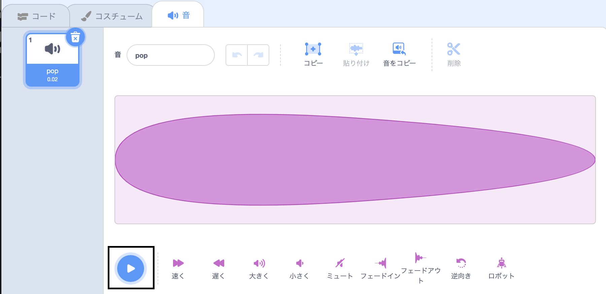

## Picoが音を出す

<div style="display: flex; flex-wrap: wrap">
<div style="flex-basis: 200px; flex-grow: 1; margin-right: 15px;">
コミュニケーションのもう1つの方法は、音を使うことです。
</div>
<div>

{:width="300px"}

</div>
</div>

### Picoスプライトに音を追加する

--- task ---

**Pico**スプライトで**音**タブをクリックすると、**pop**音声が見つかります。 **再生**アイコンをクリックして**pop**音声を聞きます。



**デバッグ**: 音が聞こえない場合は、コンピューターまたはタブレットで音が機能しているかどうかを確認してください。

--- /task ---

--- task ---

新しい音を選択するには、**音を選ぶ**アイコンをクリックし、**宇宙**カテゴリを選択するか、検索ボックスに`space`と入力します。


--- /task ---

--- task ---

**再生**アイコンを使用して、いくつかの音声を聞いてみましょう。 使いたい音声が見つかったら、それをクリックしてプロジェクトに追加します。


--- /task ---

### クリック（またはタップ）時に音を鳴らす

--- task ---

**コード**タブをクリックします。 `音`{:class="block3sound"}ブロックメニューで、`音を鳴らす`{:class="block3sound"}ブロックを見つけます。

ブロックを、`このスプライトが押されたとき`{:class="block3events"}ブロックと`言う`{:class="block3looks"}ブロックの間にドラッグします。 すき間が開き、ブロックが中にはまります。


コードは次のようになります。


```blocks3
when this sprite clicked
+start sound [Alien Creak1 v] 
say [Hello!] for [2] seconds // hide speech after 2 seconds
```

--- /task ---

### コードをテストする

--- task ---

`音を鳴らす`{:class="block3sound"}ブロックにあなたが選択した音が含まれていることを確認します。 含まれていない場合、`音を鳴らす`{:class="block3sound"}ブロックで音をクリックし、ドロップダウンメニューから、選択した音を選ぶ必要があります。


--- /task ---

--- task ---

**テスト:** **Pico**スプライトをクリックし、ふきだしが表示され、音が聞こえることを確認します。 音が聞こえない場合、`このスプライトが押されたとき`{:class="block3events"}ブロックの下に`音を鳴らす`{:class="block3sound"}ブロックが追加されていることを確認します。

--- /task ---

