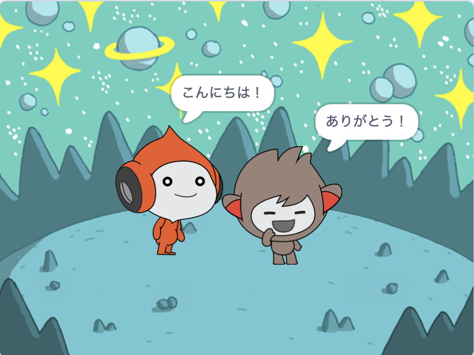
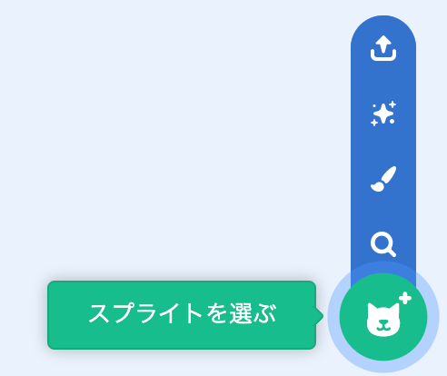
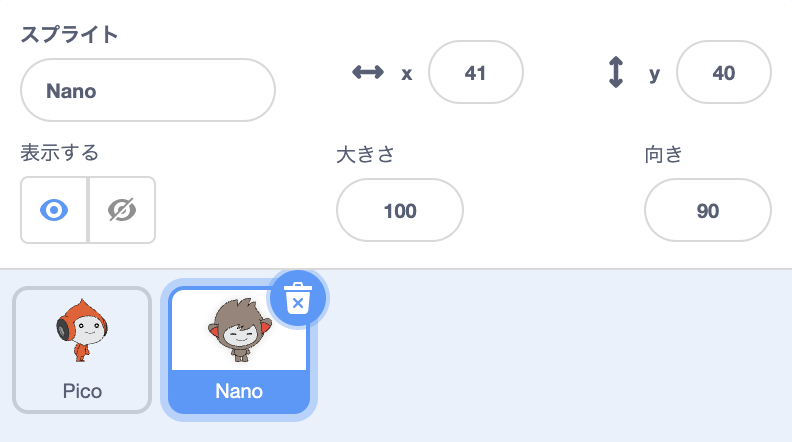
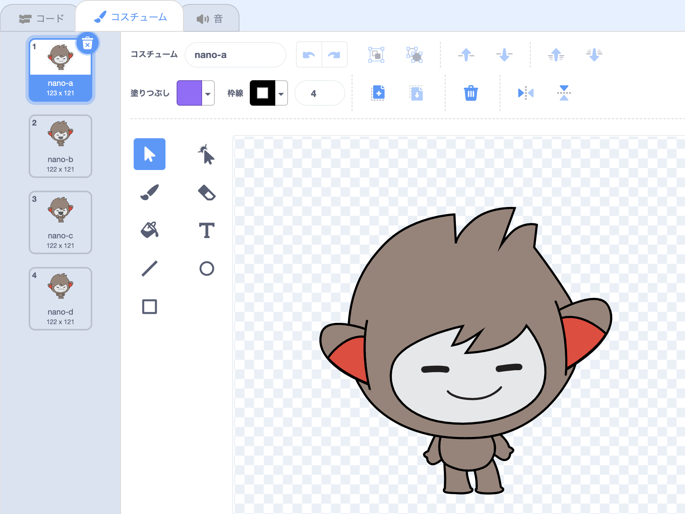
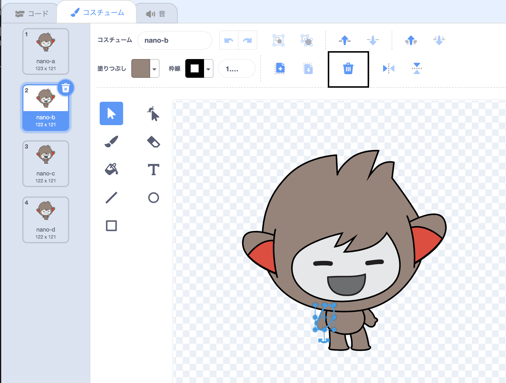
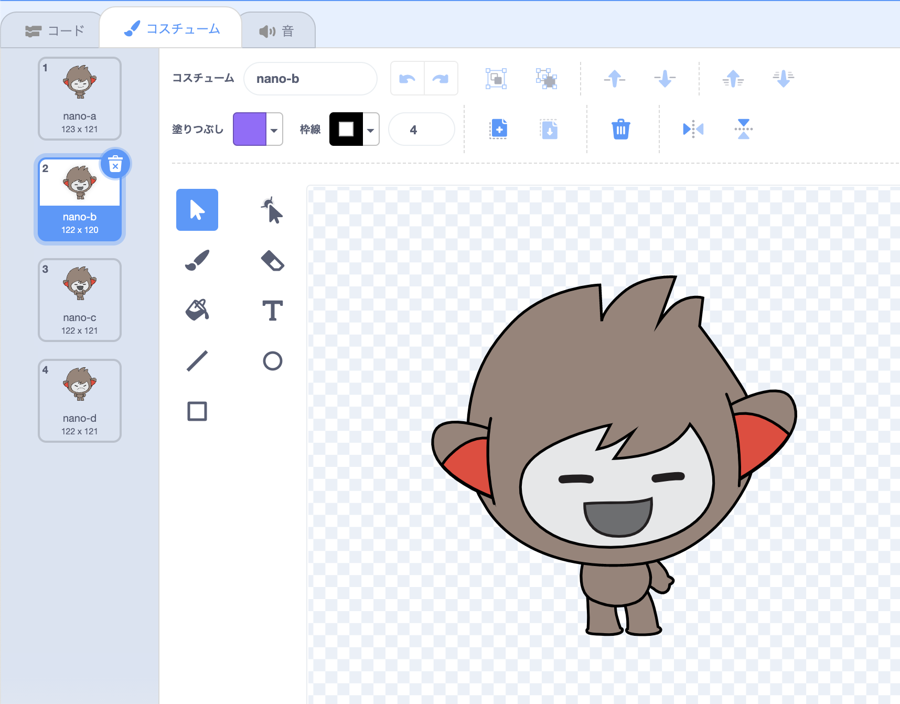
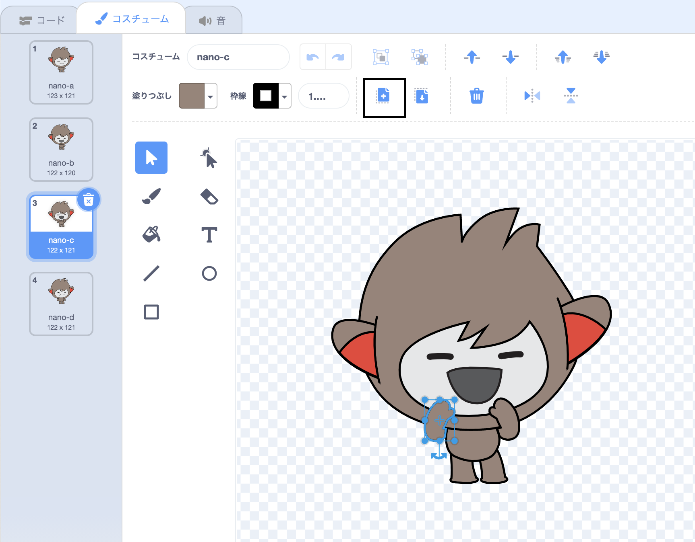
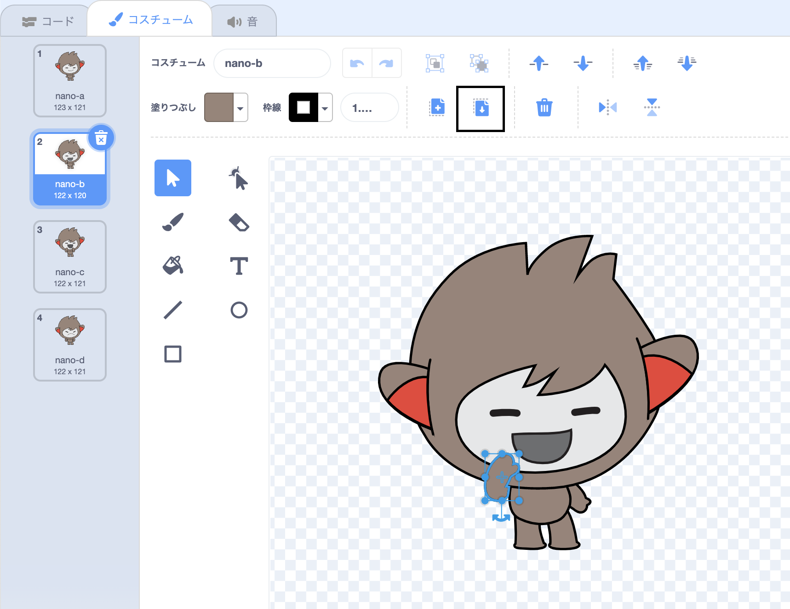

## Nanoのコスチュームを変える

<div style="display: flex; flex-wrap: wrap">
<div style="flex-basis: 200px; flex-grow: 1; margin-right: 15px;">

**コスチューム**を切り替えることで、Nanoにエモートさせることができます。

スプライトには、見た目を変えるための**コスチューム**があります。 コスチュームを変更してスプライトを動かすことができます。

</div>
<div>

{:width="300px"}

</div>
</div>

### Nanoが「ありがとう！」と言う

--- task ---

**ファンタジー**カテゴリからプロジェクトに**Nano**スプライトを追加します。



--- /task ---

--- task ---

ステージの下にあるスプライトリストで**Nano**スプライトが選択されていることを確認します。




「**コード**」タブをクリックし、**Nano**スプライトが`ありがとう！``と言う`{:class="block3looks"}ためのスクリプトを追加します。


```blocks3
when this sprite clicked // when Nano is clicked
switch costume to [nano-b v] // Nano talking
say [Thanks!] for [2] seconds // try 1 instead of 2
switch costume to [nano-a v] // Nano smiling
```
--- /task ---

**ヒント:** すべてのブロックは色で分類されているため、`コスチュームを...にする`{:class="block3looks"}ブロックは`見た目`{:class="block3looks"}ブロックメニューにあります。

--- task ---

**テスト:** ステージの**Nano**スプライトをクリックし、ふきだしが表示され、Nanoのコスチュームが変わることを確認します。

--- /task ---

### Nanoが手話で話す

<p style="border-left: solid; border-width:10px; border-color: #0faeb0; background-color: aliceblue; padding: 10px;">何百万人もの人々が手話を使ってコミュニケーションをとっています。 世界でよく使われている「ありがとう」の手話は、**右手を口に近づける**ことです。 
</p>

Nanoがコスチュームを変えることで手話を使います。

ペイントエディタを使用して、スプライトのコスチュームを編集できます。 Nanoのコスチュームを編集して、「ありがとう」の手話を行います。

--- task ---

**Nano**スプライトのコスチュームを表示するには、「**コスチューム**」タブをクリックします。



--- /task ---

--- task ---

**nano-b**コスチュームをクリックします。 左側の腕をクリックし、**削除**をクリックします。



コスチュームは次のようになります。



--- /task ---

**ヒント:** ペイントエディタで間違えた場合は、**元に戻す**をクリックできます。


--- task ---

**nano-c**コスチュームに移動し、左側の腕をクリックして **コピー**をクリックします。



--- /task ---

--- task ---

**nano-b**コスチュームに戻り、**貼り付け**をクリックします。 コスチュームは次のようになります。



--- /task ---

--- task ---

**テスト:** **Nano**スプライトをクリックし、ふきだしが表示され、Nanoのコスチュームが編集したコスチュームに変わることを確認します。

--- /task ---

<p style="border-left: solid; border-width:10px; border-color: #0faeb0; background-color: aliceblue; padding: 10px;">これで、「ありがとう」の手話を学びました。 次に誰かに感謝するときに、ぜひ使ってみてください。
</p>

--- save ---
