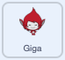

## Gigaの色を変える

<div style="display: flex; flex-wrap: wrap">
<div style="flex-basis: 200px; flex-grow: 1; margin-right: 15px;">
スプライトでは、ふきだしを使ったり色を変えたりして個性を出すこともできます。 Gigaには次のようなことをさせます。
</div>
<div>

{:width="300px"}

</div>
</div>

### Gigaの色を変える

--- task ---

**Giga**スプライトを追加します。

**Giga**スプライトをステージの右側にドラッグします。

--- /task ---

--- task ---

ステージの下にあるスプライトリストで**Giga**スプライトが選択されていることを確認します。 次のコードを追加して、**Giga**スプライトが色を変えることでコミュニケーションを行うようにします。



```blocks3
when this sprite clicked
set [color v] effect to [0] // 0が最初の色
think [うーん...] for [2] seconds 
clear graphic effects // 最初の色に戻る
```

--- /task ---

**ヒント:** コード、コスチューム、または音を追加または変更する前に、ステージの下にあるスプライトリストでスプライトをクリックします。 正しいスプライトをクリックしていることを確認してください。

--- task ---

`色の効果を...にする`{:class="block3looks"} ブロックで`1`から`200`までのさまざまな数字を試してお気に入りの数を見つけます。

--- /task ---

--- task ---

`...と考える`{:class="block3looks"} ブロックで言葉や数字を変更します。

--- /task ---

--- task ---

**テスト: **ステージの**Giga**スプライトをクリックし、スプライトの色が変わり、ふきだしが表示されることを確認します。

--- /task ---

