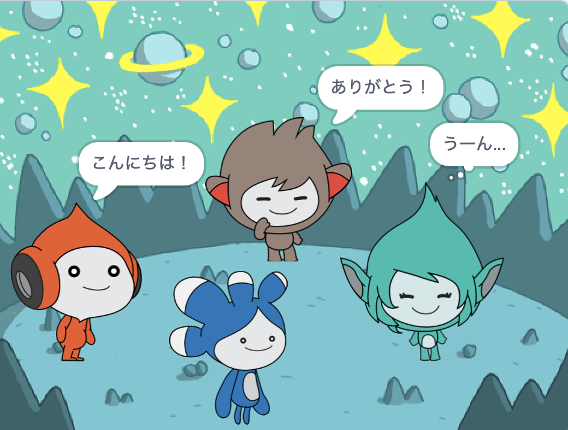

## プロジェクトをアップグレードする

<div style="display: flex; flex-wrap: wrap">
<div style="flex-basis: 200px; flex-grow: 1; margin-right: 15px;">
**Tera**スプライトを追加し、ここまでに学んだブロックのいずれかを使用して、**Tera**スプライトの「エモート」を作成します。
</div>
<div>

{:width="300px"}

</div>
</div>

音声合成の拡張機能を使用したら、**Tera**に大声でしゃべらせることもできます。

[[[scratch3-text-to-speech]]]

**Tera**スプライトの個性はあなたが決められます。あなた自身の創造的なアイデアを使って楽しんでください。

```blocks3
when this sprite clicked

say [こんにちは！] for [2] seconds

say [こんにちは！]

say [] // ふきだしを隠す

think [うーん...] for [2] seconds

switch costume to [tera-d v]

wait (1) seconds // 0.5は1秒の半分

set [color v] effect to [0] // 200までの数

clear graphic effects

play sound [pop v] until done

start sound [pop v]

speak [こんにちは]
```

プロジェクトを「リミックス」して、好きな変更を加えることもできます。 背景やスプライトのエモート方法を変更したり、別のスプライトを選択してエモートを与えたりすることもできます。

**ヒント:** ステージの下にあるスプライトリストでスプライトをクリックして、そのスプライトのコード、コスチューム、音を変更します。

--- collapse ---
---
title: スペーストーク修了証
---

よくできました！ スペーストークのプロジェクトが完了しました。 この[修了証](https://drive.google.com/file/d/18xx4uNIyRSty_2ujHkGDzGwTgfSGC1AF/view?usp=sharing){:target="_blank"}であなたの新しいスキルをお祝いしよう。 ダウンロードして開いて自分の名前を記入してください。

--- /collapse ---

--- collapse ---
---
title: 完成したプロジェクト
---

[完成したプロジェクトはこちら](https://scratch.mit.edu/projects/606912139/){:target="_blank"}で確認できます。

--- /collapse ---

--- save ---
