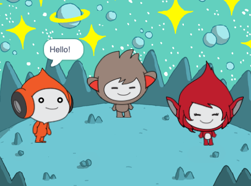

## What you will make

ಈ ಯೋಜನೆಯಲ್ಲಿ, ನೀವು ಆಲೋಚನೆಗಳು ಅಥವಾ ಭಾವನೆಗಳನ್ನು ಹಂಚಿಕೊಳ್ಳಲು 'ಅಭಿನಯಿಸುವ' ಪಾತ್ರಗಳಿರುವ ಅಂತರಿಕ್ಷದ ದೃಶ್ಯವನ್ನು ರಚಿಸುವಿರಿ.

**'ಎಮೋಟ್ಸ್** ಆಟದಲ್ಲಿನ ಪಾತ್ರದ ವ್ಯಕ್ತಿತ್ವವನ್ನು ತೋರಿಸುವ ಒಂದು ಮಾರ್ಗವಾಗಿದೆ. ಸ್ಕ್ರಾಚ್‌ನಂತೆಯೇ ಅವರು ಮಾತು, ಶಬ್ದಗಳು, ಚಲನೆ ಮತ್ತು ಗ್ರಾಫಿಕ್ ಪರಿಣಾಮಗಳನ್ನು ಬಳಸಬಹುದು. ಭಾವನೆಗಳನ್ನು ಬಳಸುವ ಯಾವುದೇ ಆಟಗಳನ್ನು ನೀವು ಆಡುತ್ತೀರಾ?

Scratchನಲ್ಲಿ, ಪಾತ್ರಗಳು ಮತ್ತು ವಸ್ತುಗಳನ್ನು **sprites**ಎಂದು ಕರೆಯಲಾಗುತ್ತದೆ, ಮತ್ತು ಅವು **Stage** ಮೇಲೆ ಕಾಣಿಸಿಕೊಳ್ಳುತ್ತವೆ.
+ ನಿಮ್ಮ ಪ್ರಾಜೆಕ್ಟ್ ಅಣಿಮಾಡಲು ಸ್ಪ್ರೈಟ್ಸ್ ಮತ್ತು **backdrop** ಸೇರಿಸಿ
+ ಸ್ಪ್ರೈಟ್‌ಗಳ ಮೇಲೆ ಕ್ಲಿಕ್ ಮಾಡಿ, `Looks`{:class="block3looks"} ಮತ್ತು `Sound`{:class="block3sound"} ಕೋಡ್ ಬ್ಲಾಕ್‌ಗಳನ್ನು ಬಳಸಿಕೊಂಡು ಸ್ಪ್ರೈಟ್‌ಗಳನ್ನು ಸಂವಹನ ಮಾಡುವಂತೆ ಮಾಡಿ
+ **costume**ನ್ನು ಬದಲಾಯಿಸಲು **Paint editor** ಬಳಸಿ

--- no-print --- --- task ---
### ಇದನ್ನು ಪ್ರಯತ್ನಿಸಿ

  
Click on each sprite to see what they do. 

What happens if you click on one sprite and then quickly click on another sprite?

  <iframe allowtransparency="true" width="485" height="402" src="https://scratch.mit.edu/projects/embed/485673032/?autostart=false" frameborder="0"></iframe>

--- /task --- --- /no-print ---

--- print-only ---

--- /print-only ---

