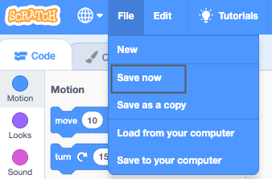

## ನಿಮ್ಮ ದೃಶ್ಯವನ್ನು ಇಲ್ಲಿ ರಚಿಸಿ

ಈ ಹಂತದಲ್ಲಿ, ನೀವು ಬಾಹ್ಯಾಕಾಶ ಹಿನ್ನೆಲೆ ಮತ್ತು ಮೊದಲನೆಯ ಸ್ಪ್ರೈಟ್‌ನೊಂದಿಗೆ ನಿಮ್ಮ ಪ್ರಾಜೆಕ್ಟ್‌ ಅಣಿಮಾಡುವಿರಿ. 

{:width="300px"}

--- task ---

[ಬಾಹ್ಯಾಕಾಶ ಮಾತುಕತೆ ಪ್ರಾರಂಭಿಕ ಪ್ರಾಜೆಕ್ಟ್](https://scratch.mit.edu/projects/582213331/editor){:target="_blank"} ತೆರೆಯಿರಿ. ಸ್ಕ್ರಾಚ್ ಇನ್ನೊಂದು ಬ್ರೌಸರ್ ಟ್ಯಾಬ್‌ನಲ್ಲಿ ತೆರೆಯುತ್ತದೆ.

[[[working-offline]]]

--- /task ---

Scratch ಎಡಿಟರ್ ಈ ರೀತಿ ಕಾಣುತ್ತದೆ:

**Stage** ನಲ್ಲಿ ನಿಮ್ಮ ಪ್ರಾಜೆಕ್ಟ್‌ ರನ್‌ ಆಗುತ್ತದೆ. **backdrop** ವೇದಿಕೆಯ ನೋಟವನ್ನು ಬದಲಾಯಿಸುತ್ತದೆ.

--- task ---

ಸ್ಟೇಜ್‌ ಫಲಕದಲ್ಲಿ **Choose a Backdrop** ಮೇಲೆ ಕ್ಲಿಕ್‌ ಮಾಡಿ(ಅಥವಾ ಟ್ಯಾಬ್ಲೆಟ್‌ನಲ್ಲಿ ಟ್ಯಾಪ್ ಮಾಡಿ):

--- /task ---

--- task ---

**Space** ವರ್ಗದ ಮೇಲೆ ಕ್ಲಿಕ್‌ ಮಾಡಿ ಅಥವಾ ಸರ್ಚ್‌ ಬಾಕ್ಸ್‌ನಲ್ಲಿ `space` ಟೈಪ್‌ ಮಾಡಿ:

--- /task ---

ನಮ್ಮ ಉದಾಹರಣೆಯಲ್ಲಿ, ನಾವು **Space** ಹಿನ್ನೆಲೆ ಆಯ್ಕೆ ಮಾಡಿಕೊಂಡಿದ್ದೇವೆ, ಆದರೆ ನಿಮಗೆ ಯಾವ ಹಿನ್ನೆಲೆ ಅತ್ಯಂತ ಇಷ್ಟವಾಗಿದೆಯೋ ಅದನ್ನು ಆಯ್ಕೆಮಾಡಿಕೊಳ್ಳಿ.

--- task ---

ನಿಮ್ಮ ಪ್ರಾಜೆಕ್ಟ್‌ಗೆ ಸೇರಿಸಲು ನೀವು ಆಯ್ಕೆ ಮಾಡಿಕೊಂಡ ಹಿನ್ನೆಲೆಯ ಮೇಲೆ ಕ್ಲಿಕ್‌ ಮಾಡಿ. ನೀವು ಆಯ್ಕೆಮಾಡಿಕೊಂಡ ಹಿನ್ನೆಲೆಯನ್ನು Stage ತೋರಿಸಬೇಕು:

--- /task ---

ನಿಮ್ಮ ಪ್ರಾಜೆಕ್ಟ್‌ನಲ್ಲಿ ಈಗಾಗಲೇ ಸೇರಿಸಿದ ಸ್ಪ್ರೈಟ್‌ನ್ನು ನೀವು ನೋಡಬಹುದೇ? ಅದು Scratch Cat.

--- task ---

**Sprite1** (Scratch Cat) ಸ್ಪ್ರೈಟ್‌ ತೆಗೆದುಹಾಕಿ: Stage ಕೆಳಗಿನ Sprite list ನಲ್ಲಿ **Sprite1** ಸ್ಪ್ರೈಟ್‌ ಆಯ್ಕೆಮಾಡಿ ಮತ್ತು **Delete** ಐಕಾನ್‌ ಮೇಲೆ ಕ್ಲಿಕ್‌ ಮಾಡಿ.

--- /task ---

--- task ---

Sprite ಪಟ್ನಟಿಯಲ್ಲಿ **Choose a Sprite** ಮೇಲೆ ಕ್ಲಿಕ್‌ ಮಾಡಿ:

--- /task ---

--- task ---

**Fantasy** ವರ್ಗವನ್ನು ಆಯ್ಕೆಮಾಡಿಕೊಳ್ಳಿ. ಅವುಗಳನ್ನು ನಿಮ್ಮ ಪ್ರಾಜೆಕ್ಟ್‌ಗೆ ಸೇರಿಸಲು **Pico** ಸ್ಪ್ರೈಟ್‌ ಮೇಲೆ ಕ್ಲಿಕ್‌ ಮಾಡಿ.

--- /task ---

--- task ---

ಸ್ಟೇಜ್‌ನ ಎಡಭಾಗದಲ್ಲಿ ಅವುಗಳನ್ನು ಇಡಲು **Pico** ಸ್ಪ್ರೈಟ್‌ನ್ನು ಎಳೆಯಿರಿ. ನಿಮ್ಮ Stage ಈ ರೀತಿ ಕಾಣಬೇಕು:

--- /task ---

--- task ---

ನಿಮ್ಮScratch ಖಾತೆಗೆ ನೀವು ಸೈನ್ ಇನ್ ಆಗಿದ್ದರೆ, ಹಸಿರು Remix ಬಟನ್ ಕ್ಲಿಕ್ ಮಾಡಿ. ಇದು ಪ್ರಾಜೆಕ್ಟ್‌ನ ನಕಲನ್ನು ನಿಮ್ಮ Scratch ಖಾತೆಗೆ ಉಳಿಸುತ್ತದೆ(ಸೇವ್‌ ಮಾಡುತ್ತದೆ).

ಪರದೆಯ ಮೇಲ್ಭಾಗದಲ್ಲಿರುವ ಪ್ರಾಜೆಕ್ಟ್ ಹೆಸರಿನ ಬಾಕ್ಸ್‌ನಲ್ಲಿ ನಿಮ್ಮ ಪ್ರಾಜೆಕ್ಟ್‌ನ ಹೆಸರನ್ನು ಟೈಪ್ ಮಾಡಿ.

**ಸಲಹೆ:** ನಿಮ್ಮ ಪ್ರಾಜೆಕ್ಟ್‌ಗಳಿಗೆ ಸಹಾಯಕವಾಗುವ ಹೆಸರುಗಳನ್ನು ನೀಡಿ ಇದರಿಂದ ನೀವು ಸಾಕಷ್ಟು ಯೋಜನೆಗಳನ್ನು ಹೊಂದಿರುವಾಗ ಅವುಗಳನ್ನು ಸುಲಭವಾಗಿ ಹುಡುಕಬಹುದು.

ನಂತರ, ನಿಮ್ಮ ಪ್ರಾಜೆಕ್ಟ್ ಅನ್ನು ಸೇವ್ ಮಾಡಲು ನೀವು **File** ಮೇಲೆ ಕ್ಲಿಕ್ ಮಾಡಿ ತದನಂತರ **Save now** ಮೇಲೆ ಕ್ಲಿಕ್ ಮಾಡಿ.

ನೀವು ಆನ್‌ಲೈನ್‌ನಲ್ಲಿಲ್ಲದಿದ್ದರೆ ಅಥವಾ ನಿಮ್ಮಲ್ಲಿ ಸ್ಕ್ರಾಚ್ ಖಾತೆಯಿಲ್ಲದಿದ್ದರೆ, ನಿಮ್ಮ ಪ್ರಾಜೆಕ್ಟ್ ಪ್ರತಿಯನ್ನು ಉಳಿಸಲು(ಸೇವ್ ಮಾಡಲು) **Save to your computer** ಮೇಲೆ ಕ್ಲಿಕ್ ಮಾಡಬಹುದು.

--- /task ---

