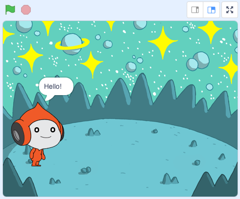
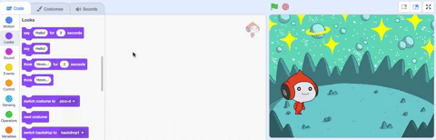

## Pico hello ಹೇಳುತ್ತಾನೆ

<div style="display: flex; flex-wrap: wrap">
<div style="flex-basis: 200px; flex-grow: 1; margin-right: 15px;">
ಸ್ಪ್ರೈಟ್ ಹೇಗೆ ಕಾಣುತ್ತದೆ ಮತ್ತು ಏನು ಮಾಡುತ್ತದೆ ಎಂಬುದನ್ನು ಬದಲಾಯಿಸಲು ಅದು ಕೋಡ್, ಉಡುಪುಗಳು ಮತ್ತು ಶಬ್ದಗಳನ್ನು ಹೊಂದಬಹುದು. 
  
ಸ್ಪ್ರೈಟ್‌ನ್ನು ಕ್ಲಿಕ್ ಮಾಡಿದಾಗ ಪದಗಳು ಮತ್ತು ಧ್ವನಿಯೊಂದಿಗೆ Pico ಭಾವನೆಯನ್ನು ಅಭಿನಯಿಸಲು ನೀವು ಕೋಡ್ ಬ್ಲಾಕ್‌ಗಳನ್ನು ಸೇರಿಸುತ್ತೀರಿ.
</div>
<div>

{:width="300px"}

</div>
</div>

Blocks ಉಪಯೋಗಿಸಲು ನೀವು Blocks ಮೆನುವಿನಲ್ಲಿ ಅವುಗಳ ಮೇಲೆ ಕ್ಲಿಕ್‌ ಮಾಡಬಹುದು.

--- task ---

`Looks`{:class="block3looks"} ಬ್ಲಾಕ್‌ ಮೆನು ತೆರೆಯಿರಿ.

`say`{:class="block3looks"} `Hello!` `for`{:class="block3looks"} `2` `seconds`{:class="block3looks"} ಬ್ಲಾಕ್‌ ಮೇಲೆ ಕ್ಲಿಕ್‌ ಮಾಡಿ.


**Pico** ಸ್ಪ್ರೈಟ್ ಎರಡು ಸೆಕೆಂಡುಗಳ ಕಾಲ ಮಾತಿನ ಗುಳ್ಳೆಯನ್ನು ತೋರಿಸುತ್ತದೆ.



**ಸಲಹೆ:** Scratchನಲ್ಲಿರುವ ಕೋಡ್ ಬ್ಲಾಕ್‌ಗಳು ರನ್‌ ಆಗುತ್ತಿರುವಾಗ ಹಳದಿ ಬಾಹ್ಯರೇಖೆಗಳೊಂದಿಗೆ ಹೊಳೆಯುತ್ತವೆ.

--- /task ---

ನೀವು Code ಪ್ರದೇಶಕ್ಕೆ ಬ್ಲಾಕ್‌ಗಳನ್ನು ಎಳೆಯಬಹುದು ಮತ್ತು ಅಲ್ಲಿಂದ ಅವುಗಳನ್ನು ಉಪಯೋಗಿಸಬಹುದು.

--- task ---

`say`{:class="block3looks"} `Hello!` `for`{:class="block3looks"} `2` `seconds`{:class="block3looks"} ಬ್ಲಾಕ್‌ನ್ನು Code ಪ್ರದೇಶಕ್ಕೆ ಎಳೆಯಿರಿ. ಅದರ ಮೇಲೆ ಮತ್ತೊಮ್ಮೆ ಕ್ಲಿಕ್ ಮಾಡಿ.




--- /task ---

ಒಂದೇ ಸಮಯದಲ್ಲಿ ಒಂದಕ್ಕಿಂತ ಹೆಚ್ಚು ರನ್ ಮಾಡಲು Code ಪ್ರದೇಶದಲ್ಲಿ ಬ್ಲಾಕ್‌ಗಳನ್ನು ಒಟ್ಟಿಗೆ ಸಂಪರ್ಕಿಸಬಹುದು. ಸಂಪರ್ಕಿತ ಬ್ಲಾಕ್‌ಗಳು ಮೇಲಿನಿಂದ ಕೆಳಕ್ಕೆ ಕ್ರಮವಾಗಿ ರನ್‌ ಆಗುತ್ತವೆ.

--- task ---

`when this sprite clicked`{:class="block3events"} ಬ್ಲಾಕ್‌ನ್ನು `Events`{:class="block3events"} ಬ್ಲಾಕ್‌ಗಳ ಮೆನುಯಿಂದ ಎಳೆಯಿರಿ ಮತ್ತು ಅದನ್ನುCode ಪ್ರದೇಶದಲ್ಲಿರುವ ನಿಮ್ಮ `say`{:class="block3looks"}ಗೆ ಮೇಲ್ಭಾಗಕ್ಕೆ ಸಂಪರ್ಕಿಸಿ. ಬ್ಲಾಕ್‌ಗಳು ಒಟ್ಟಿಗೆ ಅಂಟಿಕೊಳ್ಳುತ್ತವೆ.


```blocks3
+when this sprite clicked
say [Hello!] for [2] seconds // hide speech after 2 seconds
```

--- /task ---

ಟಿಪ್ಪಣಿ(ಕಾಮೆಂಟ್)‌ ನಿಮ್ಮ ಕೋಡ್‌ ಏನು ಮಾಡುತ್ತದೆ ಎಂಬುವುದರ ವಿವರಣೆ.

```blocks3
say [Hello!] for [2] seconds // hide speech after 2 seconds
```
ಕೋಡ್‌ ಉದಾಹರಣೆಗಳಲ್ಲಿ ನೀವು ಟಿಪ್ಪಣಿ(ಕಾಮೆಂಟ್)‌ಗಳನ್ನು ನೋಡುತ್ತೀರಿ. ನಿಮ್ಮ ಪ್ರಾಜೆಕ್ಟ್‌ಗೆ ನೀವು ಕೋಡ್ ಅನ್ನು ಸೇರಿಸಿದಾಗ ಟಿಪ್ಪಣಿಗಳನ್ನು( ಕಾಮೆಂಟ್‌ಗಳನ್ನು) ಸೇರಿಸುವ ಅಗತ್ಯವಿಲ್ಲ.

ನೀವು ನಿಮ್ಮ ಪ್ರಾಜೆಕ್ಟ್‌ ಪೂರ್ಣಗೊಳಿಸಿದ ನಂತರ ನಿಮಗೆ ಸಮಯವಿದ್ದರೆ, ನಿಮ್ಮ ಕೋಡ್‌ಗಳಿಗೆ ಟಿಪ್ಪಣಿ(ಕಾಮೆಂಟ್)‌ ಸೇರಿಸುವುದ ಒಳ್ಳೆಯದು, ಇದರಿಂದ ನಂತರ ಅರ್ಥಮಾಡಿಕೊಳ್ಳಲು ಸುಲಭವಾಗುತ್ತದೆ. ಟಿಪ್ಪಣಿ(ಕಾಮೆಂಟ್)‌ ಸೇರಿಸಲು, Code ಪ್ರದೇಶದಲ್ಲಿರುವ ಬ್ಲಾಕ್‌ ಮೇಲೆ ರೈಟ್-ಕ್ಲಿಕ್‌ ಮಾಡಿ(ಅಥವಾ ಟ್ಯಾಬ್ಲೆಟ್‌ನಲ್ಲಿಯಾದರೆ, ಟ್ಯಾಪ್‌ ಮಾಡಿ ಹಿಡಿದುಕೊಳ್ಳಿ) ಮತ್ತು **Add Comment** ಆಯ್ಕೆಮಾಡಿಕೊಳ್ಳಿ.


--- task ---

**ಪರೀಕ್ಷೆ:** Stage ಮೇಲಿನ **Pico** ಸ್ಪ್ರೈಟ್ ಮೇಲೆ ಕ್ಲಿಕ್ ಮಾಡಿ ಮತ್ತು ಎರಡು ಸೆಕೆಂಡುಗಳ ಕಾಲ ಮಾತಿನ ಗುಳ್ಳೆ ಕಾಣಿಸಿಕೊಳ್ಳುತ್ತದೆಯೇ ಎಂದು ಪರಿಶೀಲಿಸಿ. ನಿಮ್ಮ ಕೋಡ್‌ ನೀವು ನಿರೀಕ್ಷಿಸಿದುದನ್ನು ಮಾಡುತ್ತದೆಯೇ ಎಂದು ಪರೀಕ್ಷೆ ಮಾಡುವುದು ಮಹತ್ವವಾಗಿರುತ್ತದೆ.

--- /task ---

--- save ---
