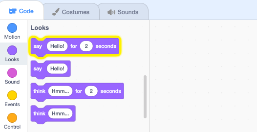

## Pico says hello

<div style="display: flex; flex-wrap: wrap">
<div style="flex-basis: 200px; flex-grow: 1; margin-right: 15px;">
ಸ್ಪ್ರೈಟ್ ಹೇಗೆ ಕಾಣುತ್ತದೆ ಮತ್ತು ಏನು ಮಾಡುತ್ತದೆ ಎಂಬುದನ್ನು ಬದಲಾಯಿಸಲು ಅದು ಕೋಡ್, ಉಡುಪುಗಳು ಮತ್ತು ಶಬ್ದಗಳನ್ನು ಹೊಂದಬಹುದು. 
  
ಸ್ಪ್ರೈಟ್‌ನ್ನು ಕ್ಲಿಕ್ ಮಾಡಿದಾಗ ಪದಗಳು ಮತ್ತು ಧ್ವನಿಯೊಂದಿಗೆ Pico ಭಾವನೆಯನ್ನು ಅಭಿನಯಿಸಲು ನೀವು ಕೋಡ್ ಬ್ಲಾಕ್‌ಗಳನ್ನು ಸೇರಿಸುತ್ತೀರಿ.
</div>
<div>

{:width="300px"}

</div>
</div>

To use blocks, you can click on them in the Blocks menu.

--- task ---

`Looks`{:class="block3looks"} ಬ್ಲಾಕ್‌ ಮೆನು ತೆರೆಯಿರಿ.

`say`{:class="block3looks"} `Hello!` `for`{:class="block3looks"} `2` `seconds`{:class="block3looks"} ಬ್ಲಾಕ್‌ ಮೇಲೆ ಕ್ಲಿಕ್‌ ಮಾಡಿ.



**Pico** ಸ್ಪ್ರೈಟ್ ಎರಡು ಸೆಕೆಂಡುಗಳ ಕಾಲ ಮಾತಿನ ಗುಳ್ಳೆಯನ್ನು ತೋರಿಸುತ್ತದೆ.


**Tip:** Code blocks in Scratch glow with a yellow outline when they are running.

--- /task ---

You can drag blocks to the Code area, and they can be used from there.

--- task ---

Drag the `say`{:class="block3looks"} `Hello!` `for`{:class="block3looks"} `2` `seconds`{:class="block3looks"} block to the Code area. ಅದರ ಮೇಲೆ ಮತ್ತೊಮ್ಮೆ ಕ್ಲಿಕ್ ಮಾಡಿ.


--- /task ---

Blocks can be connected together in the Code area to run more than one at a time. ಸಂಪರ್ಕಿತ ಬ್ಲಾಕ್‌ಗಳು ಮೇಲಿನಿಂದ ಕೆಳಕ್ಕೆ ಕ್ರಮವಾಗಿ ರನ್‌ ಆಗುತ್ತವೆ.

--- task ---

Drag a `when this sprite clicked`{:class="block3events"} block from the `Events`{:class="block3events"} blocks menu and connect it to the top of your `say`{:class="block3looks"} block in the Code area. ಬ್ಲಾಕ್‌ಗಳು ಒಟ್ಟಿಗೆ ಅಂಟಿಕೊಳ್ಳುತ್ತವೆ.


```blocks3
+when this sprite clicked
say [Hello!] for [2] seconds // hide speech after 2 seconds
```

--- /task ---

ಟಿಪ್ಪಣಿ(ಕಾಮೆಂಟ್)‌ ನಿಮ್ಮ ಕೋಡ್‌ ಏನು ಮಾಡುತ್ತದೆ ಎಂಬುವುದರ ವಿವರಣೆ.

```blocks3
say [Hello!] for [2] seconds // hide speech after 2 seconds
```
ಕೋಡ್‌ ಉದಾಹರಣೆಗಳಲ್ಲಿ ನೀವು ಟಿಪ್ಪಣಿ(ಕಾಮೆಂಟ್)‌ಗಳನ್ನು ನೋಡುತ್ತೀರಿ. ನಿಮ್ಮ ಪ್ರಾಜೆಕ್ಟ್‌ಗೆ ನೀವು ಕೋಡ್ ಅನ್ನು ಸೇರಿಸಿದಾಗ ಟಿಪ್ಪಣಿಗಳನ್ನು( ಕಾಮೆಂಟ್‌ಗಳನ್ನು) ಸೇರಿಸುವ ಅಗತ್ಯವಿಲ್ಲ.

ನೀವು ನಿಮ್ಮ ಪ್ರಾಜೆಕ್ಟ್‌ ಪೂರ್ಣಗೊಳಿಸಿದ ನಂತರ ನಿಮಗೆ ಸಮಯವಿದ್ದರೆ, ನಿಮ್ಮ ಕೋಡ್‌ಗಳಿಗೆ ಟಿಪ್ಪಣಿ(ಕಾಮೆಂಟ್)‌ ಸೇರಿಸುವುದ ಒಳ್ಳೆಯದು, ಇದರಿಂದ ನಂತರ ಅರ್ಥಮಾಡಿಕೊಳ್ಳಲು ಸುಲಭವಾಗುತ್ತದೆ. To add a comment, right-click (or on a tablet, tap and hold) on a block in the Code area and choose **Add Comment**.


--- task ---

**Test:** Click on the **Pico** sprite on the Stage and check that the speech bubble appears for two seconds. ನಿಮ್ಮ ಕೋಡ್‌ ನೀವು ನಿರೀಕ್ಷಿಸಿದುದನ್ನು ಮಾಡುತ್ತದೆಯೇ ಎಂದು ಪರೀಕ್ಷೆ ಮಾಡುವುದು ಮಹತ್ವವಾಗಿರುತ್ತದೆ.

--- /task ---

--- save ---
