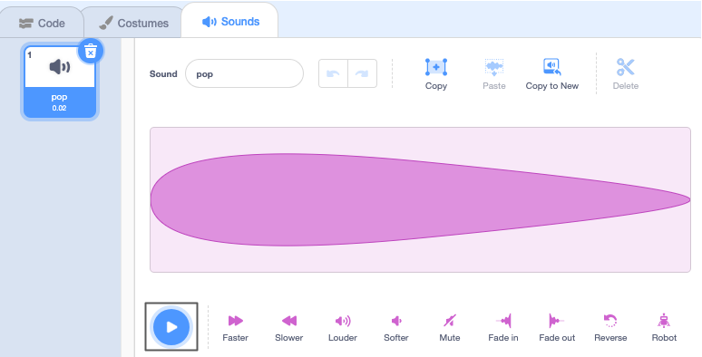

## Pico ಧ್ವನಿಯನ್ನು ನುಡಿಸುತ್ತಾನೆ

<div style="display: flex; flex-wrap: wrap">
<div style="flex-basis: 200px; flex-grow: 1; margin-right: 15px;">
ಸಂವಹನ ಮಾಡುವ ಇನ್ನೊಂದು ವಿಧಾನವೆಂದರೆ ಧ್ವನಿಯನ್ನು ಬಳಸುವುದು.
</div>
<div>

![Pico ಸ್ಪ್ರೈಟ್ "Hello!" ಹೇಳುತ್ತಿರುವುದು]‌(images/pico-step2.png){:width="300px"}

</div>
</div>

--- task ---

**Pico** ಸ್ಪ್ರೈಟ್‌ಗೆ **Sounds** ಟ್ಯಾಬ್‌ ಮೇಲೆ ಕ್ಲಿಕ್‌ ಮಾಡಿ ಮತ್ತು ನೀವು **pop** ಧ್ವನಿಯನ್ನು ಕಾಣಬಹುದು. **pop** ಧ್ವನಿಯನ್ನು ಕೇಳಿಸಿಕೊಳ್ಳಲು **Play** ಐಕಾನ್‌ ಮೇಲೆ ಕ್ಲಿಕ್‌ ಮಾಡಿ.



--- /task ---

Scratch‌ ನಲ್ಲಿ ಕೆಲವು ಅದ್ಭುತ ಏಲಿಯನ್ ಶಬ್ದಗಳಿವೆ, ಅದನ್ನು ನೀವು ನಿಮ್ಮ ಸ್ಪ್ರೈಟ್‌ಗೆ ಸೇರಿಸಬಹುದು.

--- task ---

ಹೊಸ ಶಬ್ದವನ್ನು ಆಯ್ಕೆ ಮಾಡಲು, **Choose a Sound** ಐಕಾನ್‌ ಮೇಲೆ ಕ್ಲಿಕ್‌ ಮಾಡಿ ಮತ್ತು **Space** ವರ್ಗವನ್ನು ಆಯ್ಕೆಮಾಡಿಕೊಳ್ಳಿ ಅಥವಾ ಸರ್ಚ್‌ ಬಾಕ್ಸ್‌ನಲ್ಲಿ `space` ಟೈಪ್‌ ಮಾಡಿ.


--- /task ---

--- task ---

**Play** ಐಕಾನ್‌ಗಳನ್ನು ಉಪಯೋಗಿಸಿ ಬೇರೆ ಬೇರೆ ಧ್ವನಿಗಳನ್ನು ನುಡಿಸಿ. ನೀವು ಉಪಯೋಗಿಸಬೇಕೆಂದಿರುವ ಧ್ವನಿಯು ನಿಮಗೆ ಸಿಕ್ಕಾಗ, ನಿಮ್ಮ ಪ್ರಾಜೆಕ್ಟ್‌ಗೆ ಅದನ್ನು ಸೇರಿಸಲು ಅದರ ಮೇಲೆ ಕ್ಲಿಕ್‌ ಮಾಡಿ.


--- /task ---

--- task ---

**Code** ಟ್ಯಾಬ್‌ ಮೇಲೆ ಕ್ಲಿಕ್‌ ಮಾಡಿ. `Sound`{:class="block3sound"} ಬ್ಲಾಕ್‌ಗಳ ಮೆನುವಿನಲ್ಲಿ, `start sound`{:class="block3sound"} ಬ್ಲಾಕ್‌ ಹುಡುಕಿ.

`when this sprite clicked`{:class="block3events"} ಬ್ಲಾಕ್‌ ಮತ್ತು `say`{:class="block3looks"} ಬ್ಲಾಕ್‌ ನಡುವೆ, ಬ್ಲಾಕ್‌ನ್ನು Code ಪ್ರದೇಶಕ್ಕೆ ಎಳೆಯಿರಿ. ಒಂದು ಅಂತರ ತೆರೆಯುತ್ತದೆ ಮತ್ತು ಆ ಜಾಗದಲ್ಲಿ ಬ್ಲಾಕ್‌ ಸೇರಿಕೊಳ್ಳುತ್ತದೆ.


ನಿಮ್ಮ ಕೋಡ್ ಈ ರೀತಿ ಇರಬೇಕು:


```blocks3
when this sprite clicked
+start sound [Alien Creak1 v] 
say [Hello!] for [2] seconds // 2 ಸೆಕೆಂಡುಗಳ ನಂತರ ಮಾತನ್ನು ಮರೆಮಾಡಿ
```

--- /task ---

--- task ---

ನಿಮ್ಮ `start sound`{:class="block3sound"} ಬ್ಲಾಕ್‌ ಅದರಲ್ಲಿ ನೀವು ಆಯ್ಕೆ ಮಾಡಿದ ಧ್ವನಿಯನ್ನು ಹೊಂದಿದೆಯೇ ಎಂದು ಪರಿಶೀಲಿಸಿ. ಅದರಲ್ಲಿ ಇಲ್ಲವಾದರೆ, ನೀವು `start sound`{:class="block3sound"} ಬ್ಲಾಕ್‌ನಲ್ಲಿ ಧ್ವನಿಯ ಮೇಲೆ ಕ್ಲಿಕ್‌ ಮಾಡಬೇಕು, ನಂತರ ಡ್ರಾಪ್-ಡೌನ್‌ ಮೆನುನಲ್ಲಿ ನಿಮ್ಮ ಆಯ್ಕೆಯ ಧ್ವನಿಯನ್ನು ಆಯ್ಕೆಮಾಡಿಕೊಳ್ಳಬೇಕು.


--- /task ---

--- task ---

**ಪರೀಕ್ಷೆ:** **Pico** ಸ್ಪ್ರೈಟ್‌ ಮೇಲೆ ಕ್ಲಿಕ್‌ ಮಾಡಿ ಮತ್ತು ಮಾತಿನ ಗುಳ್ಳೆ ಕಾಣಿಸುತ್ತದೆಯೇ ಎಂದು ಪರಿಶೀಲಿಸಿ ಮತ್ತು ನೀವು ಧ್ವನಿಯನ್ನು ಕೇಳಿಸಿಕೊಳ್ಳಬಹುದು. ನಿಮಗೆ ಧ್ವನಿ ಕೇಳದಿದ್ದರೆ, `when this sprite clicked`{:class="block3events"} ಬ್ಲಾಕ್‌ ಕೆಳಗೆ ನೀವು `start sound`{:class="block3sound"} ಬ್ಲಾಕ್‌ ಸೇರಿಸಿರುವುದನ್ನು ಖಚಿತಪಡಿಸಿಕೊಳ್ಳಿ. ನಿಮ್ಮ ಕಂಪ್ಯೂಟರ್‌ ಅಥವಾ ಟ್ಯಾಬ್ಲೆಟ್‌ನಲ್ಲಿ ಧ್ವನಿ ಕೇಳಿಸುತ್ತಿದೆಯೇ ಎಂದೂ ಸಹ ಪರಿಶೀಲಿಸಿ.

--- /task ---

--- save ---

