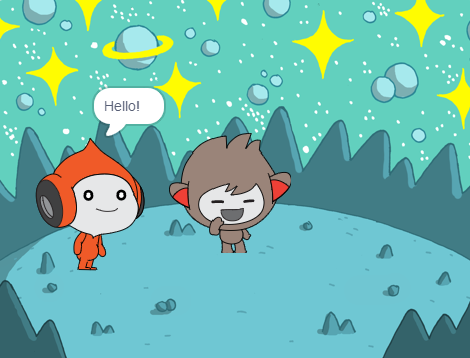
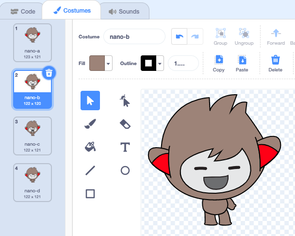
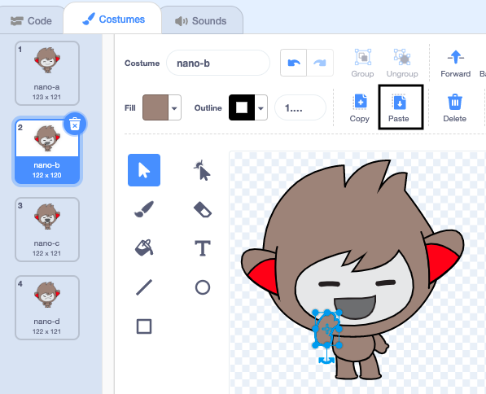

## Nano ಉಡುಪುಗಳನ್ನು ಬದಲಾಯಿಸುತ್ತದೆ

<div style="display: flex; flex-wrap: wrap">
<div style="flex-basis: 200px; flex-grow: 1; margin-right: 15px;">

Get Nano to emote by switching **costumes**.

ಸ್ಪ್ರೈಟ್‌ಗಳಿಗೆ ಅವುಗಳು ಯಾವ ರೀತಿ ಕಾಣುತ್ತವೆ ಎಂಬುವುದನ್ನು ಬದಲಾಯಿಸಲು **costumes** ಇವೆ. They are usually slightly different images of the same sprite. To animate a sprite, you can change its costume.

</div>
<div>

{:width="300px"}

</div>
</div>

### Nano "Thanks!" ಹೇಳುತ್ತಾನೆ

--- task ---

ನಿಮ್ಮ ಪ್ರಾಜೆಕ್ಟ್‌ಗೆ **Fantasy** ವರ್ಗದಿಂದ **Nano** ಸ್ಪ್ರೈಟ್‌ ಸೇರಿಸಿ.


--- /task ---

--- task ---

Stage ಕೆಳಗೆ Sprite ಲಿಸ್ಟ್‌ನಲ್ಲಿ **Nano** ಸ್ಪ್ರೈಟ್‌ ಆಯ್ಕೆ ಮಾಡಿರುವುದನ್ನು ಖಚಿತಪಡಿಸಿಕೊಳ್ಳಿ.


Click on the **Code** tab and add a script to get the **Nano** sprite to sign 'Thanks' using `switch costume to`{:class="block3looks"} and `wait`{:class="block3control"}. Use the drop down menu to switch between `nano-b`{:class="block3looks"} and `nano-a`{:class="block3looks"}:


```blocks3
when this sprite clicked // when Nano is clicked
switch costume to [nano-b v] // Nano talking
wait (0.5) seconds // try 0.25 instead of 0.5
switch costume to [nano-a v] // Nano smiling
```
--- /task ---

**ಸಲಹೆ:** ಎಲ್ಲಾ ಬ್ಲಾಕ್‌ಗಳಿಗೆ ಬಣ್ಣಗಳನ್ನು ಕೊಡಲಾಗಿದೆ, ಆದುದರಿಂದ ನೀವು `switch costume to`{:class="block3looks"} ಬ್ಲಾಕ್‌ನ್ನು `Looks`{:class="block3looks"} ಬ್ಲಾಕ್‌ಗಳ ಮೆನುನಲ್ಲಿ ನೋಡುವಿರಿ.

--- task ---

**ಪರೀಕ್ಷೆ:** Stage ಮೇಲಿನ **Nano** ಸ್ಪ್ರೈಟ್‌ ಮೇಲೆ ಕ್ಲಿಕ್‌ ಮಾಡಿ ಮತ್ತು ಮಾತಿನ ಗುಳ್ಳೆ ಕಾಣುತ್ತದೆ ಮತ್ತು Nanoನ ಉಡುಪು ಬದಲಾಗುವುದನ್ನು ಪರಿಸೀಲಿಸಿ.

--- /task ---

### Nano ಸಂಕೇತ ಭಾಷೆಯನ್ನು ಬಳಸುತ್ತದೆ

<p style="border-left: solid; border-width:10px; border-color: #0faeb0; background-color: aliceblue; padding: 10px;">ಲಕ್ಷಾಂತರ ಜನರು ಸಂವಹನಕ್ಕಾಗಿ ಸಂಕೇತ ಭಾಷೆಯನ್ನು ಬಳಸುತ್ತಾರೆ. A common way to sign 'Thank you' is to place your fingers on your chin with your hand as flat as possible. You then move your hand forwards, away from your chin and slightly down. 
</p>

<!-- Add a video of someone signing -->

Nano ಉಡುಪುಗಳನ್ನು ಬದಲಾಯಿಸುವ ಮೂಲಕ ಸಂಕೇತ ಭಾಷೆಯನ್ನು ಉಪಯೋಗಿಸುತ್ತದೆ.

ನೀವು ನಿಮ್ಮ ಸ್ಪ್ರೈಟ್‌ಗಳ ಉಡುಪುಗಳನ್ನು Paint editor ನೊಂದಿಗೆ ಎಡಿಟ್‌ ಮಾಡಬಹುದು. Nano "thank you" ಸಂಕೇತ ತೋರಿಸಲು ನೀವು ಅವುಗಳ ಉಡುಪನ್ನು ಎಡಿಟ್‌ ಮಾಡುವಿರಿ.

--- task ---

**Nano** ಸ್ಪ್ರೈಟ್‌ಗೆ ಉಡುಪು ನೋಡಲು **Costumes** ಟ್ಯಾಬ್‌ ಕ್ಲಿಕ್‌ ಮಾಡಿ:


--- /task ---

--- task ---

**nano-b** ಉಡುಪಿನ ಮೇಲೆ ಕ್ಲಿಕ್‌ ಮಾಡಿ. ಎಡಭಾಗದಲ್ಲಿರುವ ತೋಳಿನ ಮೇಲೆ ಕ್ಲಿಕ್‌ ಮಾಡಿ, ಮತ್ತು ನಂತರ **Delete** ಮೇಲೆ ಕ್ಲಿಕ್‌ ಮಾಡಿ.


ಉಡುಪು ಈ ರೀತಿ ಕಾಣಿಸಬೇಕು:



--- /task ---

**ಸಲಹೆ:** ನೀವು Paint editor ನಲ್ಲಿ ತಪ್ಪು ಮಾಡಿದರೆ, ನೀವು **Undo** ಮೇಲೆ ಕ್ಲಿಕ್‌ ಮಾಡಬಹುದು.


--- task ---

**nano-c** ಉಡುಪಿಗೆ ಹೋಗಿ ಮತ್ತು ಎಡಭಾಗದಲ್ಲಿರುವ ತೋಲಿನ ಮೇಲೆ ಕ್ಲಿಕ್‌ ಮಾಡಿ, ನಂತರ **Copy** ಕ್ಲಿಕ್‌ ಮಾಡಿ.


--- /task ---

--- task ---

**nano-b** ಉಡುಪಿಗೆ ಮರಳಿ ಹೋಗಿ ಮತ್ತು **Paste** ಮೇಲೆ ಕ್ಲಿಕ್‌ ಮಾಡಿ. ಉಡುಪು ಈ ರೀತಿ ಕಾಣಬೇಕು:



--- /task ---

--- task ---

**ಪರೀಕ್ಷೆ:** Stage ಮೇಲಿನ **Nano** ಸ್ಪ್ರೈಟ್‌ ಮೇಲೆ ಕ್ಲಿಕ್‌ ಮಾಡಿ ಮತ್ತು ಮಾತಿನ ಗುಳ್ಳೆ ಕಾಣುತ್ತದೆಯೆ ಮತ್ತು Nanoನ ಉಡುಪು ನೀವು ಎಡಿಟ್‌ ಮಾಡಿದ ಉಡುಪಿಗೆ ಬದಲಾಗುತ್ತದೆಯೇ ಎಂದು ಪರಿಶೀಲಿಸಿ.

--- /task ---

<p style="border-left: solid; border-width:10px; border-color: #0faeb0; background-color: aliceblue; padding: 10px;">"ಧನ್ಯವಾದ" ಹೇಗೆ ಸಂಕೇತ ಮಾಡಬೇಕು ಎಂದು ನೀವು ತಿಳಿದುಕೊಂಡಿರಿ. ಮುಂದಿನ ಬಾರಿ ನೀವು ಯಾರಿಗಾದರೂ ಧನ್ಯವಾಧ ತಿಳಿಸುವಾಗ, ನಿಮ್ಮ ಹೊಸ ಕೌಶಲ್ಯವನ್ನು ಏಕೆ ಉಪಯೋಗಿಸಬಾರದು?
</p>

