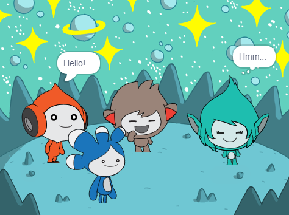

## ನಿಮ್ಮ ಪ್ರಾಜೆಕ್ಟ್‌ ಅಪ್‌ಗ್ರೇಡ್‌ ಮಾಡಿ

<div style="display: flex; flex-wrap: wrap">
<div style="flex-basis: 200px; flex-grow: 1; margin-right: 15px;">
**Tera** ಸ್ಪ್ರೈಟ್‌ ಸೇರಿಸಿ ಮತ್ತು ನೀವು ಕಲಿತಿರುವ ಯಾವುದಾದರೂ ಬ್ಲಾಕ್‌ಗಳನ್ನು ಉಪಯೋಗಿಸಿ **Tera** ಸ್ಪ್ರೈಟ್‌ ಭಾವನೆಗಳನ್ನು ಅಭಿನಯಿಸುವಂತೆ ಮಾಡಿ.
</div>
<div>

{:width="300px"}

</div>
</div>

**Tera** ಸ್ಪ್ರೈಟ್‌ನ ವ್ಯಕ್ತಿತ್ವ ನಿಮ್ಮ ಆಯ್ಕೆ, ಆದುದರಿಂದ ನಿಮ್ಮದೇ ರಚನಾತ್ಮಕ ಆಲೋಚನೆಗಳನ್ನು ಉಪಯೋಗಿಸಿ ಆನಂದಿಸಿ.

```blocks3
when this sprite clicked

say [Hello!] for [2] seconds

say [Hello!]

say [] // hide speech bubble

think [Hmm...] for [2] seconds

switch costume to [tera-d v]

set [color v] effect to [0] // number up to 200

clear graphic effects

play sound [pop v] until done

start sound [pop v]
```

ನಿಮಗಿಷ್ಟವಾದ ಬದಲಾವಣೆಗಳನ್ನು ಮಾಡಲು ನೀವು ಪ್ರಾಜೆಕ್ಟ್‌ನ್ನು 'remix' ಮಾಡಬಹುದು. ನೀವು ಹಿನ್ನೆಲೆಯನ್ನು ಮತ್ತು ಸ್ಪ್ರೈಟ್‌ಗಳು ಹೇಗೆ ಅಭಿನಯಿಸುತ್ತವೆ ಎಂಬುವುದನ್ನು ಬದಲಾಯಿಸಬೇಕು ಮತ್ತು ಬೇರೆ ಬೇರೆ ಸ್ಪ್ರೈಟ್‌ಗಳನ್ನು ಸಹ ಆಯ್ಕೆ ಮಾಡಿಕೊಂಡು ಅವುಗಳಿಗೆ ಬೇರೆ ಬೇರೆ ಭಾವನೆಗಳನ್ನು ಕೊಡಿ.

**Tip:** Click on a sprite in the Sprite list below the Stage to change the code, costumes, and sound for that sprite.

--- collapse ---
---
ಶೀರ್ಷಿಕೆ: ಬಾಹ್ಯಾಕಾಶ ಮಾತುಕತೆ ಪ್ರಮಾಣಪತ್ರ
---

ಭೇಷ್! ನೀವು ಬಾಹ್ಯಾಕಾಶ ಮಾತುಕತೆ ಪ್ರಾಜೆಕ್ಟ್‌ ಪೂರ್ಣಗೊಳಿಸಿದ್ದೀರಿ. ನಿಮ್ಮ ಹೊಸ ಕೌಶಲ್ಯವನ್ನು ಆಚರಿಸಲು [ಪ್ರಮಾಣಪತ್ರ](https://drive.google.com/file/d/18xx4uNIyRSty_2ujHkGDzGwTgfSGC1AF/view?usp=sharing){:target="_blank"} ಇಲ್ಲಿದೆ. ಪ್ರತಿಯನ್ನು ಡೌನ್‌ಲೋಡ್‌ ಮಾಡಿಕೊಳ್ಳಿ ನಂತರ ನಿಮ್ಮ ಹೆಸರನ್ನು ಸೇರಿಸಲು ತೆರೆಯಿರಿ.

--- /collapse ---

--- collapse ---
---
title: ಪೂರ್ಣಗೊಂಡ ಪ್ರಾಜೆಕ್ಟ್
---

ನೀವು [ಇಲ್ಲಿ ಪೂರ್ಣಗೊಂಡ ಪ್ರಾಜೆಕ್ಟ್ ನೋಡಬಹುದು](https://scratch.mit.edu/projects/485673032/){:target="_blank"}.

--- /collapse ---

--- save ---
