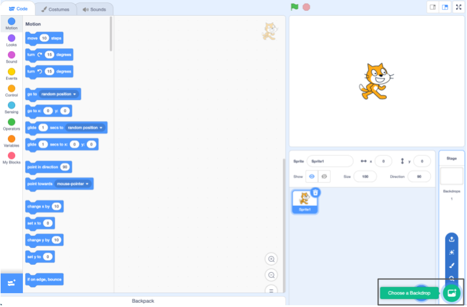

## तुमचा सीन तयार करा

या टप्प्यात, तुम्ही स्पेस बॅकड्रॉप आणि पहिला sprite वापरून तुमचा प्रोजेक्ट सेट कराल. 

{:width="300px"}

--- task ---

[स्पेस टॉक स्टार्टर प्रोजेक्ट](https://scratch.mit.edu/projects/582213331/editor){:target="_blank"} उघडा. Scratch दुसऱ्या ब्राऊजर टॅब मध्ये उघडेल.

[[[working-offline]]]

--- /task ---

Scratch एडिटरअसा दिसतो:

**Stage** येथे तुमचा प्रोजेक्ट रन होतो. **backdrop** हा Stage दिसतो त्याप्रकारे बदलतो.

--- task ---

Stage पेन मधील **Choose a Backdrop** वर क्लिक करा (किंवा टॅबलेट, टॅप):

--- /task ---

--- task ---

**Space** कॅटेगरीवर क्लिक करा किंवा सर्च बॉक्स मध्ये `space` टाईप करा:

--- /task ---

आमच्या उदाहरणात, आम्ही **Space** बॅकड्रॉप निवडले आहे, परंतु तुम्हाला जास्त आवडणारा बॅकड्रॉप निवडा.

--- task ---

तुमच्या प्रोजेक्टमध्ये समाविष्ट करण्यासाठी तुमच्या निवडलेल्या बॅकड्रॉपवर क्लिक करा. Stage ने तुम्ही निवडलेला बॅकड्रॉप दाखवायला हवा:

--- /task ---

तुम्ही तुमच्या प्रोजेक्टमध्ये आधीच समाविष्ट असलेला sprite बघू शकता का? ही Scratch Cat आहे.

--- task ---

**Sprite1** (Scratch Cat) sprite डिलीट करा: Stage च्या खालील Sprite लीस्टमध्ये **Sprite1** sprite निवडा आणि **Delete** आयकॉनवर क्लिक करा.

--- /task ---

--- task ---

Sprite लीस्टमधील **Choose a Sprite** वर क्लिक करा:

--- /task ---

--- task ---

**Fantasy** कॅटेगरी निवडा. तुमच्या प्रोजेक्टमध्ये समाविष्ट करण्यासाठी **Pico** sprite वर क्लिक करा.

--- /task ---

--- task ---

Stage च्या डाव्या बाजूवर स्थान घेण्यासाठी **Pico** sprite ला ड्रॅग करा. तुमचा Stage याप्रमाणे दिसायला हवा:

--- /task ---

--- task ---

तुम्ही तुमच्या Scratch अकाऊंटमध्ये साईन इन केल्यास, हिरव्या Remix बटन वर क्लिक करा. यामुळे तुमच्या Scratch अकाऊंटला प्रोजेक्टची कॉपी सेव होईल.

स्क्रीनच्या वरील भागातील प्रोजेक्ट नेम बॉक्स मध्ये तुमच्या प्रोजेक्टचे नाव टाईप करा.

**टीप:** तुमच्या प्रोजेक्टला उपयोग होणारे नाव द्या जेणेकरून तुमच्याकडे बरेच प्रोजेक्ट असतांना तुम्ही तो सहजतेने शोधू शकता.

पुढे, तुमचा प्रोजेक्ट सेव करण्यासाठी **File**, आणि नंतर **Save now** वर क्लिक करा.

तुम्ही ऑनलाईन नसल्यास किंवा तुमच्याकडे Scratch अकाऊंट नसल्यास, तुम्ही तुमच्या प्रोजेक्टची कॉपी सेव करण्यासाठी **Save to your computer** वर क्लिक करू शकता.

--- /task ---

