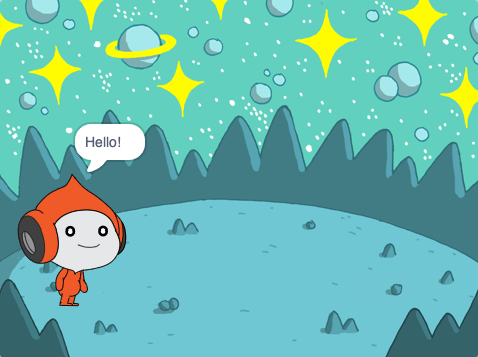
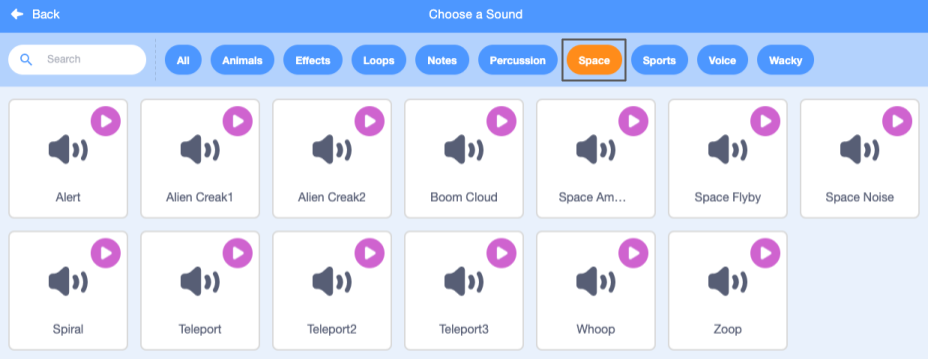
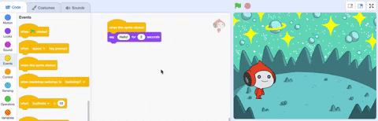

## Pico साऊंड प्ले करतो

<div style="display: flex; flex-wrap: wrap">
<div style="flex-basis: 200px; flex-grow: 1; margin-right: 15px;">
संवाद साधण्याचा दुसरा मार्ग म्हणजे साऊंड वापरणे.
</div>
<div>

{:width="300px"}

</div>
</div>

--- task ---

**Pico** sprite साठी **Sounds** टॅबवर क्लिक करा आणि तुम्हाला **pop** साऊंड मिळेल. Click on the **Play** icon to hear the **pop** sound.


--- /task ---

Scratch मध्ये काही विलक्षण ऍलियन साऊंड आहेत जे तुम्ही तुमच्या स्प्राईट मध्ये जोडू शकता.

--- task ---

To choose a new sound, click on the **Choose a Sound** icon and select the **Space** category or type `space` in the search box.




--- /task ---

--- task ---

**Play** आयकॉन वापरून काही वेगळे साऊंड प्ले करा. तुम्हाला वापरायचा असलेला साऊंड सापडला की, तो तुमच्या प्रोजेक्टमध्ये जोडण्यासाठी त्यावर क्लिक करा.


--- /task ---

--- task ---

**Code** टॅब वर क्लिक करा. `Sound`{:class="block3sound"} ब्लॉक्स मेनूमध्ये, `start sound`{:class="block3sound"} ब्लॉक शोधा.

ब्लॉक कोड एरियात ड्रॅग करा, `when this sprite clicked`{:class="block3events"} आणि `say`{:class="block3looks"} ब्लॉक दरम्यान. गॅप उघडेल आणि ब्लॉक जागेवर स्नॅप होईल.



आपला कोड असा दिसला पाहिजे:


```blocks3
when this sprite clicked
+start sound [Alien Creak1 v] 
say [Hello!] for [2] seconds // hide speech after 2 seconds
```

--- /task ---

--- task ---

तुमच्या `start sound`{:class="block3sound"} ब्लॉकमध्ये तुम्ही निवडलेला साऊंड आहे का ते तपासा. तो नसल्यास, तुम्ही `start sound`{:class="block3sound"} ब्लॉकमध्ये साऊंडवर क्लिक करणे आवश्यक आहे, त्यानंतर ड्रॉप-डाऊन मेनूमधील तुमचा साऊंड निवडा.


--- /task ---

--- task ---

**चाचणी:** **Pico** स्प्राइटवर क्लिक करा आणि दोन सेकंदांसाठी स्पीच बबल दिसत आहे का ते तपासा. If you do not hear the sound, make sure that you have added the `start sound`{:class="block3sound"} block under the `when this sprite clicked`{:class="block3events"} block. तसेच, तुमच्या संगणकावर किंवा टॅबलेटवर साऊंड कार्यरत आहे का ते तपासा.

--- /task ---

--- save ---

