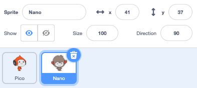
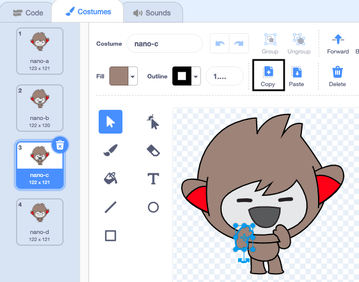

## Nano ने कॉश्चुम बदलला

<div style="display: flex; flex-wrap: wrap">
<div style="flex-basis: 200px; flex-grow: 1; margin-right: 15px;">

तुम्हाला **कॉश्चुम** बदलून इमोट करण्यास Nano मिळेल.

स्प्राईटकडे त्यांना हवा तो बदल करण्यासाठी **कॉश्चुम** आहे. स्प्राईट ऍनिमेट करण्यासाठी, तुम्ही त्याचा कॉश्चुम बदलू शकता.

</div>
<div>

{:width="300px"}

</div>
</div>

### Nano म्हणतो "धन्यवाद!"

--- task ---

**Fantasy** कॅटेगरी मधून तुमच्या प्रोजेक्टला **Nano** स्प्राईट जोडा.


--- /task ---

--- task ---

Stage च्या खालील Sprite यादीमध्ये **Nano** स्प्राईट निवडला असल्याची खात्री करा.




**Code** टॅबवर क्लिक करा आणि `say`{:class="block3looks"} `Thanksकोडकोडकोड!` ला **Nano** स्प्राईट मिळण्यासाठी स्क्रीप्ट जोडा:


```blocks3
when this sprite clicked // when Nano is clicked
switch costume to [nano-b v] // Nano talking
say [Thanks!] for [2] seconds // try 1 instead of 2
switch costume to [nano-a v] // Nano smiling
```
--- /task ---

**टीप:** सर्व ब्लॉक्स कलर-कोडेड आहेत, त्यामुळे तुम्हाला `switch costume to`{:class="block3looks"} हा ब्लॉक `Looks`{:class="block3looks"} ब्लॉक मेनूमध्ये आढळेल.

--- task ---

**चाचणी:** Stage वरील **Nano** स्प्राईटवर क्लिक करा आणि स्पीच बबल दिसतो का आणि Nano चा कॉश्चुम बदलतो का ते तपासा.

--- /task ---

### Nano सांकेतिक भाषा वापरतो

<p style="border-left: solid; border-width:10px; border-color: #0faeb0; background-color: aliceblue; padding: 10px;">लाखो लोक संवाद साधण्यासाठी सांकेतिक भाषा वापरतात. 'धन्यवाद' साठी एक सामान्य संकेत म्हणजे **तुमचा उजवा हात तोंडावर आणणे**. 
</p>

Nano कॉश्चुम बदलून सांकेतिक भाषेचा वापर करेल.

तुम्ही Paint एडिटरसह तुमच्या स्प्राईटसाठी कॉश्चुम एडिट करू शकता. तुम्ही त्यांना "धन्यवाद" संकेत देण्यासाठी Nano चा कॉश्चुम एडिट कराल.

--- task ---

**Nano** स्प्राईटसाठी कॉश्चुम बघण्यासाठी **Costumes** टॅबवर क्लिक करा:


--- /task ---

--- task ---

**nano-b** कॉश्चुमवर क्लिक करा. डाव्या बाजूच्या हातावर क्लिक करा, आणि त्यानंतर **Delete** वर क्लिक करा.


कॉश्चुम असा दिसायला हवा:


--- /task ---

**टीप:** जर तुम्ही Paint एडिटरमध्ये चूक केली, तर तुम्ही **Undo**वर क्लिक करू शकता.


--- task ---

**nano-c** कॉश्चुमवर जा आणि डाव्या बाजूच्या हातावर क्लिक करा, त्यानंतर **Copy** वर क्लिक करा.



--- /task ---

--- task ---

**nano-b** कॉश्चुमवर परत जा आणि **Paste** वर क्लिक करा. कॉश्चुम असा दिसायला हवा:


--- /task ---

--- task ---

**चाचणी:** Stage वरील **Nano** स्प्राईटवर क्लिक करा आणि स्पीच बबल दिसतो का आणि तुम्ही एडिट केलेल्या कॉश्चुममध्ये Nano कॉश्चुम बदलतो का ते तपासा.

--- /task ---

<p style="border-left: solid; border-width:10px; border-color: #0faeb0; background-color: aliceblue; padding: 10px;">"धन्यवाद" संकेत कसा करायचा ते तुम्ही शिकलात. पुढच्या वेळी तुम्ही एखाद्याचे आभार मानता तेव्हा तुमचे नवीन कौशल्य का वापरू नये?
</p>

--- save ---
