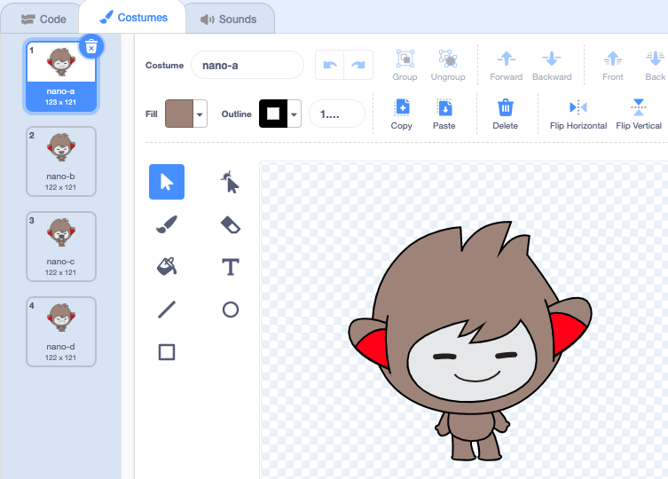

## Nano ने कॉश्चुम बदलला

<div style="display: flex; flex-wrap: wrap">
<div style="flex-basis: 200px; flex-grow: 1; margin-right: 15px;">

तुम्हाला **कॉश्चुम** बदलून इमोट करण्यास Nano मिळेल.

स्प्राईटकडे त्यांना हवा तो बदल करण्यासाठी **कॉश्चुम** आहे. स्प्राईट ऍनिमेट करण्यासाठी, तुम्ही त्याचा कॉश्चुम बदलू शकता.

</div>
<div>

{:width="300px"}

</div>
</div>

### Nano says "Thanks!"

--- task ---

**Fantasy** कॅटेगरी मधून तुमच्या प्रोजेक्टला **Nano** स्प्राईट जोडा.


--- /task ---

--- task ---

Make sure that the **Nano** sprite is selected in the Sprite list below the Stage.


Click on the **Code** tab and add a script to get the **Nano** sprite to `say`{:class="block3looks"} `Thanks!`:


```blocks3
when this sprite clicked // when Nano is clicked
switch costume to [nano-b v] // Nano talking
say [Thanks!] for [2] seconds // try 1 instead of 2
switch costume to [nano-a v] // Nano smiling
```
--- /task ---

**टीप:** सर्व ब्लॉक्स कलर-कोडेड आहेत, त्यामुळे तुम्हाला `switch costume to`{:class="block3looks"} हा ब्लॉक `Looks`{:class="block3looks"} ब्लॉक मेनूमध्ये आढळेल.

--- task ---

**Test:** Click on the **Nano** sprite on the Stage and check that the speech bubble appears and Nano's costume changes.

--- /task ---

### Nano सांकेतिक भाषा वापरतो

<p style="border-left: solid; border-width:10px; border-color: #0faeb0; background-color: aliceblue; padding: 10px;">लाखो लोक संवाद साधण्यासाठी सांकेतिक भाषा वापरतात. 'धन्यवाद' साठी एक सामान्य संकेत म्हणजे **तुमचा उजवा हात तोंडावर आणणे**. 
</p>

Nano कॉश्चुम बदलून सांकेतिक भाषेचा वापर करेल.

You can edit costumes for your sprites with the Paint editor. तुम्ही त्यांना "धन्यवाद" संकेत देण्यासाठी Nano चा कॉश्चुम एडिट कराल.

--- task ---

**Nano** स्प्राईटसाठी कॉश्चुम बघण्यासाठी **Costumes** टॅबवर क्लिक करा:



--- /task ---

--- task ---

**nano-b** कॉश्चुमवर क्लिक करा. Click on the arm on the left-hand side, and then click on **Delete**.


कॉश्चुम असा दिसायला हवा:


--- /task ---

**Tip:** If you make a mistake in the Paint editor, you can click on **Undo**.


--- task ---

**nano-c** कॉश्चुमवर जा आणि डाव्या बाजूच्या हातावर क्लिक करा, त्यानंतर **Copy** वर क्लिक करा.


--- /task ---

--- task ---

**nano-b** कॉश्चुमवर परत जा आणि **Paste** वर क्लिक करा. कॉश्चुम असा दिसायला हवा:


--- /task ---

--- task ---

**Test:** Click on the **Nano** sprite on the Stage and check that the speech bubble appears and Nano's costume changes to the costume that you have edited.

--- /task ---

<p style="border-left: solid; border-width:10px; border-color: #0faeb0; background-color: aliceblue; padding: 10px;">"धन्यवाद" संकेत कसा करायचा ते तुम्ही शिकलात. पुढच्या वेळी तुम्ही एखाद्याचे आभार मानता तेव्हा तुमचे नवीन कौशल्य का वापरू नये?
</p>

--- save ---
