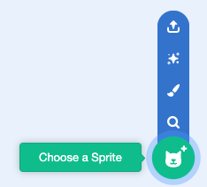

## Nano switches costume

<div style="display: flex; flex-wrap: wrap">
<div style="flex-basis: 200px; flex-grow: 1; margin-right: 15px;">

Get Nano to emote by switching **costumes**.

स्प्राईटकडे त्यांना हवा तो बदल करण्यासाठी **कॉश्चुम** आहे. To animate a sprite, you can change its costume.

</div>
<div>

{:width="300px"}

</div>
</div>

### Nano signs "Thanks!"

--- task ---

**Fantasy** कॅटेगरी मधून तुमच्या प्रोजेक्टला **Nano** स्प्राईट जोडा.



--- /task ---

--- task ---

Stage च्या खालील Sprite यादीमध्ये **Nano** स्प्राईट निवडला असल्याची खात्री करा.


Click on the **Code** tab and add a script to get the **Nano** sprite to sign 'Thanks' using `switch costume to`{:class="block3looks"} and `wait`{:class="block3control"}:


```blocks3
when this sprite clicked // when Nano is clicked
switch costume to [nano-b v] // Nano talking
wait (0.5) seconds // try 0.25 instead of 0.5
switch costume to [nano-a v] // Nano smiling
```
--- /task ---

**Tip:** All the blocks are colour-coded, so you will find the `switch costume to`{:class="block3looks"} block in the `Looks`{:class="block3looks"} blocks menu and the `wait`{:class="block3control"} block in the `Control`{:class="block3control"} blocks menu.

--- task ---

**Test:** Click on the **Nano** sprite on the Stage and check that Nano's costume changes.

--- /task ---

### Nano सांकेतिक भाषा वापरतो

<p style="border-left: solid; border-width:10px; border-color: #0faeb0; background-color: aliceblue; padding: 10px;">लाखो लोक संवाद साधण्यासाठी सांकेतिक भाषा वापरतात. A common way to sign 'Thank you' is to place your fingers on your chin with your hand as flat as possible. You then move your hand forwards, away from your chin and slightly down. 
</p>

<!-- Add a video of someone signing -->

Nano कॉश्चुम बदलून सांकेतिक भाषेचा वापर करेल.

तुम्ही Paint एडिटरसह तुमच्या स्प्राईटसाठी कॉश्चुम एडिट करू शकता. तुम्ही त्यांना "धन्यवाद" संकेत देण्यासाठी Nano चा कॉश्चुम एडिट कराल.

--- task ---

**Nano** स्प्राईटसाठी कॉश्चुम बघण्यासाठी **Costumes** टॅबवर क्लिक करा:


--- /task ---

--- task ---

**nano-b** कॉश्चुमवर क्लिक करा. डाव्या बाजूच्या हातावर क्लिक करा, आणि त्यानंतर **Delete** वर क्लिक करा.


कॉश्चुम असा दिसायला हवा:


--- /task ---

**टीप:** जर तुम्ही Paint एडिटरमध्ये चूक केली, तर तुम्ही **Undo**वर क्लिक करू शकता.


--- task ---

**nano-c** कॉश्चुमवर जा आणि डाव्या बाजूच्या हातावर क्लिक करा, त्यानंतर **Copy** वर क्लिक करा.


--- /task ---

--- task ---

**nano-b** कॉश्चुमवर परत जा आणि **Paste** वर क्लिक करा. कॉश्चुम असा दिसायला हवा:


--- /task ---

--- task ---

**चाचणी:** Stage वरील **Nano** स्प्राईटवर क्लिक करा आणि स्पीच बबल दिसतो का आणि तुम्ही एडिट केलेल्या कॉश्चुममध्ये Nano कॉश्चुम बदलतो का ते तपासा.

--- /task ---

<p style="border-left: solid; border-width:10px; border-color: #0faeb0; background-color: aliceblue; padding: 10px;">"धन्यवाद" संकेत कसा करायचा ते तुम्ही शिकलात. पुढच्या वेळी तुम्ही एखाद्याचे आभार मानता तेव्हा तुमचे नवीन कौशल्य का वापरू नये?
</p>

