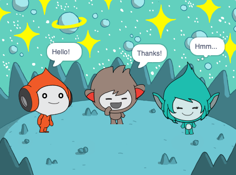

## Giga ने रंग बदलला

<div style="display: flex; flex-wrap: wrap">
<div style="flex-basis: 200px; flex-grow: 1; margin-right: 15px;">
स्प्राईट्स थॉट बबल्स सुद्धा वापरू शकतात आणि त्यांचे व्यक्तीमत्व दाखवण्यासाठी रंग बदलू शकतात. हे करण्यासाठी तुम्हाला Giga मिळेल.
</div>
<div>

{:width="300px"}

</div>
</div>

--- task ---

**Giga** स्प्राईट जोडा.

**Giga** स्प्राईट Stage च्या उजव्या बाजूला ड्रॅग करा.

--- /task ---

--- task ---

Stage च्या खालील sprite लीस्टमधील तुमच्याकडे **Giga** स्प्राईट निवडलेला असल्याची खात्री करा. रंग बदलून संवाद साधण्यासाठी **Giga** स्प्राईट तयार करण्यासाठी हा कोड समाविष्ट करा:


```blocks3
when this sprite clicked
set [color v] effect to [0] // 0 हा सुरूवातीचा रंग आहे
think [Hmm...] for [2] seconds 
clear graphic effects // सुरूवातीच्या रंगावर परत
```

--- /task ---

**टीप:** तुम्ही कोड, कॉश्चुम किंवा साऊंड जोडण्यापूर्वी किंवा बदलण्यापूर्वी Stage च्या खाली असलेल्या Sprite लीस्टमधील स्प्राइटवर क्लिक करा. तुम्ही योग्य स्प्राइटवर क्लिक केले असल्याची खात्री करा.

--- task ---

तुमचा आवडता रंग सापडेपर्यंत `1` पासून `200` पर्यंत वेगवेगळ्या संख्यांचा `set color effect to`{:class="block3looks"} ब्लॉकमध्ये वापर करण्याचा प्रयत्न करा.

--- /task ---

--- task ---

`think`{:class="block3looks"} ब्लॉकमधील शब्द आणि सेकंदांची संख्या बदला.

--- /task ---

--- task ---

**चाचणी:** Stage वरील **Giga** स्प्राईटवर क्लिक करा आणि स्प्राईट रंग बदलतो का आणि थॉट बबल दाखवतो का ते तपासा.

--- /task ---

--- save ---
