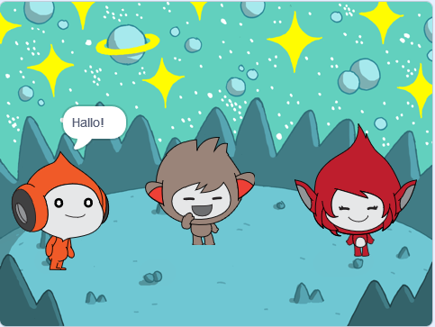

## What you will make

Creëer een ruimtescène met personages ? die emoties gebruiken om hun gedachten of gevoelens te delen.

In Scratch worden karakters en objecten **sprites** genoemd en verschijnen ze op het **speelveld**.

Je gaat:
+ Sprites en een **achtergrond** toevoegen om je project op te zetten
+ Op sprites klikken om ze te laten communiceren met behulp van `Uiterlijken`{:class="block3looks"} en `Geluid`{:class="block3sound"} codeblokken
+ De **Paint-editor** gebruiken om een **uiterlijk** te veranderen

--- no-print --- --- task ---
### Afspelen ▶️

  
Klik op elke sprite om te zien wat ze doen. 

Wat gebeurt er als je op een sprite klikt en dan snel op een andere sprite klikt?

  <iframe allowtransparency="true" width="485" height="402" src="https://scratch.mit.edu/projects/embed/485673032/?autostart=false" frameborder="0"></iframe>

--- /task --- --- /no-print ---

--- print-only ---

--- /print-only ---

