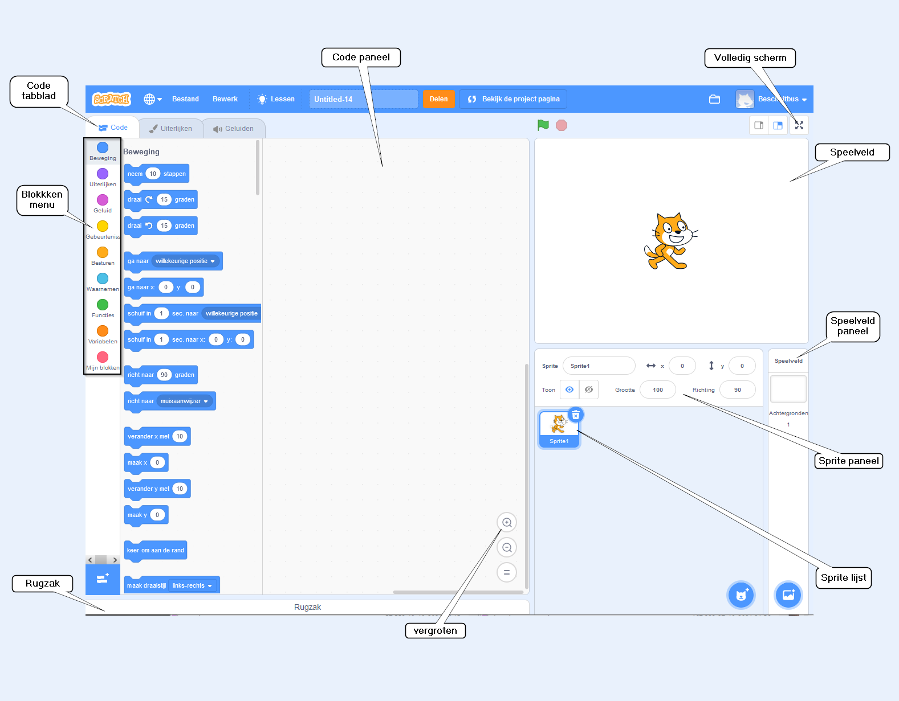
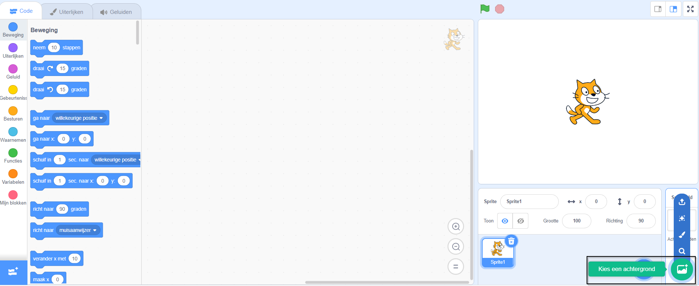
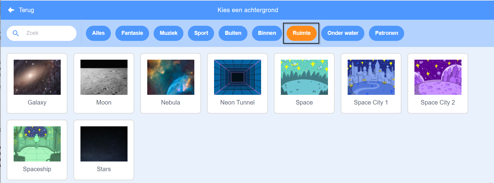
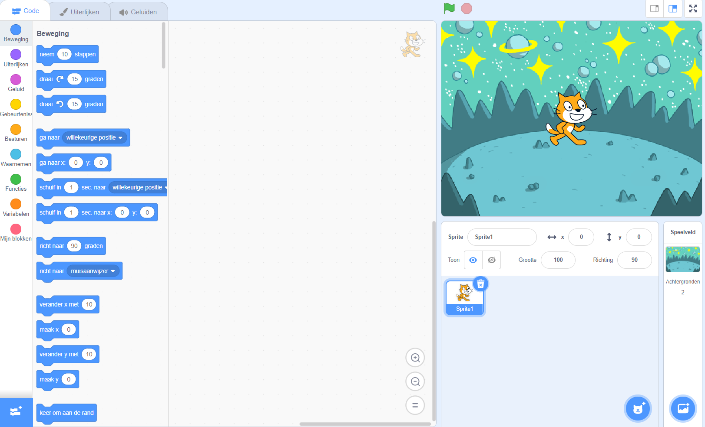
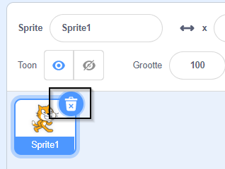
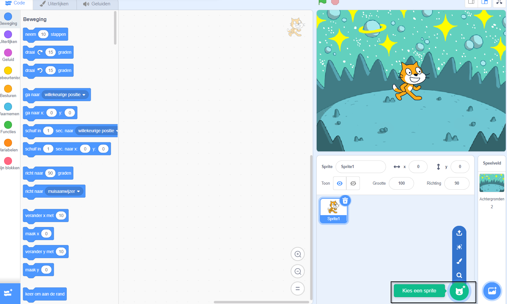
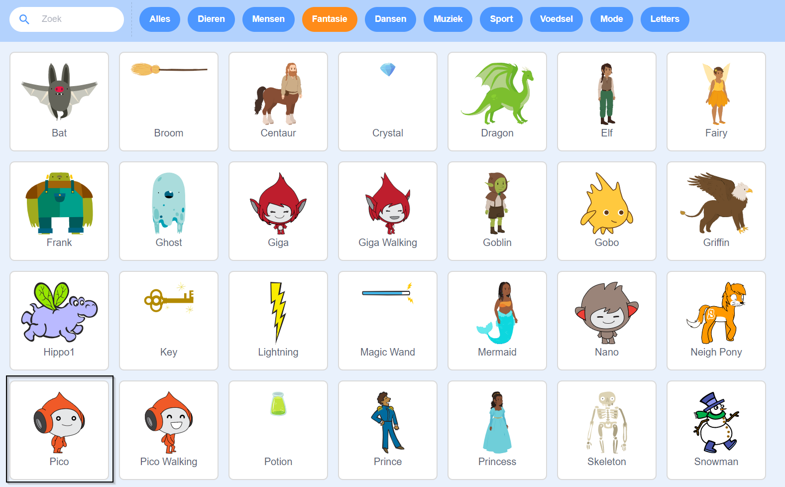
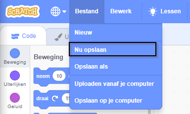

## Creëer je scène

Stel je project in met een ruimteachtergrond en de eerste sprite. 

{:width="300px"}

### Open het startproject

--- task ---

Open het [Ruimte praat start-project](https://scratch.mit.edu/projects/582213331/editor){:target="_blank"}. Scratch wordt in een nieuwe browsertabblad geopend.

[[[working-offline]]]

--- /task ---

### De Scratch-editor

### Een achtergrond toevoegen

Het **Speelveld** is waar jouw project wordt uitgevoerd. Een **achtergrond** verandert de manier waarop het Speelveld eruit ziet.

--- task ---

Klik (of tik op een tablet) op **Kies een Achtergrond** in het Speelveld-paneel:

--- /task ---

--- task ---

Klik op de **Ruimte** categorie of typ `space` in het zoekvak:

--- /task ---

In ons voorbeeld hebben we de **Space** achtergrond gekozen, maar kies de achtergrond die je het leukst vindt.

--- task ---

Klik op de door jouw gekozen achtergrond om deze aan je project toe te voegen. Het Speelveld zou de achtergrond moeten tonen die je hebt gekozen:

--- /task ---

### Voeg een sprite toe

Zie je de sprite die al in je project is opgenomen? Dat is de Scratch kat.

--- task ---

Verwijder de **Sprite1** (Scratch kat): selecteer de sprite **Sprite1** in de sprite lijst onder het speelveld en klik op het pictogram **Verwijderen**.

--- /task ---

--- task ---

Klik op **Kies een Sprite** in de Sprite-lijst:

--- /task ---

--- task ---

Selecteer de categorie **Fantasie**. Klik op de **Pico** sprite om deze aan je project toe te voegen.

--- /task ---

--- task ---

Sleep de **Pico** sprite naar de linkerkant van het Speelveld. Je Speelveld zou er ongeveer zo uit moeten zien:

--- /task ---

--- task ---

**Opslaan**: Als je bent aangemeld bij je Scratch-account, klik je op de groene Remix-knop. Hiermee wordt een kopie van het project opgeslagen in je Scratch-account.

Typ de naam van jouw project in het vak projectnaam bovenaan het scherm.

**Tip:** Geef je projecten nuttige namen zodat je ze gemakkelijk terug kunt vinden als je veel projecten hebt.

Klik vervolgens op **Bestand** en dan op **Opslaan** om je project op te slaan.

Als je niet online bent of geen Scratch-account hebt, kun je op **Opslaan op je computer** klikken om een kopie van jouw project op te slaan.

--- /task ---

