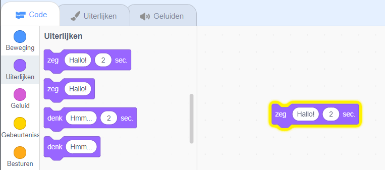

## Pico zegt hallo

<div style="display: flex; flex-wrap: wrap">
<div style="flex-basis: 200px; flex-grow: 1; margin-right: 15px;">
Een sprite kan code, uiterlijken en geluiden hebben om de manier waarop hij eruitziet en doet, te veranderen. 
  
Je voegt codeblokken toe om Pico emoties met woorden en geluid te laten maken als op de sprite wordt geklikt.
</div>
<div>

{:width="300px"}

</div>
</div>

Om blokken te gebruiken, kun je op ze klikken in het blokkenmenu.

--- task ---

Open het `Uiterlijken`{:class="block3looks"} blokkenmenu.

Klik op een `zeg`{:class="block3looks"} `Hallo!` `voor`{:class="block3looks"} `2` `seconden`{:class="block3looks"} blok.


De **Pico** sprite toont gedurende twee seconden een tekstballon.


**Tip:** Codeblokken in Scratch gloeien met een gele omtreklijn wanneer ze actief zijn.

--- /task ---

Je kunt blokken naar het codegebied slepen en ze kunnen vanaf daar worden gebruikt.

--- task ---

Sleep een `zeg`{:class="block3looks"} `Hallo!` `voor`{:class="block3looks"} `2` `seconden`{:class="block3looks"} blok naar het codegebied. Klik er nogmaals op.




--- /task ---

Blokken kunnen in het codegebied met elkaar worden verbonden om er meer dan één te laten werken. Verbonden blokken worden van boven naar beneden uitgevoerd.

--- task ---

Sleep een `wanneer op deze sprite wordt geklikt`{:class="block3events"} blok uit het `Gebeurtenissen`{:class="block3events"} blokkenmenu en verbind het met de bovenkant van je `zeg`{:class="block3looks"} blok in het codegebied. De blokken zullen in elkaar klikken.


```blocks3
+when this sprite clicked
say [Hallo!] for [2] seconds // spraak verbergen na 2 seconden
```

--- /task ---

Een opmerking is een uitleg van wat je code doet.

```blocks3
say [Hallo!] for [2] seconds // spraak verbergen na 2 seconden
```
Je ziet opmerkingen in de codevoorbeelden. Je hoeft de opmerkingen niet toe te voegen wanneer je code aan jouw project toevoegt.

Als je tijd over hebt zodra je jouw project hebt afgerond, is het een goed idee om opmerkingen aan je code toe te voegen, zodat deze later gemakkelijker te begrijpen is. Om een opmerking toe te voegen, klik je met de rechtermuisknop (of tik je op een tablet en houdt je vast) op een blok in het codegebied en kies je **Commentaar toevoegen**.


--- task ---

**Test:** Klik op de **Pico** sprite in het Speelveld en controleer of de tekstballon twee seconden lang verschijnt. Het is belangrijk om je code te testen om er zeker van te zijn dat deze doet wat je verwacht.

--- /task ---

--- save ---
