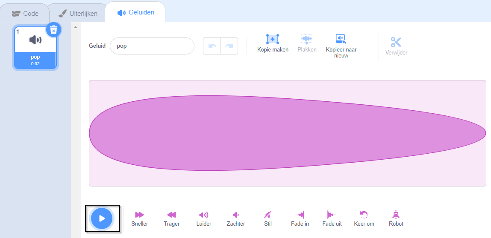
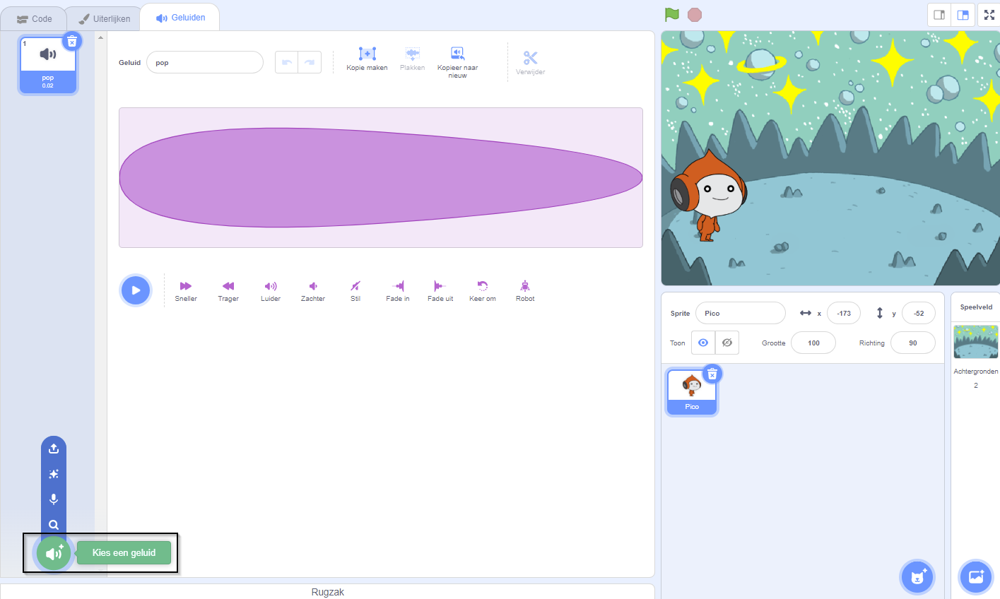
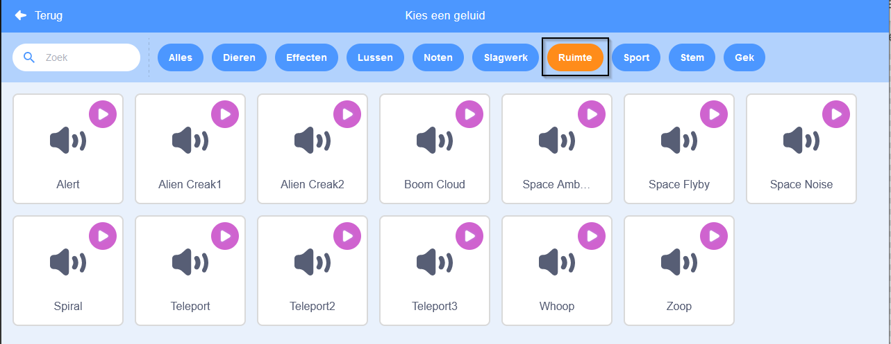
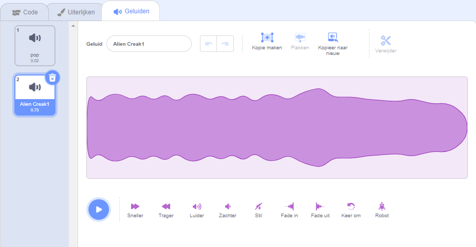
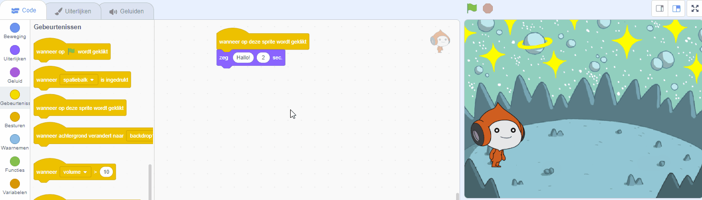
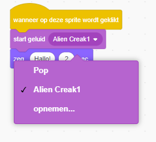

## Pico maakt een geluid

<div style="display: flex; flex-wrap: wrap">
<div style="flex-basis: 200px; flex-grow: 1; margin-right: 15px;">
Een andere manier om te communiceren is het gebruik van geluid.
</div>
<div>

{:width="300px"}

</div>
</div>

--- task ---

Klik op de **Geluiden** tab voor de **Pico** sprite en je zult een **pop** geluid vinden. Klik op het **Spelen** pictogram om het **pop** geluid te horen.



--- /task ---

Er zijn een aantal fantastische buitenaardse geluiden in Scratch die je aan je sprite kunt toevoegen.

--- task ---

Om een nieuw geluid te kiezen, klik je op het **Kies een geluid** pictogram en selecteer de **Ruimte** categorie of typ `space` in het zoekvak.






--- /task ---

--- task ---

Speel een paar verschillende geluiden met behulp van het **Play** pictogram. Zodra je een geluid hebt gevonden klik je erop om het aan jouw project toe te voegen.



--- /task ---

--- task ---

Klik op het **Code** tabblad. Zoek bij de `Geluid`{:class="block3sound"} blokken het blok `start geluid`{:class="block3sound"}.

Sleep het blok naar het codegebied tussen `wanneer op deze sprite wordt geklikt`{:class="block3events"} blok en het `zeg`{:class="block3looks"} blok. Er ontstaat een opening en het blok klikt op zijn plaats.



Je code zou er als volgt uit moeten zien:


```blocks3
when this sprite clicked
+start sound [Alien Creak1 v] 
say [Hallo!] for [2] seconds // spraak verbergen na 2 seconden
```

--- /task ---

--- task ---

Controleer of jouw `start geluid`{:class="block3sound"} blok het door jou gekozen geluid bevat. Als dit niet het geval is, moet je op het geluid in het `start geluid`{:class="block3sound"} blok klikken en vervolgens het door jou gekozen geluid in het keuzemenu selecteren.



--- /task ---

--- task ---

**Test:** Klik op de **Pico** sprite en controleer of de tekstballon verschijnt en je het geluid kunt horen. Als je het geluid niet hoort, zorg er dan voor dat je het `start geluid`{:class="block3sound"} blok hebt toegevoegd onder het `wanneer op deze sprite wordt geklikt`{:class="block3events"} blok. Controleer ook of het geluid werkt op jouw computer of tablet.

--- /task ---

--- save ---

