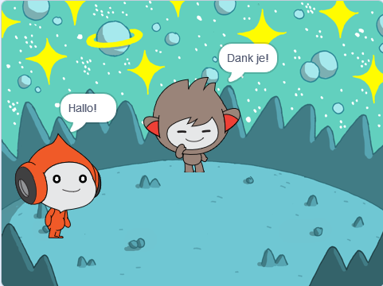
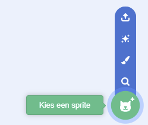
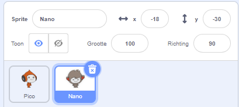
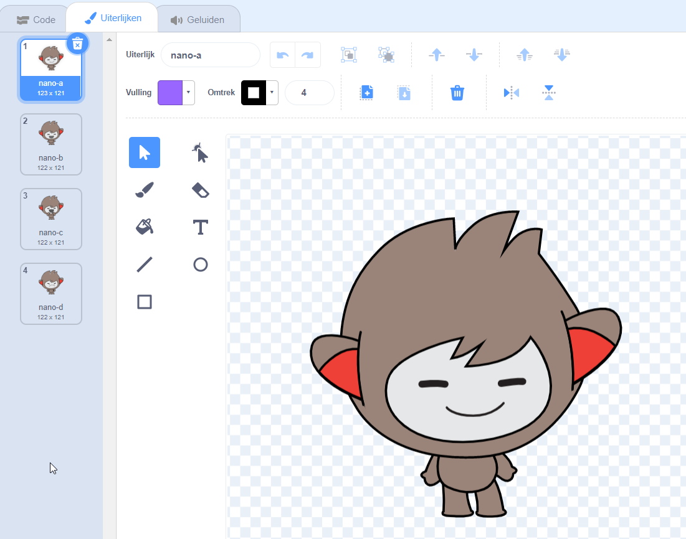
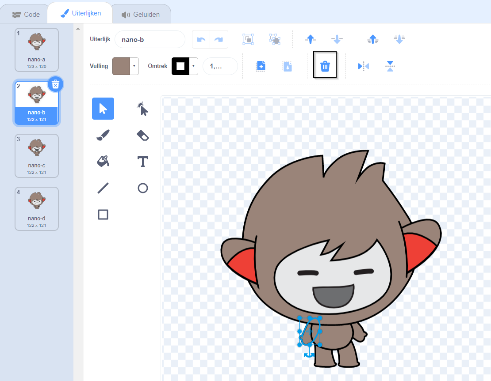
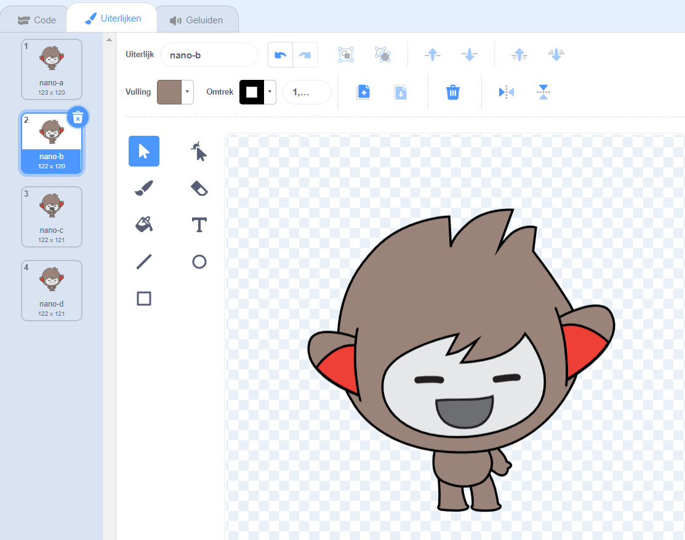
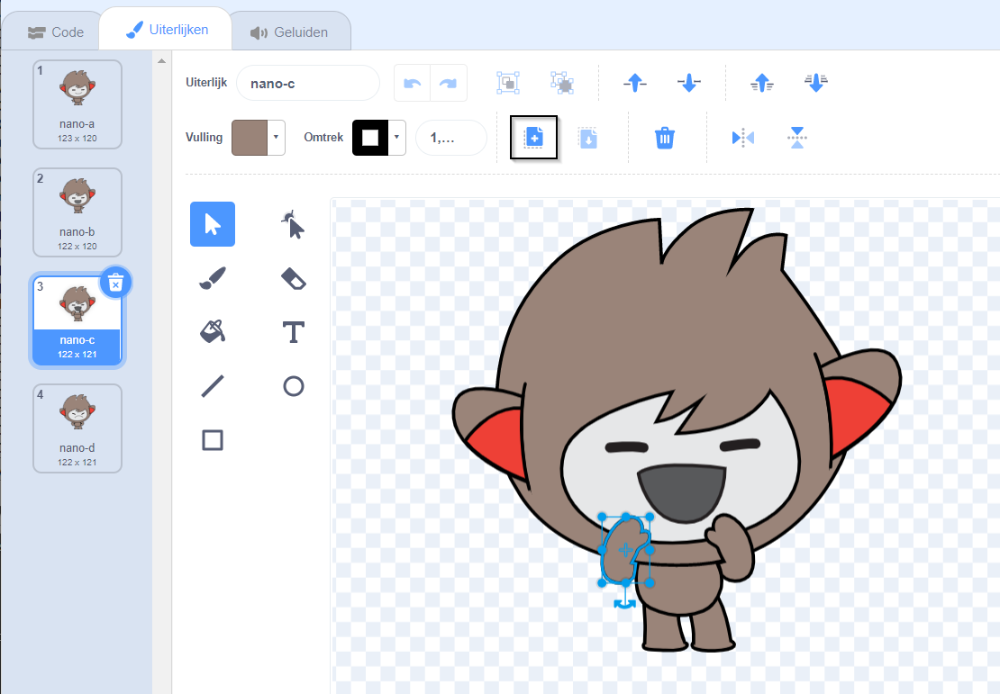
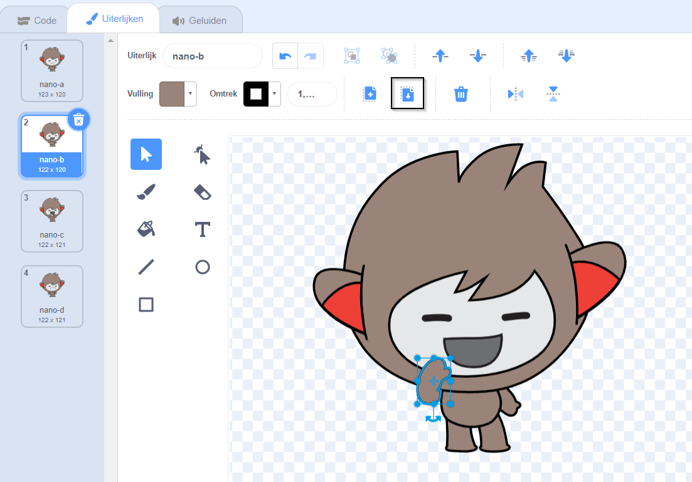

## Nano wisselt van uiterlijk

<div style="display: flex; flex-wrap: wrap">
<div style="flex-basis: 200px; flex-grow: 1; margin-right: 15px;">

Je gaat Nano een emotie laten zien door van **Uiterlijk** te wisselen.

Sprites hebben **uiterlijken** om hun uiterlijk te veranderen. Om een sprite te animeren, kun je zijn uiterlijk laten veranderen.

</div>
<div>

{:width="300px"}

</div>
</div>

### Nano zegt "Dank je!"

--- task ---

Voeg de **Nano** sprite uit de categorie **Fantasie** toe aan je project.



--- /task ---

--- task ---

Zorg ervoor dat de **Nano** sprite geselecteerd is in de Sprite lijst onder het Speelveld.




Klik op de **Code** tab en voeg een script toe om de **Nano** sprite `Dank je!` te laten `zeggen`{:class="block3looks"}:


```blocks3
when this sprite clicked // wanneer op Nano wordt geklikt
switch costume to [nano-b v] // Nano praat
say [Dank je!] for [2] seconds // probeer 1 in plaats van 2 
switch costume to [nano-a v] // Nano lacht
```
--- /task ---

**Tip:** Alle blokken zijn kleurgecodeerd, dus je vindt het `verander uiterlijk naar`{:class="block3looks"} blok in het `Uiterlijken`{:class="block3looks"} blokkenmenu.

--- task ---

**Test:** Klik op de **Nano** sprite in het Speelveld en controleer of de tekstballon verschijnt en Nano's uiterlijk verandert.

--- /task ---

### Nano gebruikt gebarentaal

<p style="border-left: solid; border-width:10px; border-color: #0faeb0; background-color: aliceblue; padding: 10px;">Miljoenen mensen gebruiken gebarentaal om te communiceren. Een veelgebruikt teken voor 'dank je' is **je rechterhand naar je mond brengen**. 
</p>

Nano gebruikt gebarentaal door van uiterlijk te wisselen.

Je kunt uiterlijken voor je sprites bewerken met de Teken-editor. Je zult een uiterlijk van Nano bewerken om het "dank je" te laten weergeven.

--- task ---

Klik op het **Uiterlijken** tabblad om de uiterlijken voor de **Nano** sprite te zien:



--- /task ---

--- task ---

Klik op het **nano-b** uiterlijk. Klik op de arm aan de linkerkant en klik vervolgens op **Verwijderen**.



Het uiterlijk zou er als volgt uit moeten zien:



--- /task ---

**Tip:** Als je een fout maakt in de Teken-editor, kun je klikken op **Ongedaan maken**.


--- task ---

Ga naar het **nano-c** uiterlijk en klik op de arm aan de linkerkant, klik dan op **Kopie maken**.



--- /task ---

--- task ---

Ga terug naar het **nano-b** uiterlijk en klik op **Plakken**. Het uiterlijk zou er als volgt uit moeten zien:



--- /task ---

--- task ---

**Test:** Klik op de **Nano** sprite in het Speelveld en controleer of de tekstballon verschijnt en Nano's uiterlijk verandert in het uiterlijk dat je hebt bewerkt.

--- /task ---

<p style="border-left: solid; border-width:10px; border-color: #0faeb0; background-color: aliceblue; padding: 10px;">Je hebt het gebaar voor "dank je" geleerd. Waarom zou je de volgende keer dat je iemand bedankt, je nieuwe vaardigheid niet gebruiken?
</p>

--- save ---
