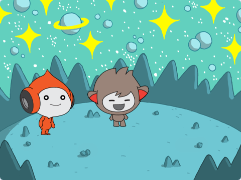
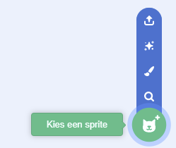
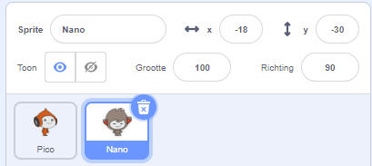

## Nano wisselt van uiterlijk

<div style="display: flex; flex-wrap: wrap">
<div style="flex-basis: 200px; flex-grow: 1; margin-right: 15px;">

Je gaat Nano een emotie laten zien door van **Uiterlijk** te wisselen.

Sprites hebben **uiterlijken** om hun uiterlijk te veranderen. Het zijn meestal bijna dezelfde afbeeldingen van dezelfde sprite. Om een sprite te animeren, kun je zijn uiterlijk laten veranderen.

</div>
<div>

{:width="300px"}

</div>
</div>

--- task ---

Voeg de **Nano** sprite uit de categorie **Fantasie** toe aan je project.



--- /task ---

--- task ---

Zorg ervoor dat de **Nano** sprite geselecteerd is in de Sprite lijst onder het Speelveld.



Klik op het tabblad **Code** en voeg een script toe om de **Nano**-sprite van uiterlijk te laten veranderen met behulp van `verander uiterlijk naar`{:class="block3looks"} en `wacht`{:class="block3control"}. Gebruik het drop down menu om te schakelen tussen `nano-b`{:class="block3looks"} en `nano-a`{:class="block3looks"}:


```blocks3
when this sprite clicked // wanneer op Nano wordt geklikt
switch costume to (nano-b v) // Nano praat
wait (0.5) seconds // probeer 0.25 in plaats van 0.5
switch costume to (nano-a v) // Nano lacht
```
--- /task ---

**Tip:** Alle blokken hebben een kleurcode, dus je vindt het `verander uiterlijk naar`{:class="block3looks"} blok in het `Uiterlijken`{:class="block3looks"} blokkenmenu en het `wacht`{:class="block3control"} blok in het `Besturen`{:class="block3control"} blokkenmenu.

--- task ---

**Test:** Klik op de **Nano** sprite in het speelveld en controleer of Nano's uiterlijk verandert.

--- /task ---
