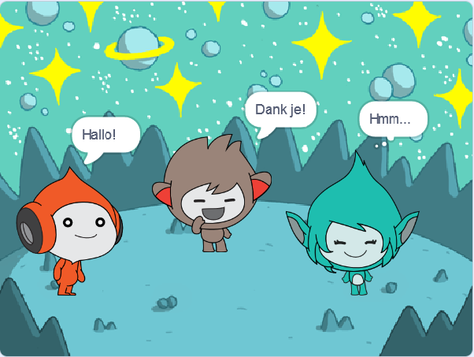

## Giga verandert van kleur

<div style="display: flex; flex-wrap: wrap">
<div style="flex-basis: 200px; flex-grow: 1; margin-right: 15px;">
Sprites kunnen ook denkballonnen gebruiken en van kleur veranderen om hun persoonlijkheid te tonen. Je gaat Giga dit laten doen.
</div>
<div>

{:width="300px"}

</div>
</div>

--- task ---

Voeg de **Giga** sprite toe.

Sleep de **Giga** sprite naar de rechterkant van het Speelveld.

--- /task ---

--- task ---

Zorg ervoor dat je de **Giga** sprite hebt geselecteerd in de Sprite-lijst onder het Speelveld. Voeg deze code toe om de **Giga** sprite te laten communiceren door van kleur te veranderen:


```blocks3
when this sprite clicked
set [color v] effect to [0] // 0 is de startkleur
think [Hmm...] for [2] seconds 
clear graphic effects // terug naar de startkleur
```

--- /task ---

**Tip:** Klik op de sprite in de Sprite lijst onder het Speelveld voordat je code, uiterlijken of geluid toevoegt of wijzigt. Zorg ervoor dat je op de juiste sprite hebt geklikt.

--- task ---

Probeer verschillende getallen van `1` tot `200` in de `verander kleur effect met`{:class="block3looks"} blok totdat je een kleur vindt die je leuk vindt.

--- /task ---

--- task ---

Verander de woorden en het aantal seconden in het `denk`{:class="block3looks"} blok.

--- /task ---

--- task ---

**Test:** Klik op de **Giga** sprite in het speelveld en controleer of de sprite van kleur verandert en een tekstballon toont.

--- /task ---

--- save ---
