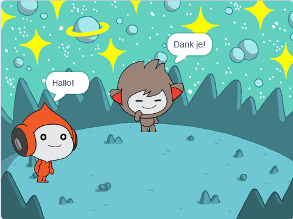

## Nano gebaart "Bedankt!"

<div style="display: flex; flex-wrap: wrap">
<div style="flex-basis: 200px; flex-grow: 1; margin-right: 15px;">

Laat Nano een gebaar maken door het uiterlijk aan te passen.

<p style="border-left: solid; border-width:10px; border-color: #0faeb0; background-color: aliceblue; padding: 10px;">Miljoenen mensen gebruiken gebarentaal om te communiceren. Een veel voorkomend 'Dankjewel' gebaar maak je door je vingers op je kin te leggen met je hand zo plat mogelijk. Dan beweeg je je hand naar voren, van je kin af en iets naar beneden. 
</p>


</div>
<div>

{:width="300px"}

</div>
</div>

### Nano gebruikt gebarentaal

Je gaat het uiterlijk van Nano bewerken om hem het gebaar "dank je" te laten doen.

Je kunt uiterlijken voor sprites bewerken met de Teken-editor.

> [!TASK]
>
> Voeg de **Giga** sprite toe.
>
> Sleep de **Giga** sprite naar de rechterkant van het Speelveld.

> [!TASK]
>
> Zorg ervoor dat je de **Giga** sprite hebt geselecteerd in de Sprite-lijst onder het Speelveld. Voeg deze code toe om de **Giga** sprite te laten communiceren door van kleur te veranderen:
>
> 
>
> ```blocks3
> when this sprite clicked
> set [color v] effect to [0] // 0 is de startkleur
> think [Hmm...] for [2] seconds
> clear graphic effects // terug naar de startkleur
> ```

**Tip:** Klik op de sprite in de Sprite lijst onder het Speelveld voordat je code, uiterlijken of geluid toevoegt of wijzigt. Zorg ervoor dat je op de juiste sprite hebt geklikt.

> [!TASK]
>
> Probeer verschillende getallen van `1` tot `200` in de `verander kleur effect met`{:class="block3looks"} blok totdat je een kleur vindt die je leuk vindt.

> [!TASK]
>
> Verander de woorden en het aantal seconden in het `denk`{:class="block3looks"} blok.

> [!TASK]
>
> **Test:** Klik op de **Giga** sprite in het speelveld en controleer of de sprite van kleur verandert en een tekstballon toont.
<p style="border-left: solid; border-width:10px; border-color: #0faeb0; background-color: aliceblue; padding: 10px;">Je hebt het gebaar voor "dank je" geleerd. Waarom zou je de volgende keer dat je iemand bedankt, je nieuwe vaardigheid niet gebruiken?
</p>

