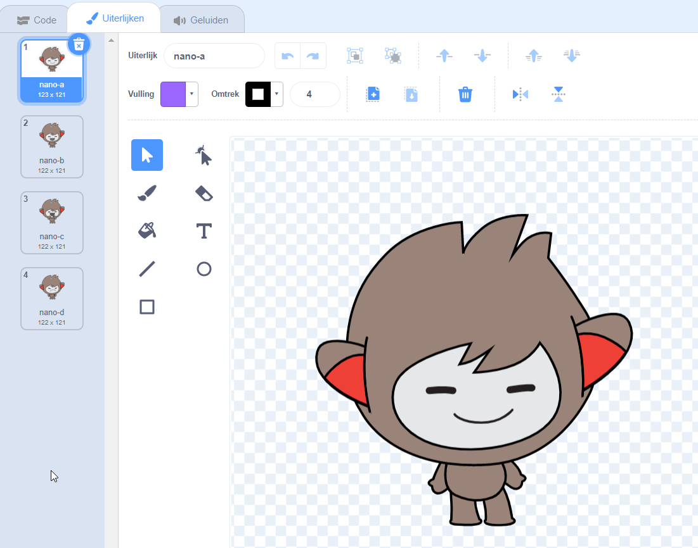
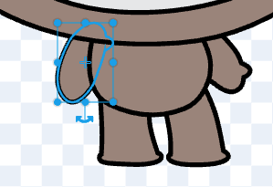
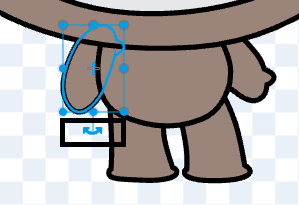
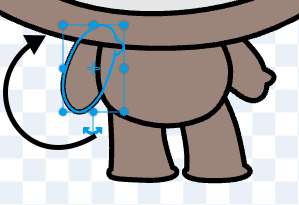
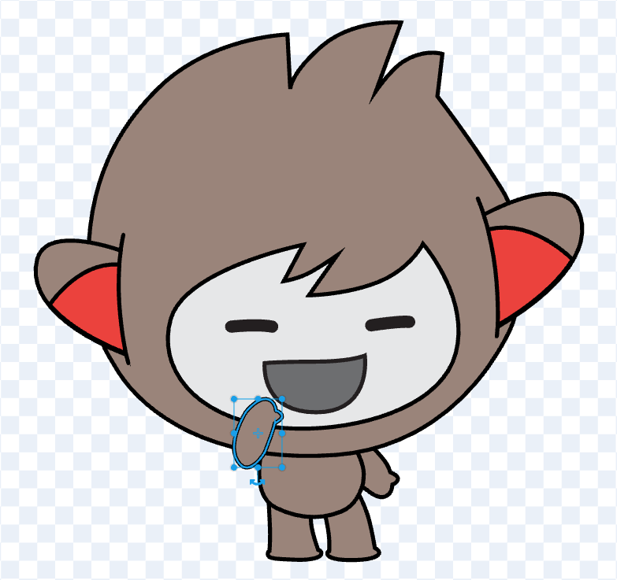
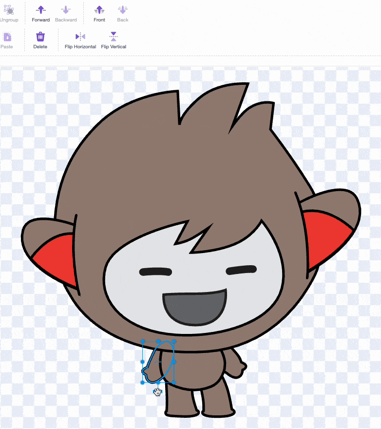

## Nano gebaart "Bedankt!"

Laat Nano een gebaar maken door het uiterlijk aan te passen.

Miljoenen mensen gebruiken gebarentaal om te communiceren. Een veel voorkomend 'Dankjewel' gebaar maak je door je vingers op je kin te leggen met je hand zo plat mogelijk. Dan beweeg je je hand naar voren, van je kin af en iets naar beneden. 

{:width="300px"}

### Nano gebruikt gebarentaal

Je gaat het uiterlijk van Nano bewerken om hem het gebaar "dank je" te laten doen.

Je kunt uiterlijken voor sprites bewerken met de Teken-editor.

--- task ---

Klik op het **Uiterlijken** tabblad om de uiterlijken voor de **Nano** sprite te zien:

--- /task ---

--- task ---

Klik op het **nano-b** uiterlijk. Klik op de arm aan de linkerkant.

--- /task ---

--- task ---

Selecteer de dubbele 'draai'-pijl en sleep de muis omhoog om de arm te draaien.

Het uiterlijk zou er als volgt uit moeten zien:

--- /task ---

--- task ---

Selecteer het 'naar voorkant' gereedschap om de arm de voorste laag te maken.

--- /task ---

**Tip:** Als je een fout maakt in de Teken-editor, kun je klikken op **Ongedaan maken**.

--- no-print ---

--- /no-print ---

--- task ---

**Test:** Klik op de **Nano** sprite in het Speelveld en controleer of Nano's uiterlijk verandert in het uiterlijk dat je hebt bewerkt.

--- /task ---

Je hebt het gebaar voor "dank je" geleerd. Waarom zou je de volgende keer dat je iemand bedankt, je nieuwe vaardigheid niet gebruiken?

