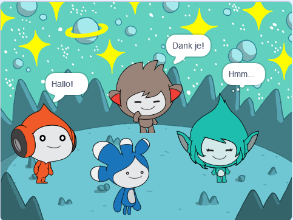

## Verbeter je project

<div style="display: flex; flex-wrap: wrap">
<div style="flex-basis: 200px; flex-grow: 1; margin-right: 15px;">
Voeg de **Tera** sprite toe en gebruik een van de blokken waar je over hebt geleerd om een 'emotie' te maken voor de **Tera** sprite.
</div>
<div>

{:width="300px"}

</div>
</div>

Je kunt ook de tekst-naar-spraakextensie gebruiken om **Tera** echt te laten praten:

[[[scratch3-text-to-speech]]]

De persoonlijkheid van de **Tera** sprite is jouw keuze, dus veel plezier met het gebruiken van je eigen creatieve ideeën.

```blocks3
when this sprite clicked

say [Hello!] for [2] seconds

say [Hello!]

say [] // hide speech bubble

think [Hmm...] for [2] seconds

switch costume to [tera-d v]

wait (1) seconds // 0.5 is half a second

set [color v] effect to [0] // number up to 200

clear graphic effects

play sound [pop v] until done

start sound [pop v]

speak [hello]
```

Je kunt het project ook 'remixen' om allerlei wijzigingen aan te brengen. Je zou de achtergrond kunnen veranderen, en hoe de sprites emoties laten zien, en zelfs verschillende sprites kiezen en ze emoties geven.

**Tip:** Klik op een sprite in de Sprite lijst onder het Speelveld om de code, de uiterlijken en het geluid voor die sprite te wijzigen.

--- collapse ---
---
title: Voltooid project
---

Je kunt het [voltooide project hier](https://scratch.mit.edu/projects/485673032/){:target="_blank"} bekijken.

--- /collapse ---

--- save ---
