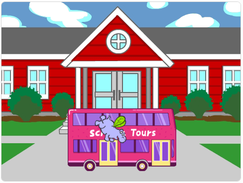

## Verbeter je project

Voeg de **Tera** sprite toe en gebruik een van de blokken waar je over hebt geleerd om een 'emotie' te maken voor de **Tera** sprite.

> [!PRINTONLY]
>
> 

> [!NOPRINT]
>
> 

>   <iframe allowtransparency="true" width="485" height="402" src="https://scratch.mit.edu/projects/embed/589764379/?autostart=false" frameborder="0"></iframe>
> 

> [!ACCORDION] Voltooid project
>
> Dit project werd vertaald door vrijwilligers:
> Je kunt het [voltooide project hier](https://scratch.mit.edu/projects/595587060/){:target="_blank"} bekijken.

> [!SAVE]
