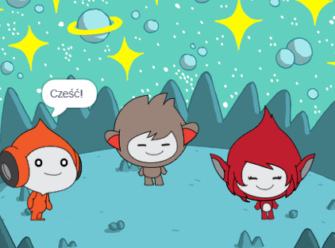

## Wprowadzenie

W tym projekcie stworzysz scenę w kosmosie z postaciami, które „emotują”, aby podzielić się swoimi przemyśleniami lub uczuciami.

**Emoty** to sposób na pokazanie osobowości postaci w grze. Mogą używać mowy, dźwięków, ruchu i efektów graficznych, tak jak w Scratchu. Czy grasz w jakieś gry wykorzystujące emoty?

W Scratchu postacie i obiekty są nazywane **duszkami** i pojawiają się na **scenie**.

Co zrobisz:
+ Dodaj duszki i **tło** aby skonfigurować swój projekt
+ Klikniesz duszki, aby komunikowały się za pomocą `Wyglądu`{:class="block3looks"} i `Dźwięku`{:class="block3sound"}
+ Użyjesz **Edytora graficznego** aby zmienić **kostium**

--- no-print --- --- task ---
### Spróbuj

  
Kliknij każdego duszka, aby zobaczyć, co robi. 

Co się stanie, jeśli klikniesz jednego duszka, a potem szybko innego?

  <iframe allowtransparency="true" width="485" height="402" src="https://scratch.mit.edu/projects/embed/485673032/?autostart=false" frameborder="0"></iframe>

--- /task --- --- /no-print ---

--- print-only ---

--- /print-only ---

