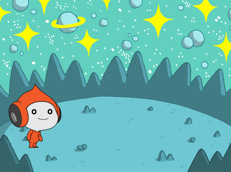
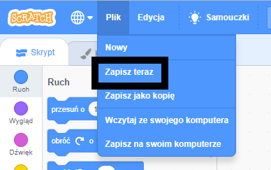

## Stwórz swoją scenę

Skonfiguruj swój projekt z kosmicznym tłem i pierwszym duszkiem. 

{:width="300px"}

### Otwórz projekt startowy

--- task ---

Otwórz [projekt startowy Kosmicznej rozmowy ](https://scratch.mit.edu/projects/582213331/editor){:target="_blank"}. Scratch otworzy się w nowej karcie przeglądarki.

[[[working-offline]]]

--- /task ---

### Edytor Scratch

### Dodaj tło

**Scena** to miejsce, gdzie uruchamiany jest Twój projekt. **Tło** zmienia wygląd sceny.

--- task ---

Kliknij (lub stuknij na tablecie) opcję **Wybierz tło** w okienku Scena:

--- /task ---

--- task ---

Kliknij kategorię **Kosmos** lub wpisz `kosmos` w polu wyszukiwania:

--- /task ---

W naszym przykładzie wybraliśmy tło **Space** (kosmos), ale wybierz tło, które najbardziej Ci się podoba.

--- task ---

Kliknij wybrane tło, aby dodać je do swojego projektu. Scena powinna pokazywać wybrane przez Ciebie tło:

--- /task ---

### Dodaj duszka

Czy widzisz duszka, który już istnieje w Twoim projekcie? To jest Scratch Cat.

--- task ---

Usuń **Duszek1** (Scratch Cat): wybierz element **Duszek1** z listy duszków poniżej sceny i kliknij ikonę **Usuń**.

--- /task ---

--- task ---

Kliknij **Wybierz duszka** na liście duszków:

--- /task ---

--- task ---

Wybierz kategorię **Fikcja**. Kliknij duszka **Pico** aby dodać go do swojego projektu.

--- /task ---

--- task ---

Przeciągnij duszka **Pico** tak, aby umieścić go po lewej stronie Sceny. Twoja Scena powinna wyglądać mniej więcej w ten sposób:

--- /task ---

--- task ---

**Zapisz**: Jeśli jesteś zalogowany na swoje konto Scratch, kliknij zielony przycisk Remix. Spowoduje to zapisanie kopii projektu na Twoim koncie Scratch.

Wpisz nazwę swojego projektu w polu nazwy projektu u góry ekranu.

**Wskazówka:** Nadaj swoim projektom pomocne nazwy, aby łatwo je znaleźć, gdy będziesz mieć wiele projektów.

Następnie kliknij **Plik**, a potem **Zapisz teraz**, aby zapisać swój projekt.

Jeśli nie jesteś online lub nie masz konta Scratch, możesz kliknąć **Zapisz na swoim komputerze** aby zapisać kopię swojego projektu.

--- /task ---

