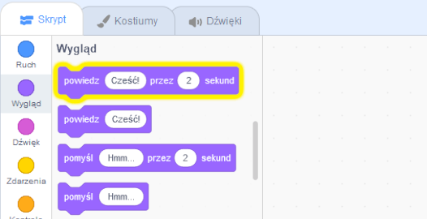
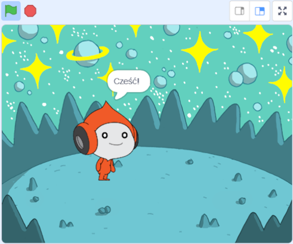
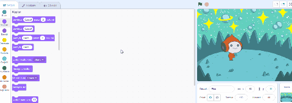
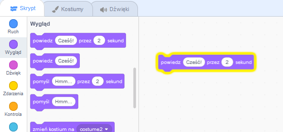
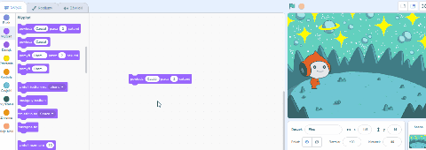
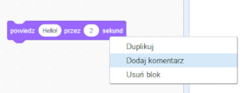

## Pico mówi: "cześć"

<div style="display: flex; flex-wrap: wrap">
<div style="flex-basis: 200px; flex-grow: 1; margin-right: 15px;">
Możesz użyć kodu, kostiumów i dźwięku, aby zmienić wygląd i zachowanie duszka. 
  
Dodasz bloki kodu, aby Pico wyrażał emocje z użyciem słów i dźwięku po kliknięciu duszka.
</div>
<div>

{:width="300px"}

</div>
</div>

<p style="border-left: solid; border-width:10px; border-color: #0faeb0; background-color: aliceblue; padding: 10px;">
<span style="color: #0faeb0">**Emotki**</span> to sposób na pokazanie osobowości postaci w grze. Mogą używać mowy, dźwięków, ruchu i efektów graficznych, zupełnie tak jak w Scratchu. Czy grasz w jakieś gry, które używają emotek?
</p>

### Użyj bloku powiedz

--- task ---

Otwórz menu blokowe `Wygląd`{:class="block3looks"}.

Kliknij blok `powiedz`{:class="block3looks"} `Cześć!` `przez`{:class="block3looks"} `2` `sekundy`{:class="block3looks"}.



Duszek **Pico** pokaże dymek z tekstem przez dwie sekundy.



**Wskazówka:** Kiedy bloki kodu w Scratchu są uruchomione, otacza je żółty świecący kontur.

--- /task ---

--- task ---

Przeciągnij blok `powiedz`{:class="block3looks"} `Cześć!` `przez`{:class="block3looks"} `2` `sekundy`{:class="block3looks"} do obszaru Skrypt. Kliknij go ponownie.





--- /task ---

### Spraw, by Pico mówił po kliknięciu (lub stuknięciu)

--- task ---

Przeciągnij blok `kiedy ten duszek kliknięty`{:class="block3events"} z menu bloków `Zdarzenia`{:class="block3events"} do górnej krawędzi bloku `Powiedz`{:class="block3looks"} w obszarze Skrypt. Bloki się połączą.




```blocks3
+when this sprite clicked
say [Hello!] for [2] seconds // hide speech after 2 seconds
```

--- /task ---

### Komentarze do kodu

--- task ---

```blocks3
say [Hello!] for [2] seconds // hide speech after 2 seconds
```
W przykładach kodu zobaczysz komentarze. Nie musisz dodawać komentarzy podczas dodawania kodu do projektu.

Jeśli po zakończeniu projektu masz czas, dobrym pomysłem jest dodanie komentarzy do kodu, aby później był łatwiejszy do zrozumienia. Try adding a comment now. Aby dodać komentarz, kliknij prawym przyciskiem myszy (lub na tablecie naciśnij i przytrzymaj) blok w obszarze Skrypt i wybierz **Dodaj komentarz**.



--- /task ---

### Test

--- task ---

**Test:** Kliknij duszka **Pico** na Scenie i sprawdź, czy dymek wyświetla się przez dwie sekundy. To ważne, by przetestować kod i upewnić się, że robi to, czego oczekujesz.

--- /task ---

--- task ---

Zapisałeś już swój projekt i nadałeś mu nazwę. Scratch będzie teraz **automatycznie** zapisywał projekt dla ciebie.

Nadal możesz kliknąć Zapisz, jeśli chcesz, aby mieć pewność.

--- /task ---
