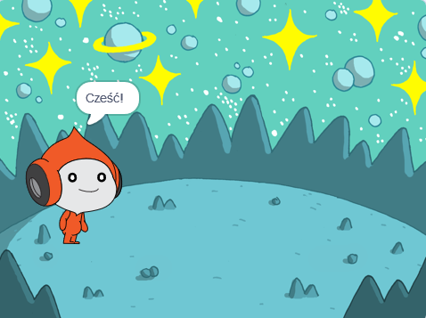

## Pico mówi: "cześć"

<div style="display: flex; flex-wrap: wrap">
<div style="flex-basis: 200px; flex-grow: 1; margin-right: 15px;">
Możesz użyć kodu, kostiumów i dźwięku, aby zmienić wygląd i zachowanie duszka. 
  
Dodasz bloki kodu, aby Pico wyrażał emocje z użyciem słów i dźwięku po kliknięciu duszka.
</div>
<div>

{:width="300px"}

</div>
</div>

Aby użyć bloków, możesz kliknąć na nie w menu bloków.

--- task ---

Otwórz menu blokowe `Wygląd`{:class="block3looks"}.

Kliknij blok `powiedz`{:class="block3looks"} `Cześć!` `przez`{:class="block3looks"} `2` `sekundy`{:class="block3looks"}.


Duszek **Pico** pokaże dymek z tekstem przez dwie sekundy.


**Wskazówka:** Kiedy bloki kodu w Scratchu są uruchomione, otacza je żółty świecący kontur.

--- /task ---

Możesz przeciągać bloki do obszaru Skrypt i następnie stamtąd ich używać.

--- task ---

Przeciągnij blok `powiedz`{:class="block3looks"} `Cześć!` `przez`{:class="block3looks"} `2` `sekundy`{:class="block3looks"} do obszaru Skrypt. Kliknij go ponownie.


--- /task ---

Bloki można łączyć ze sobą w obszarze Skrypt, aby uruchomić więcej niż jeden na raz. Połączone bloki będą uruchamiane w kolejności od góry do dołu.

--- task ---

Przeciągnij blok `kiedy ten duszek kliknięty`{:class="block3events"} z menu bloków `Zdarzenia`{:class="block3events"} do górnej krawędzi bloku `Powiedz`{:class="block3looks"} w obszarze Skrypt. Bloki się połączą.


```blocks3
+when this sprite clicked
say [Cześć!] for [2] seconds // ukryj dymek po 2 sekundach
```

--- /task ---

Komentarz jest wyjaśnieniem, co robi Twój skrypt.

```blocks3
say [Cześć!] for [2] seconds // ukryj dymek po 2 sekundach
```
W przykładach kodu zobaczysz komentarze. Nie musisz dodawać komentarzy podczas dodawania kodu do projektu.

Jeśli po zakończeniu projektu masz czas, dobrym pomysłem jest dodanie komentarzy do kodu, aby później był łatwiejszy do zrozumienia. Aby dodać komentarz, kliknij prawym przyciskiem myszy (lub na tablecie naciśnij i przytrzymaj) blok w obszarze Skrypt i wybierz **Dodaj komentarz**.


--- task ---

**Test:** Kliknij duszka **Pico** na Scenie i sprawdź, czy dymek wyświetla się przez dwie sekundy. To ważne, by przetestować kod i upewnić się, że robi to, czego oczekujesz.

--- /task ---

--- save ---
