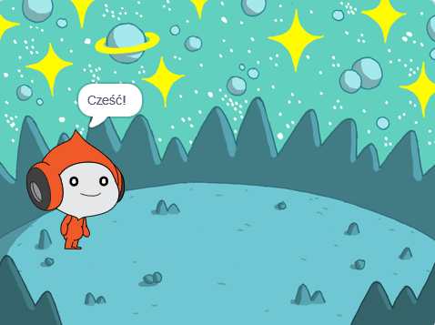
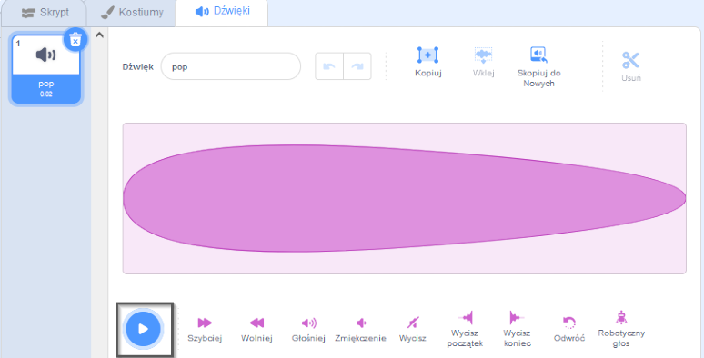
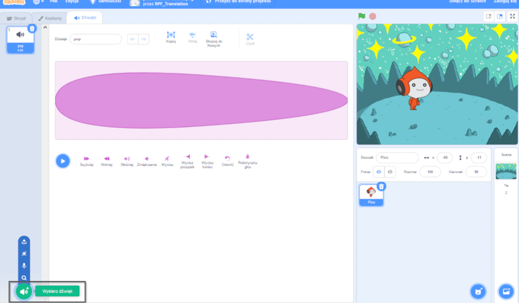
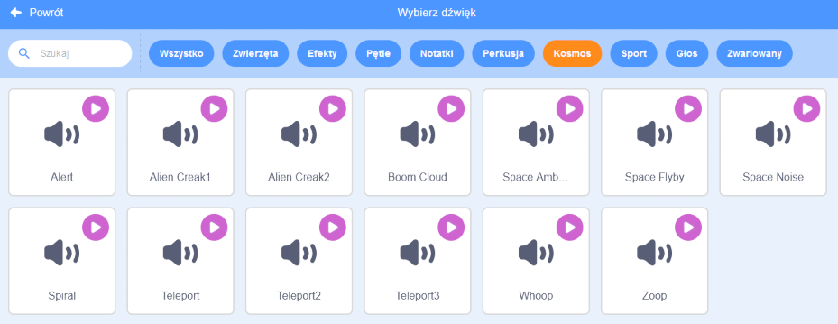
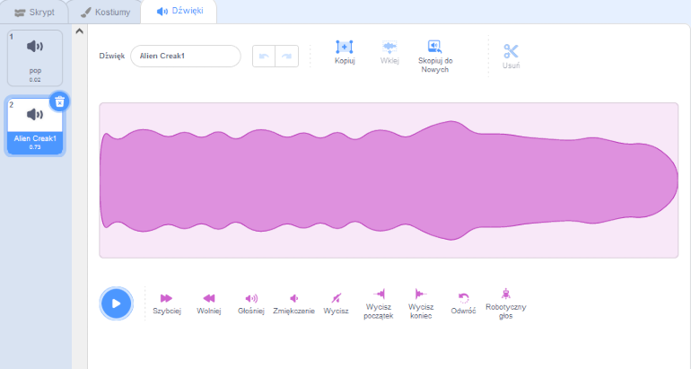
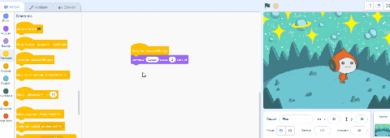
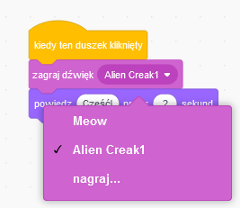

## Pico odtwarza dźwięk

<div style="display: flex; flex-wrap: wrap">
<div style="flex-basis: 200px; flex-grow: 1; margin-right: 15px;">
Innym sposobem komunikowania się jest użycie dźwięku.
</div>
<div>

{:width="300px"}

</div>
</div>

### Dodaj dźwięk do duszka Pico

--- task ---

Kliknij zakładkę **Dźwięki** duszka **Pico**, a znajdziesz dźwięk **pop**. Kliknij ikonę **Odtwórz** aby go usłyszeć.



**Debugowanie**: Jeśli nie słyszysz dźwięku, sprawdź, czy dźwięk działa na komputerze lub tablecie.

--- /task ---

--- task ---

Aby wybrać nowy dźwięk, kliknij ikonę **Wybierz dźwięk** i wybierz kategorię **Kosmos** lub wpisz `space` w polu wyszukiwania.






--- /task ---

--- task ---

Odtwórz kilka różnych dźwięków za pomocą ikon **Odtwórz**. Kiedy już znajdziesz dźwięk, którego chcesz użyć, kliknij go, aby dodać go do swojego projektu.



--- /task ---

### Spraw, by dźwięk odtwarzał się po kliknięciu (lub stuknięciu)

--- task ---

Kliknij na zakładkę **Skrypt**. W menu bloków `Dźwięk`{:class="block3sound"} znajdź blok `zagraj dźwięk`{:class="block3sound"}.

Przeciągnij blok do obszaru Skrypt, pomiędzy blok `kiedy ten duszek kliknięty`{:class="block3events"}, a blok `powiedz`{:class="block3looks"}. Zrobi się luka i blok wskoczy na swoje miejsce.



Twój kod powinien wyglądać tak:


```blocks3
when this sprite clicked
+start sound [Alien Creak1 v] 
say [Hello!] for [2] seconds // hide speech after 2 seconds
```

--- /task ---

### Przetestuj swój kod

--- task ---

Upewnij się, że Twój blok `zagraj dźwięk`{:class="block3sound"} zawiera Twój wybrany dźwięk. Jeśli nie, kliknij dźwięk w bloku `zagraj dźwięk`{:class="block3sound"}, a następnie wybierz swój dźwięk z rozwijanego menu.



--- /task ---

--- task ---

**Test:** Kliknij duszka **Pico** i sprawdź, czy dymek wyświetla się i czy słyszysz dźwięk. Jeśli nie słyszysz dźwięku, upewnij się, że dodałeś blok `zagraj dźwięk`{:class="block3sound"} pod blokiem `gdy ten duszek kliknięty`{:class="block3events"}.

--- /task ---

