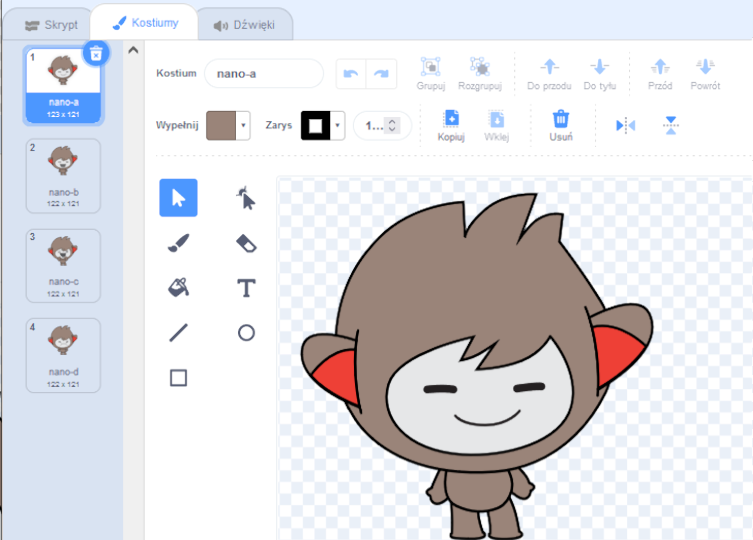
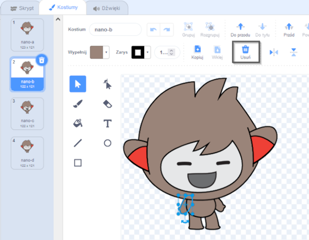
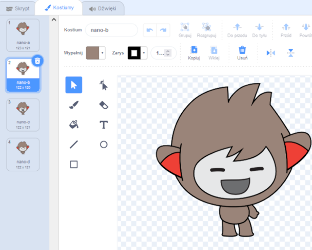
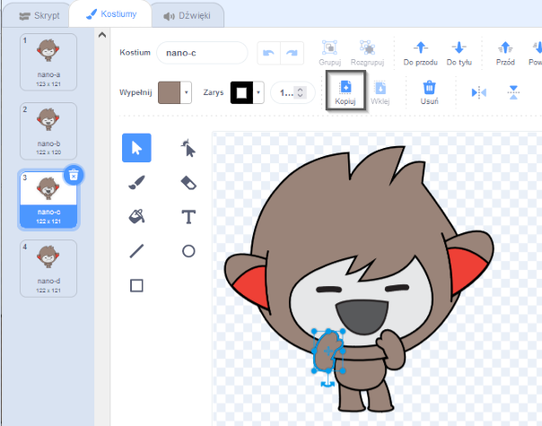
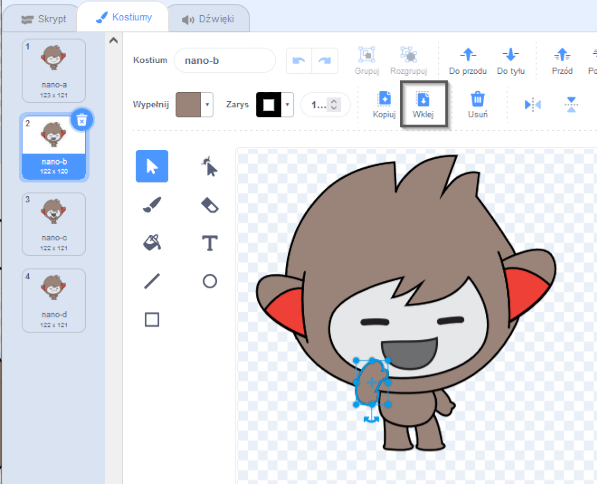

## Nano switches costume

<div style="display: flex; flex-wrap: wrap">
<div style="flex-basis: 200px; flex-grow: 1; margin-right: 15px;">

Get Nano to emote by switching **costumes**.

Duszki mają **kostiumy**, które pozwalają im zmienić wygląd. To animate a sprite, you can change its costume.

</div>
<div>

{:width="300px"}

</div>
</div>

### Nano signs "Thanks!"

--- task ---

Dodaj duszka **Nano** do swojego projektu z kategorii **Fikcja**.


--- /task ---

--- task ---

Upewnij się, że duszek **Nano** jest zaznaczony na Liście duszków pod Sceną.


Click on the **Code** tab and add a script to get the **Nano** sprite to sign 'Thanks' using `switch costume to`{:class="block3looks"} and `wait`{:class="block3control"}:


```blocks3
when this sprite clicked // when Nano is clicked
switch costume to [nano-b v] // Nano talking
wait (0.5) seconds // try 0.25 instead of 0.5
switch costume to [nano-a v] // Nano smiling
```
--- /task ---

**Tip:** All the blocks are colour-coded, so you will find the `switch costume to`{:class="block3looks"} block in the `Looks`{:class="block3looks"} blocks menu and the `wait`{:class="block3control"} block in the `Control`{:class="block3control"} blocks menu.

--- task ---

**Test:** Click on the **Nano** sprite on the Stage and check that Nano's costume changes.

--- /task ---

### Nano używa języka migowego

<p style="border-left: solid; border-width:10px; border-color: #0faeb0; background-color: aliceblue; padding: 10px;">Miliony ludzi porozumiewają się w języku migowym. A common way to sign 'Thank you' is to place your fingers on your chin with your hand as flat as possible. You then move your hand forwards, away from your chin and slightly down. 
</p>

<!-- Add a video of someone signing -->

Nano posłuży się językiem migowym poprzez zmianę kostiumów.

Możesz edytować kostiumy swoich duszków za pomocą Edytora graficznego. Zmodyfikujesz kostium Nano tak, aby pokazał "dziękuję".

--- task ---

Kliknij zakładkę **Kostiumy**, aby zobaczyć kostiumy dla duszka **Nano**:



--- /task ---

--- task ---

Kliknij kostium **nano-b**. Kliknij ramię po lewej stronie, a następnie kliknij **Usuń**.



Kostium powinien wyglądać następująco:



--- /task ---

**Wskazówka:** Jeśli popełnisz błąd w Edytorze graficznym, możesz kliknąć **Cofnij**.


--- task ---

Przejdź do kostiumu **nano-c** i kliknij ramię po lewej stronie, a następnie kliknij **Kopiuj**.



--- /task ---

--- task ---

Wróć do kostiumu **nano-b** i kliknij **Wklej**. Kostium powinien wyglądać następująco:



--- /task ---

--- task ---

**Test:** Kliknij duszka **Nano** na Scenie i sprawdź, czy wyświetla się dymek z tekstem, a kostium Nano się zmienia na kostium który wyedytowałeś.

--- /task ---

<p style="border-left: solid; border-width:10px; border-color: #0faeb0; background-color: aliceblue; padding: 10px;">Nauczyłeś się pokazywać gest „dziękuję”. Gdy następnym razem będziesz komuś dziękować, może wykorzystasz swoją nową umiejętność?
</p>

