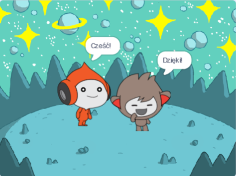
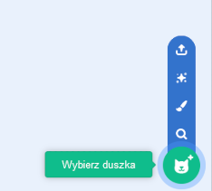
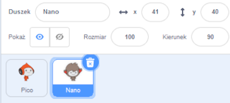

## Nano zmienia kostiumy

<div style="display: flex; flex-wrap: wrap">
<div style="flex-basis: 200px; flex-grow: 1; margin-right: 15px;">

Sprawisz, że Nano będzie emotował poprzez zmianę **kostiumów**.

Duszki mają **kostiumy**, które pozwalają im zmienić wygląd. They are usually slightly different images of the same sprite. Aby animować duszka, możesz zmienić jego kostiumy.

</div>
<div>

{:width="300px"}

</div>
</div>

--- task ---

Dodaj duszka **Nano** do swojego projektu z kategorii **Fikcja**.



--- /task ---

--- task ---

Upewnij się, że duszek **Nano** jest zaznaczony na Liście duszków pod Sceną.



Kliknij zakładkę **Skrypt** i dodaj kod, aby duszek **Nano** powiedział „Dzięki!” używając `zmień kostium na`{:class="block3looks"} i `czekaj`{:class="block3control"}: Use the drop down menu to switch between `nano-b`{:class="block3looks"} and `nano-a`{:class="block3looks"}:


```blocks3
when this sprite clicked // po kliknięciu Nano
switch costume to [nano-b v] // Nano mówi
wait (0.5) seconds // spróbuj 0.25 zamiast 0.5
switch costume to [nano-a v] // Nano się uśmiecha
```
--- /task ---

**Wskazówka:** Wszystkie bloki są oznaczone kolorami, więc znajdziesz blok `zmień kostium na`{:class="block3looks"} w menu bloków `Wygląd`{:class="block3looks"} i blok `czekaj`{:class="block3control"} w menu bloków `Kontroli`{:class="block3control"}.

--- task ---

**Test:** Kliknij duszka **Nano** na Scenie i sprawdź, czy kostium Nano się zmienia.

--- /task ---
