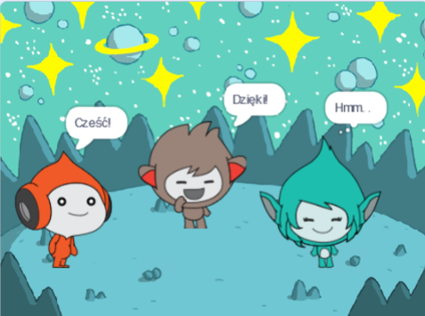

## Giga zmienia kolor

<div style="display: flex; flex-wrap: wrap">
<div style="flex-basis: 200px; flex-grow: 1; margin-right: 15px;">
Duszki mogą również używać baniek myśli i zmieniać kolory, aby pokazać swoją osobowość. Sprawisz, że Giga zrobi tak.
</div>
<div>

{:width="300px"}

</div>
</div>

### Giga zmienia kolor

--- task ---

Dodaj duszka **Giga**.

Przeciągnij **Giga** na prawą stronę Sceny.

--- /task ---

--- task ---

Upewnij się, że duszek **Giga** jest zaznaczony na Liście duszków pod Sceną. Dodaj ten kod, aby **Giga** komunikował się poprzez zmianę koloru:


```blocks3
when this sprite clicked
set [color v] effect to [0] // 0 is the starting colour
think [Hmm...] for [2] seconds 
clear graphic effects // back to the starting colour
```

--- /task ---

**Wskazówka:** Kliknij duszka na liście duszków pod sceną zanim dodasz lub zmienisz kod, kostiumy lub dźwięk. Upewnij się, że kliknąłeś właściwego duszka.

--- task ---

Wypróbuj różne liczby od `1` do `200` w `ustaw efekt kolor na`{:class="block3looks"}, aż znajdziesz kolor, który się Tobie podoba.

--- /task ---

--- task ---

Zmień słowa i liczbę sekund w bloku `pomyśl`{:class="block3looks"}.

--- /task ---

--- task ---

**Test:** Kliknij duszka **Giga** na scenie i sprawdź, czy duszek zmienia kolor i pokazuje bańkę myśli.

--- /task ---

