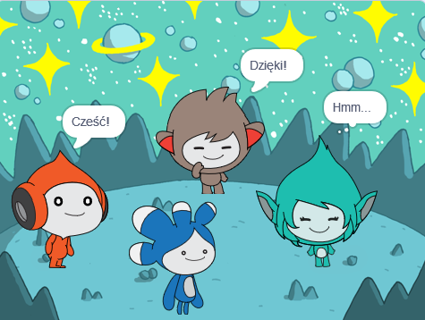

## Ulepsz swój projekt

<div style="display: flex; flex-wrap: wrap">
<div style="flex-basis: 200px; flex-grow: 1; margin-right: 15px;">
Dodaj duszka **Tera** i użyj dowolnych bloków, o których się nauczyłeś, aby stworzyć „emoty” dla duszka **Tera**.
</div>
<div>

{:width="300px"}

</div>
</div>

Osobowość duszka **Tera** to Twój wybór, więc baw się dobrze korzystając z własnych kreatywnych pomysłów.

```blocks3
kiedy ten duszek kliknięty

powiedz [Witaj!] przez [2] sekundę

powiedz [Witaj!]

powiedz [] // ukryj dymek

pomyśl [Hmm...] przez [2] sekundy

przełącz kostium na [tera-d v]

ustaw efekt [kolor v] na [0] // liczbę do 200

wyczyść efekty graficzne

odtwórz dźwięk [pop v] 

uruchom dźwięk [pop v]
```

Możesz także „zremiksować” projekt, aby wprowadzić dowolne zmiany. Możesz zmienić tło i sposób emotowania duszków, a nawet wybrać inne duszki i dać im emoty.

**Wskazówka:** Kliknij duszka na liście duszków pod sceną, aby zmienić kod, kostiumy i dźwięk tego duszka.

--- collapse ---
---
tytuł: Certyfikat Kosmicznej rozmowy
---

Dobra robota! Ukończyłeś projekt Kosmiczna rozmowa. Oto [certyfikatu](https://drive.google.com/file/d/18xx4uNIyRSty_2ujHkGDzGwTgfSGC1AF/view?usp=sharing){:target="_blank"}, aby uczcić Twoje nowe umiejętności. Pobierz kopię, a następnie otwórz ją, aby dodać swoje imię.

--- /collapse ---

--- collapse ---
---
title: Ukończony projekt
---

Tutaj możesz zobaczyć [ukończony projekt](https://scratch.mit.edu/projects/485673032/){:target="_blank"}.

--- /collapse ---

--- save ---
