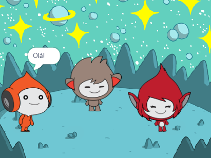

## What you will make

Crie uma cena espacial com personagens 👾 que expressem seus pensamentos ou sentimentos através de gestos e expressões faciais.

No Scratch, os personagens e objetos são chamados de **atores** e aparecem no **Palco**.

Você deve:
+ Adicione atores e um **cenário** para configurar seu projeto
+ Clique nos atores para fazê-los se comunicar usando blocos `Aparência`{:class="block3looks"} e `Som`{:class="block3sound"}
+ Use o **editor de imagens** para mudar uma **fantasia**

--- no-print --- --- task ---
### Jogar ▶️

  
Clique em cada ator para ver o que eles fazem. 

O que acontece se você clicar em um ator e depois clicar rapidamente em outro?

  <iframe allowtransparency="true" width="485" height="402" src="https://scratch.mit.edu/projects/embed/485673032/?autostart=false" frameborder="0"></iframe>

--- /task --- --- /no-print ---

--- print-only ---

--- /print-only ---

