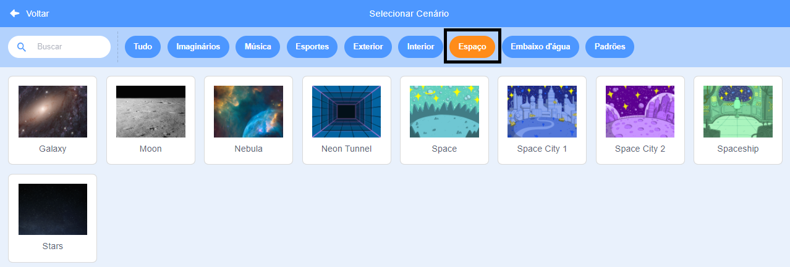
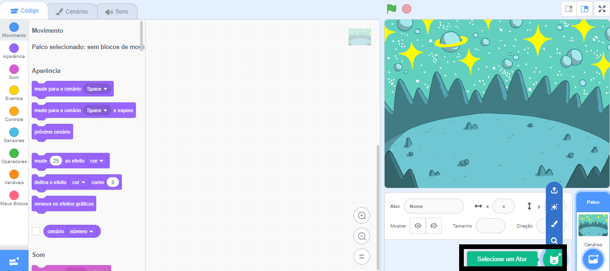
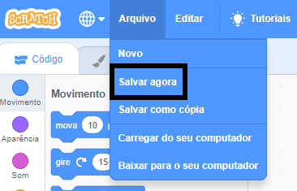

## Crie sua cena

Nesta etapa, você configurará seu projeto com um cenário de espaço e o primeiro ator. 

{:width="300px"}

### Open the starter project

--- task ---

Abra o [projeto inicial Conversa espacial](https://scratch.mit.edu/projects/582213331/editor){:target="_ blank"}. O Scratch será aberto em outra aba do navegador.

[[[working-offline]]]

--- /task ---

### O editor Scratch se parece com isso:

### Add a backdrop

O **Palco** é onde seu projeto é executado. Um **cenário** muda a aparência do Palco.

--- task ---

Clique (ou em um tablet, toque) em **Selecionar Cenário** no painel Palco:

--- /task ---

--- task ---

Clique na categoria **Space** ou digite `space` na caixa de pesquisa:

--- /task ---

Em nosso exemplo, escolhemos o **Space**, mas escolha o cenário que você mais gosta.

--- task ---

Clique no cenário escolhido para adicioná-lo ao seu projeto. O Palco deve mostrar o cenário que você escolheu:

--- /task ---

### Add a Sprite

Você consegue ver ator que já fora incluído em seu projeto? Esse é o Scratch Cat.

--- task ---

Exclua o ator **Ator1** (Scratch Cat): selecione o ator **Ator1** na lista Ator abaixo do Palco e clique no ícone **Apagar**.

--- /task ---

--- task ---

Clique em **Selecione um ator** na lista de Atores:

--- /task ---

--- task ---

Selecione a categoria **Imaginários**. Clique no **Pico** para adicioná-los ao seu projeto.

--- /task ---

--- task ---

Arraste o **Pico** para posicioná-lo no lado esquerdo do Palco. Seu Palco deve ser parecido com este:

--- /task ---

--- task ---

Se você estiver conectado à sua conta Scratch, clique no botão verde Remix. Isso salvará uma cópia do projeto em sua conta Scratch.

Digite o nome do seu projeto na caixa de nome do projeto na parte superior da tela.

**Dica:** Dê nomes úteis aos seus projetos para que você possa encontrá-los facilmente quando tiver muitos projetos.

A seguir, clique em **Arquivo**, e então em **Salvar Agora** para salvar seu projeto.

Se você não estiver online ou não tiver uma conta Scratch, você pode clicar em **Baixar para o seu computador** para salvar uma cópia do seu projeto.

--- /task ---

