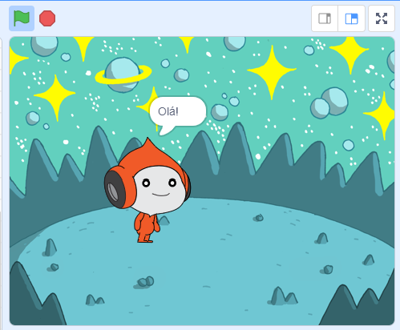
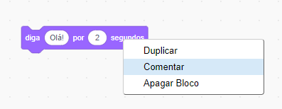

## Pico diz olá

<div style="display: flex; flex-wrap: wrap">
<div style="flex-basis: 200px; flex-grow: 1; margin-right: 15px;">
Um ator pode ter código, fantasias e sons para mudar sua aparência e o que faz. 
  
Você adicionará blocos de código para fazer o Pico reagir com palavras e sons quando o ator for clicado.
</div>
<div>

{:width="300px"}

</div>
</div>

<p style="border-left: solid; border-width:10px; border-color: #0faeb0; background-color: aliceblue; padding: 10px;">
<span style="color: #0faeb0">**Emotes**</span> são uma forma de mostrar a personalidade de um personagem em um jogo. Eles podem usar fala, sons, movimento e efeitos gráficos, assim como no Scratch. Você joga algum jogo que usa emotes?
</p>

### Use o bloco diga

--- task ---

Abra o menu dos blocos `Aparência`{:class="block3looks"}.

Clique em um bloco `diga`{:class="block3looks"} `Olá!` `por`{:class="block3looks"} `2` `segundos`{:class="block3looks"}.


O ator **Pico** mostrará um balão de fala por dois segundos.



**Dica:** blocos de código no Scratch brilham com um contorno amarelo quando estão em execução.

--- /task ---

--- task ---

Arraste o bloco `diga`{:class="block3looks"} `Olá!` `por`{:class="block3looks"} `2` `segundos`{:class="block3looks"} para a área de Código. Clique nele novamente.


--- /task ---

### Faça o Pico falar quando clicado (ou tocado)

--- task ---

Arraste um bloco `quando este ator for clicado`{:class="block3events"} do menu de blocos `Eventos`{:class="block3events"} e conecte-o ao topo do seu bloco `diga`{:class="block3looks"} na área de Código. Os blocos se encaixarão.


```blocks3
+when this sprite clicked
say [Hello!] for [2] seconds // hide speech after 2 seconds
```

--- /task ---

### Comentários de código

--- task ---

```blocks3
say [Hello!] for [2] seconds // hide speech after 2 seconds
```
Você verá comentários em código de exemplo. Você não precisa adicionar comentários ao adicionar código ao seu projeto.

Se você tiver tempo ao terminar seu projeto, é uma boa ideia adicionar comentários ao seu código para que seja mais fácil de entender mais tarde. Try adding a comment now. Para adicionar um comentário, clique com o botão direito (ou em um tablet, pressione e segure) em um bloco na área de Código e escolha **Comentar**.



--- /task ---

### Teste

--- task ---

**Teste:** Clique no ator **Pico** no Palco e verifique se o balão de fala aparece por dois segundos. É importante testar seu código para ter certeza de que ele faz o que você espera.

--- /task ---

--- task ---

Você já salvou seu projeto e deu um nome a ele. O Scratch agora salvará **automaticamente** para você.

Você ainda pode clicar em salvar se quiser, só para ter certeza.

--- /task ---
