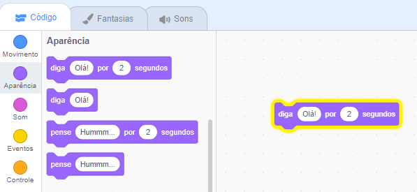

## Pico diz olá

<div style="display: flex; flex-wrap: wrap">
<div style="flex-basis: 200px; flex-grow: 1; margin-right: 15px;">
Um ator pode ter código, fantasias e sons para mudar sua aparência e o que faz. 
  
Você adicionará blocos de código para fazer o Pico reagir com palavras e sons quando o sprite for clicado.
</div>
<div>

{:width="300px"}

</div>
</div>

<p style="border-left: solid; border-width:10px; border-color: #0faeb0; background-color: aliceblue; padding: 10px;">
<span style="color: #0faeb0">**Emotes**</span> are a way of showing the personality of a character in a game. They can use speech, sounds, movement, and graphic effects, just like in Scratch. Do you play any games that use emotes?
</p>

### Use the say block

--- task ---

Abra o menu `Aparência`{:class="block3looks"} nos blocos.

Clique em um bloco `diga`{:class="block3looks"} `Olá` `por`{:class="block3looks"} `2` `segundos`{:class="block3looks"}.


O **Pico** mostrará um balão de fala por dois segundos.


**Dica:** blocos de código no Scratch brilham com um contorno amarelo quando estão em execução.

--- /task ---

--- task ---

Arraste o bloco `diga`{:class="block3looks"} `Olá` `por`{:class="block3looks"} `2` `segundos`{:class="block3looks"} para a área de Código. Clique nele novamente.




--- /task ---

### Make Pico talk when clicked (or tapped)

--- task ---

Arraste um bloco `quando este ator for clicado`{:class="block3events"} do menu de blocos `Eventos`{:class="block3events"} e conecte-o ao topo do seu bloco `diga`{:class="block3looks"} na área de Código. Os blocos se encaixarão.


```blocks3
+when this sprite clicked
say [Hello!] for [2] seconds // hide speech after 2 seconds
```

--- /task ---

### Code comments

```blocks3
say [Hello!] for [2] seconds // hide speech after 2 seconds
```
Você verá comentários em exemplos de código. Você não precisa adicionar comentários ao adicionar código ao seu projeto.

Se você tiver tempo ao terminar seu projeto, é uma boa ideia adicionar comentários ao seu código para que seja mais fácil de entender mais tarde. Para adicionar um comentário, clique com o botão direito (ou em um tablet, pressione e segure) em um bloco na área de Código e escolha **Comentar**.


### Test

--- task ---

**Teste:** Clique no ator **Pico** no Palco e verifique se o balão de fala aparece por dois segundos. É importante testar seu código para ter certeza de que ele faz o que você espera.

--- /task ---

--- task ---

You have already saved your project and given it a name. Scratch will now **automatically** save for you.

You can still click save if you like, just to make sure.

--- /task ---
