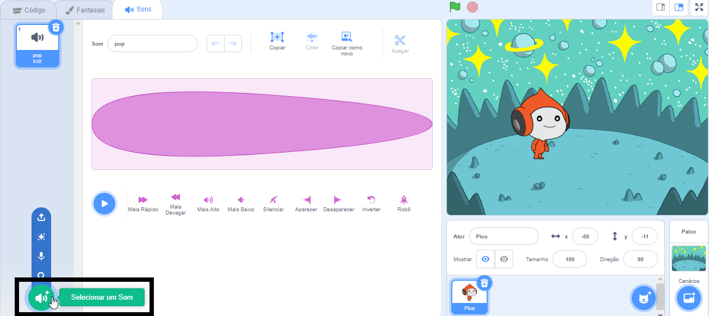
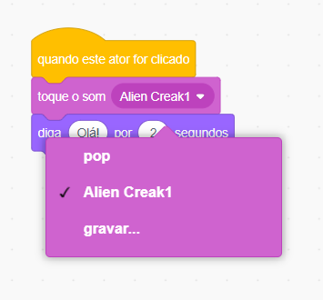

## Pico toca um som

<div style="display: flex; flex-wrap: wrap">
<div style="flex-basis: 200px; flex-grow: 1; margin-right: 15px;">
Outra forma de se comunicar é usar som.
</div>
<div>

{:width="300px"}

</div>
</div>

### Existem alguns sons alienígenas fantásticos no Scratch que você pode adicionar ao seu ator.

--- task ---

Clique na aba **Sons** para o ator **Pico** e você encontrará um som chamado **pop**. Clique no **Jogar** para ouvir o som **pop**.


Além disso, verifique se o som está funcionando em seu computador ou tablet.

--- /task ---

--- task ---

Para escolher um novo som, clique no ícone **Selecionar um Som** e selecione a categoria **Espaço** ou digite `espaço` na caixa de pesquisa.





--- /task ---

--- task ---

Reproduza alguns sons diferentes usando os ícones **Reproduzir**. Depois de encontrar o som que deseja usar, clique nele para adicioná-lo ao seu projeto.


--- /task ---

### Make the sound play when clicked (or tapped)

--- task ---

Clique na aba **Código**. No menu de blocos `Som`{:class="block3sound"}, encontre o bloco `toque o som`{:class="block3sound"}.

Arraste o bloco para a área de código, entre `quando este ator for clicado`{:class="block3events"} e o bloco `diga`{:class="block3looks"}. Um espaço se abrirá e o bloco se encaixará no lugar.


Seu código deve ficar assim:


```blocks3
when this sprite clicked
+start sound [Alien Creak1 v] 
say [Hello!] for [2] seconds // hide speech after 2 seconds
```

--- /task ---

### Test your code

--- task ---

Verifique se o seu bloco `toque o som`{:class="block3sound"} contém o som escolhido. Caso contrário, você precisa clicar no som no bloco `toque o som`{:class="block3sound"} e, em seguida, selecionar o som escolhido no menu suspenso.



--- /task ---

--- task ---

Clique na aba **Sons** para o ator **Pico** e você encontrará um som chamado **pop**. Clique no **Jogar** para ouvir o som **pop**.

--- /task ---

